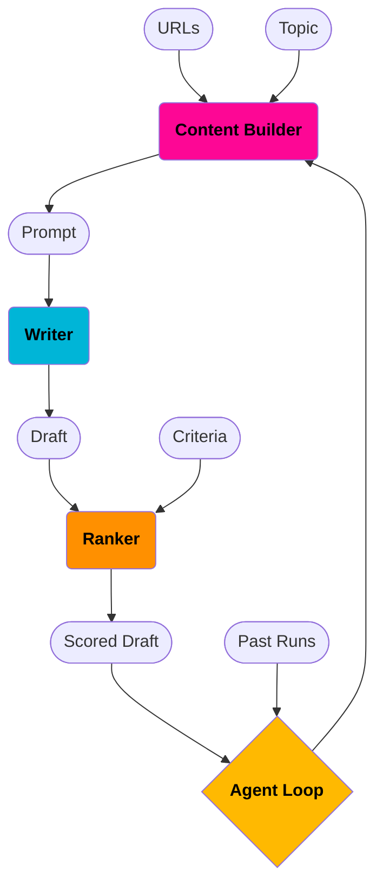

# Agentic AI Writer

## Get started
``` sh
# create a context.txt file with a list of URLs inside the `context` folder, set ANTHROPIC_API_KEY
# running agent loop
UV_ENV_FILE=../.env uv run ../agent_loop.py "write an article on software engineering management extracting the absolute best insights from this text. be concise. you are a senior cracked software engineer whose reputation is widely admired online"

# running just one module
UV_ENV_FILE=/path/to/.env uv run /path/to/writer.py "summarize all the context and list bullet points with your best insights"
```

## API

### Environment Variables
Required:
- `ANTHROPIC_API_KEY` or another model provider API Key if default `AIWRITER_MODEL` is changed

Optional:
- `AIWRITER_MODEL` determines the model to be used
- `AIWRITER_CONTEXT_FILE` filename for input context urls file to be used in the first prompt
- `AIWRITER_CONTEXT_FULL_FILE` filename for output markdown context from parsing context urls
- `AIWRITER_CONTEXT_DIR` directory where input and output context files
- `AIWRITER_CRITERIA` filename for criteria file with comma-separated list of criteria to use when scoring
- `AIWRITER_DRAFTS_DIR` directory for agent outputs

cli/non-agent use only:
- `AIWRITER_ESSAY_FILE` filename for outputs from ranker and writer functions
- `AIWRITER_SCORES` filename for output scores file

### Modules
```sh
# AI Writer Agent
aiwriter agent "<prompt>"
aiwriter writer "<prompt>"
aiwriter ranker "<essay>"
aiwriter context_builder "<prompt>"
```

## How it works

### Data Model
- Input
  - URLs
  - Prompt *(i.e. topic)*
  - Criteria
- Output
  - Content *(i.e. scored drafts)*

### Data Flow


### Modules
- **Content Builder**
  - prompt builder
  - url parser
    - html-to-markdown
    - audio-to-text (podcasts) <- out-of-scope
    - youtube-to-text <- out-of-scope
- **Writer**
- **Ranker**
- **Agent Loop**

## AI Writer tasks #todo
- html-to-markdown url parser
- prompt builder
- writer
- ranker
- agent loop
