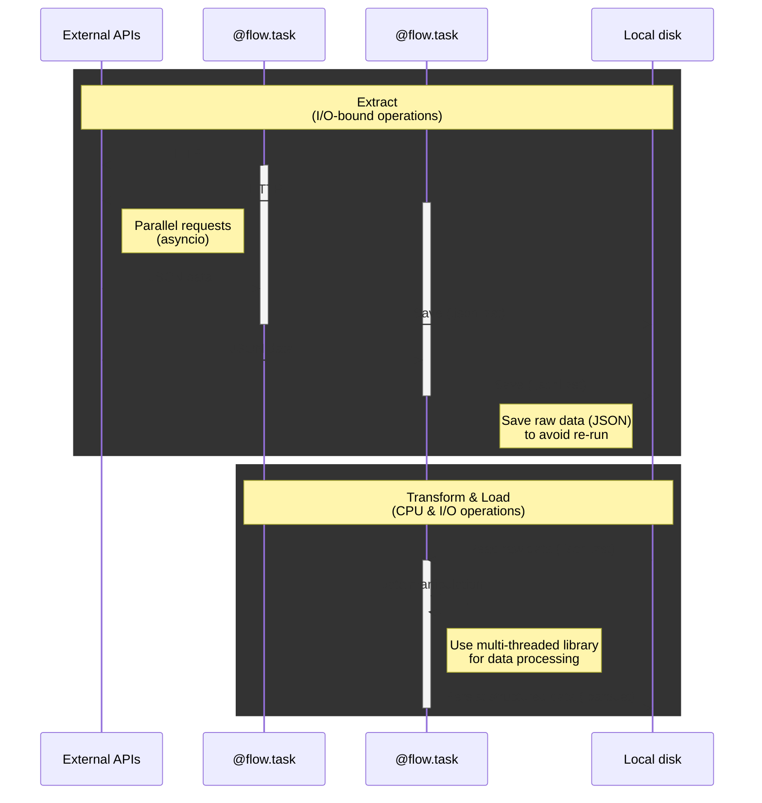

# Overview

**AsFlow** (short for "Async workflow") is a lightweight, asynchronous workflow runner built in pure Python. It's designed for ETL (Extract–Transform–Load) pipelines with a focus on minimal setup, fast iteration, and seamless integration with tools like [Polars](https://pola.rs) and [Streamlit](https://streamlit.io).


## Basic Concept

With today’s **powerful local machines** and **highly optimized libraries**, many data processing workflows can run efficiently on your computer without requiring a cloud setup.

A typical ETL pipeline has two main stages:

#### 1. Extract (I/O-bound)

This stage involves fetching data from external sources like APIs or websites. Since network requests can be slow and unreliable, this step is ideal for asynchronous execution using Python’s `asyncio`. It allows multiple data sources to be queried concurrently, dramatically speeding up the extraction phase.

#### 2. Transform & Load (CPU-bound)

Once raw data is collected, it needs to be cleaned, filtered, transformed, and loaded into a usable format—such as structured tables or analytical files. This is CPU-intensive work, and libraries like [Polars](https://pola.rs) can leverage multi-core processing to accelerate it significantly.



### Why Separating These Stages Matters

The **Extract** stage is usually the slowest and most fragile part of the pipeline. Network timeouts, API rate limits, and unexpected data formats can cause failures.

To make your workflow more robust, it’s a good practice to immediately save raw data after downloading—using formats like JSON, CSV, or plain text. If anything goes wrong later (during transformation or analysis), you can simply reuse the saved files instead of starting from scratch.

**AsFlow** helps you structure these steps as modular, fault-tolerant tasks. If something fails, you can resume the pipeline from the last successful step—no wasted work.

Once data is safely stored, you’re free to iterate on your transformation logic: extract new fields, compute aggregates, reshape tables—all without having to re-fetch the data.

### Iterative Data Engineering with Streamlit

Using [Streamlit](https://streamlit.io) together with AsFlow makes it easy to build and test ETL pipelines in a highly interactive way.

Whenever you update your code—like changing a filter or modifying how data is processed—Streamlit automatically re-runs your script and updates the dashboard in your browser. You don’t need to restart anything manually.

This means you can see the results of your changes right away, making it easier to experiment, fix problems, and understand how each step affects your data.

## Your First Data Pipeline

Unlike many orchestration tools, AsFlow uses plain Python—no DSLs, config files, or boilerplate-heavy frameworks.

Let’s begin with a simple example and gradually improve it:

```python
# Task definitions

def get_urls():
    return [...]

def download(url):
    return ...

def transform(data):
    return ...

# Data pipeline

def pipeline():
    # 1. Get a list of URLs
    urls = get_urls()

    # 2. Download data from each url
    data = []
    for url in urls:
        data.append(download(url))

    # 3. Process all data
    return transform(data)

if __name__ == "__main__":
    pipeline()
```

This version is easy to understand—but it’s entirely sequential, so performance will degrade as the number of URLs increases.

### Improving Performance with Concurrency

To accelerate the pipeline, you can parallelize I/O-heavy tasks such as downloading. Python provides several options:

#### Using `ThreadPoolExecutor`

One traditional approach is to use `ThreadPoolExecutor` from the `concurrent.futures` module:

```python
from concurrent.futures import ThreadPoolExecutor

def pipeline():
    urls = get_urls()

    # Download data concurrently
    with ThreadPoolExecutor() as executor:
        data = list(executor.map(download, urls))

    return transform(data)
```

#### Using `asyncio.TaskGroup` (Python 3.11+)

For I/O-bound workloads like HTTP requests, asynchronous programming with `asyncio` offers a modern, efficient solution:

```python
import asyncio

# Define async download task
async def download(url):
    return ...

async def pipeline():
    urls = get_urls()

    # Download concurrently using TaskGroup
    async with asyncio.TaskGroup() as tg:
        tasks = [tg.create_task(download(url)) for url in urls]

    return transform(await asyncio.gather(*tasks))
```

Both approaches help—but there’s still a major limitation:

**Each run re-downloads everything—even if the data hasn’t changed.**

### How AsFlow Helps

AsFlow helps you save raw data the first time you run a task, so you can avoid redundant downloads and safely resume workflows.

It also provides a set of features tailored for ETL pipelines:

- ✅ Native support for both **synchronous and asynchronous tasks**
- 🔁 Built-in **retries** for transient failures
- 🧵 Configurable **concurrency limits** to avoid API throttling
- 📦 Persistent storage of **raw data** (e.g., JSON, CSV, text)
- 🗜️ Automatic support for **compressed files** like `.gz` and `.zst`
- 📊 **Rich-powered** logging with progress bars and status indicators

## Flows and tasks

At the core of AsFlow is the concept of a **flow**—a lightweight wrapper that turns ordinary Python functions into modular, reusable components with file-based persistence.

AsFlow encourages you to structure your code using two types of functions:

- **Flows**: High-level data pipeline, decorated with `@flow`
- **Tasks**: Individual units of work, decorated with `@flow.task`

Here’s a minimal example:

```python
import asyncio
from asflow import flow

# Define a task function
@flow.task
async def download(url):
    return ...

# Define a flow function
@flow
async def pipeline():
    urls = get_urls()

    async with asyncio.TaskGroup() as tg:
        tasks = [tg.create_task(download(url)) for url in urls]

    return transform(await asyncio.gather(*tasks))
```

### No DAGs, Just Python

Traditional workflow tools often rely on DAGs (Directed Acyclic Graphs) to define execution order, managed by external schedulers.

**AsFlow does not use DAGs.**
A flow is simply an `async` function. You write your logic in plain Python and control the execution order directly—just like any other async program.

This design gives you the flexibility to use standard Python tools for managing concurrency and handling errors. You can run multiple tasks, or multiple flows, at the same time using `asyncio.TaskGroup` like this:

```python
async with asyncio.TaskGroup() as tg:
    # These tasks run concurrently
    tg.create_task(task1())
    tg.create_task(task2())
```

### Working with Synchronous Functions

AsFlow supports both asynchronous and synchronous functions for **tasks**. The best approach depends on how long the task runs and whether it blocks the event loop.

#### Short-Running Sync Tasks

For fast, non-blocking operations, you can call synchronous tasks directly in your flow:

```python
@flow.task
def get_config():
    return {"key": "value"}

@flow
async def pipeline():
    config = get_config()
    ...
```

In this case, AsFlow executes the task in the main thread, which is fine for quick operations like returning a small config or reading a tiny file.

#### Long-Running Sync Tasks

For blocking operations (e.g., file I/O, CPU-bound processing), you should offload the task using `asyncio.to_thread()`:

```python
@flow.task
def get_urls():
    return [...]

@flow
async def pipeline():
    urls = await asyncio.to_thread(get_urls)
    ...
```

This allows the event loop to stay responsive while your sync function runs in a background thread.

#### Running Many Blocking Tasks

If you need to run many blocking tasks concurrently, wrap them in an `async` task and use `asyncio.to_thread()` inside:

```python
@flow.task
async def download(url):
    return await asyncio.to_thread(blocking_download, url)

@flow
async def pipeline():
    async with asyncio.TaskGroup() as tg:
        for url in urls:
            tg.create_task(download(url))
```

This approach gives you the benefits of parallelism without blocking the event loop and lets AsFlow track and limit concurrent tasks effectively.

### Running Multiple Flows Concurrently

When running multiple flows at the same time, it’s essential to preserve their **asynchronous behavior**. A single blocking task can stall the entire process, negating the benefits of concurrency.

Consider the example below:

```python
# This flow runs tasks concurrently using asyncio
@flow
async def pipeline1():
    async with asyncio.TaskGroup() as tg:
        tg.create_task(task1())
        tg.create_task(task2())

# This flow includes a blocking operation
@flow
async def pipeline2():
    long_running_task()  # blocks the event loop

# Run both flows at the same time
async def main():
    async with asyncio.TaskGroup() as tg:
        tg.create_task(pipeline1())
        tg.create_task(pipeline2())
```

Even though `pipeline1()` uses `asyncio.TaskGroup` to run tasks in parallel, its execution will be blocked by `pipeline2()`, because `long_running_task()` is synchronous and blocks the event loop.

To avoid this, ensure that long-running or blocking functions are offloaded using `asyncio.to_thread()` or rewritten as async functions. This allows all flows to make full use of asynchronous concurrency.

!!! warning

    AsFlow is designed for lightweight, async-friendly task orchestration. It does not manage process-level concurrency or distributed execution. For more complex pipelines, consider integrating it with tools like **Ray**, **Dask**, or **Airflow** when scaling beyond a single machine.

## Persisting Task Results

In production ETL pipelines, it’s often essential to **persist intermediate results**. This improves reliability, reduces memory usage, and allows workflows to resume from checkpoints—saving time and avoiding redundant work after failures.

### Manual Persistence

Let’s enhance our pipeline by saving downloaded data to a `data/` directory:

```python
import polars as pl
from asflow import flow

@flow.task
async def download(url):
    filename = f"data/{hash(url)}.jsonl"
    with open(filename, "w") as f:
        f.write(...)  # write JSON records, one per line

@flow.task
def transform():
    # Combine all downloaded files into a single DataFrame
    return pl.read_ndjson("data/*.jsonl")

@flow
async def pipeline():
    urls = get_urls()

    async with asyncio.TaskGroup() as tg:
        for url in urls:
            tg.create_task(download(url))

    return transform()
```

Since each task writes directly to disk, we avoid storing large datasets in memory. This also simplifies the pipeline code, as there’s no longer a need to pass data through intermediate variables.

### Automatic Persistence

By default, `@flow.task` does not save task results between runs. If you want to avoid re-running expensive tasks, you need to explicitly enable persistence.

The built-in method to persist a task’s output is by using the `on` argument in `@flow.task`. This saves the result to a file after the first successful run and automatically skips the task in future runs if the file already exists.

```python
from asflow import flow

# Set the output file pattern
@flow.task(on="data/*.jsonl.zst")
async def download(url):
    flow.task.write("...")
```

The wildcard (`*`) in the path is replaced with a unique hash based on the task name and input (like the URL). You can use `.gz` or `.zst` file extensions to enable compression automatically.

This method is best for **raw data extraction**, where the result doesn’t change often and can be easily written to disk.

## Example: A Robust, Persistent ETL Pipeline

The example below shows a complete ETL workflow using AsFlow. It highlights how to:

- ✅ **Fetch data asynchronously** with non-blocking I/O for speed and responsiveness
- 💾 **Persist raw files to disk**, so data is only downloaded once
- ♻️ **Cache transformed results**, avoiding redundant computation
- 🌐 **Integrate with Streamlit** to create a real-time, interactive dashboard

```python
import asyncio
import httpx
import polars as pl
import streamlit as st
from asflow import flow

@flow.task
def get_urls():
    return [f"https://api.local/contents/{i}" for i in range(10)]

@flow.task(on="data/*.jsonl.zst")
async def download(url):
    # Use httpx for async data transfer
    async with httpx.AsyncClient() as client:
        r = await client.get(url)
        flow.task.write(r.text)

@flow.task
def transform():
    df = pl.read_ndjson("data/*.jsonl.zst")
    # Apply filtering, cleanup, or transformations here
    return df

@flow
async def pipeline():
    urls = get_urls()

    async with asyncio.TaskGroup() as tg:
        for url in urls:
            tg.create_task(download(url))

    return transform()

# Run and cache the pipeline result in Streamlit
@st.cache_data
def read_data():
    return asyncio.run(pipeline())

# Display the result in Streamlit
df = read_data()
st.write(df)
```

### How It Works

#### 🔄 Asynchronous Downloads with File-Based Caching

The `download()` task uses `httpx` to fetch data asynchronously. AsFlow’s `on="data/*.jsonl.zst"` ensures that each result is saved to disk and re-used on future runs. If the data hasn’t changed, it won’t be re-downloaded.

#### 🧪 Data Transformation with Polars

Once data is downloaded, the `transform()` task loads and processes it using **Polars**, a fast, multi-threaded DataFrame library ideal for ETL workloads.

#### 📊 Real-Time Exploration with Streamlit

The entire pipeline runs behind a cached `read_data()` function in **Streamlit**. The dashboard updates automatically when relevant code or inputs change, making it perfect for exploratory analysis or debugging.
