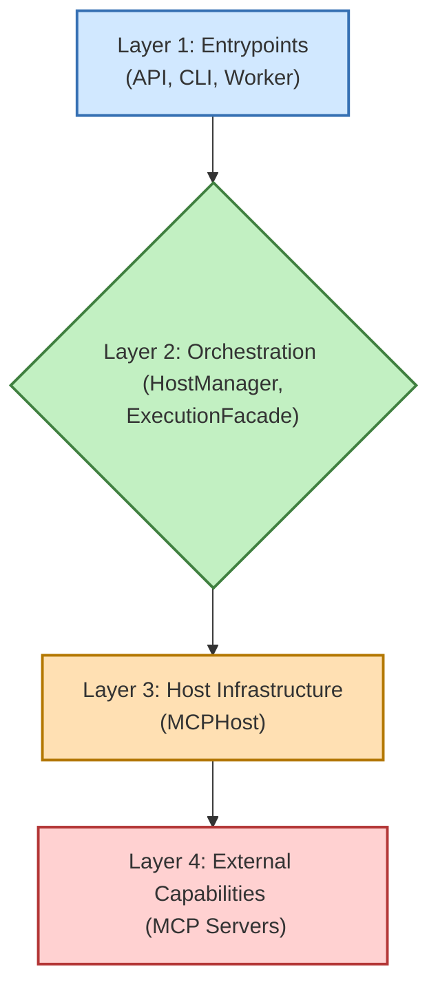

# Aurite Agents Framework

**Aurite Agents** is a Python framework designed for building and orchestrating AI agents. These agents can interact with a variety of external tools, prompts, and resources through the Model Context Protocol (MCP), enabling them to perform complex tasks.

Whether you're looking to create sophisticated AI assistants, automate processes, or experiment with agentic workflows, Aurite Agents provides the building blocks and infrastructure to get you started.

## Getting Started

Follow these steps to set up the Aurite Agents framework on your local machine.

### Prerequisites

*   Python >= 3.12 (if running locally without Docker for all services)
*   `pip` (Python package installer)
*   Node.js (LTS version recommended, for frontend development if run locally without Docker)
*   Yarn (Package manager for frontend, if run locally without Docker)
*   Docker & Docker Compose (for the quickstart script and containerized setup)
*   `redis-server` (Required if you plan to use the asynchronous task worker, whether locally or if you add it to Docker Compose)

### Installation

1.  **Clone the Repository:**
    ```bash
    git clone https://github.com/Aurite-ai/aurite-agents.git
    cd aurite-agents
    ```

### Quickstart with Docker (Recommended)

The fastest way to get the entire Aurite Agents environment (Backend API, Frontend UI, and PostgreSQL database) up and running is by using the provided setup script with Docker.

1.  **Ensure Docker is running.**
2.  **Run the appropriate setup script for your operating system:**
    *   **For Linux/macOS:**
        In the project root directory (`aurite-agents`), execute:
        ```bash
        ./setup.sh
        ```
    *   **For Windows:**
        In the project root directory (`aurite-agents`), execute:
        ```bat
        setup.bat
        ```
    These scripts will:
    *   Check for Docker and Docker Compose.
    *   Guide you through creating and configuring your `.env` file (including API keys and project selection).
    *   Ask if you want to install optional ML dependencies for your local Python environment (useful if you plan to run or develop certain MCP Servers locally that require them).
    *   Build and start all services using Docker Compose.

    Once complete, the backend API will typically be available at `http://localhost:8000` and the frontend UI at `http://localhost:5173`. The script will display the generated API key needed for the UI.

    **Note on Initial Startup:** The backend container might take a few moments to start up completely, especially the first time, as it initializes MCP servers. During this time, the frontend UI might show a temporary connection error. Please allow a minute or two for all services to become fully operational.

#### Running Docker Compose Directly (Alternative to Setup Scripts)

If you prefer to manage your `.env` file manually or if the setup scripts encounter issues, you can still use Docker Compose:

1.  **Create/Configure `.env` File:** Ensure you have a valid `.env` file in the project root. You can copy `.env.example` to `.env` and fill in the necessary values (especially `ANTHROPIC_API_KEY`, `API_KEY`, and `PROJECT_CONFIG_PATH`).
2.  **Run Docker Compose:**
    ```bash
    docker compose up --build
    ```
    (Use `docker-compose` if you have an older standalone version).

### Manual Installation & Backend Setup

If you prefer to set up and run components manually or without Docker for all services:

1.  **Create and Activate a Virtual Environment (Recommended):**
    ```bash
    python -m venv .venv
    source .venv/bin/activate  # On Windows: .venv\Scripts\activate
    ```

2.  **Install Dependencies:**
    The project uses `pyproject.toml` for dependency management. Install the framework and its dependencies (the `[dev]` is for dev dependencies like pytest) in editable mode:
    ```bash
    pip install -e .[dev]
    ```
    This command allows you to make changes to the source code and have them immediately reflected without needing to reinstall.

3.  **Environment Variables Setup:**
    Before running the system, you need to set up your environment variables.

    a.  **Copy the Example File:** In the project root, copy the `.env.example` file to a new file named `.env`:
        ```bash
        cp .env.example .env
        ```
    b.  **Edit `.env`:** Open the newly created `.env` file and fill in your specific configurations and secrets. Pay close attention to comments like `#REPLACE` indicating values you must change.

    Key variables you'll need to configure in your `.env` file include:

    *   `PROJECT_CONFIG_PATH`: **Crucial!** Set this to the absolute path of the main JSON project configuration file you want the server to load on startup (e.g., `config/projects/default.json`).
    *   `API_KEY`: A secret key to secure the FastAPI endpoints. Generate a strong random key.
    *   `ANTHROPIC_API_KEY` (or other LLM provider keys): Required if your agents use specific LLMs like Anthropic's Claude.

    The `.env` file also contains settings for Redis, optional database persistence (`AURITE_ENABLE_DB`, `AURITE_DB_URL`, etc.), and other service configurations. Review all entries marked with `#REPLACE`.

    **Important Security Note: Encryption Key**

    *   **`AURITE_MCP_ENCRYPTION_KEY`**: This environment variable is used by the framework's `SecurityManager` to encrypt sensitive data.
        *   If not set, a key will be **auto-generated on startup**. This is convenient for quick local testing.
        *   **However, for any persistent deployment, or if you intend to use features that rely on encrypted storage (even for development), it is critical to set this to a strong, persistent, URL-safe base64-encoded 32-byte key.**
        *   Relying on an auto-generated key means that any encrypted data may become inaccessible if the application restarts and generates a new key.
        *   Please refer to `SECURITY.md` (to be created) for detailed information on generating, managing, and understanding the importance of this key. You can find `AURITE_MCP_ENCRYPTION_KEY` commented out in your `.env.example` file as a reminder.

4.  **Running the Backend API Server:**
    The primary way to interact with the framework is through its FastAPI server:
    ```bash
    python -m src.bin.api.api
    ```
    or use the `pyproject.toml` script:
    ```bash
    start-api
    ```
    (This script is available after running `pip install -e .[dev]` as described in the Manual Installation section. If using Docker, the API starts automatically within its container.)

    By default, it starts on `http://0.0.0.0:8000`. You can then send requests to its various endpoints to execute agents, register components, etc. (e.g., using Postman or `curl`).

### Frontend UI Setup

To set up and run the frontend developer UI for interacting with the Aurite Agents Framework:

**Note:** Ensure the backend API server (Step 4 in Manual Setup above) is running before starting the frontend if you are not using the Docker quickstart.

1.  **Navigate to the Frontend Directory:**
    Open a new terminal or use your existing one to change into the `frontend` directory:
    ```bash
    cd frontend
    ```

2.  **Install Frontend Dependencies:**
    If you don't have Yarn installed, you can install it by following the instructions on the [official Yarn website](https://classic.yarnpkg.com/en/docs/install).

    Inside the `frontend` directory, install the necessary Node.js packages using Yarn:
    ```bash
    yarn install
    ```

3.  **Start the Frontend Development Server:**
    Once dependencies are installed, start the Vite development server:
    ```bash
    yarn dev
    ```
    The frontend UI will typically be available in your web browser at `http://localhost:5173`.

## Architecture Overview

The framework follows a layered architecture, illustrated below:



For a comprehensive understanding of the architecture, component interactions, and design principles, please see [`docs/framework_overview.md`](docs/framework_overview.md). Detailed information on each specific layer can also be found in the `docs/layers/` directory.

## Core Concepts for Users

Understanding these concepts will help you configure and use the Aurite Agents framework effectively. For detailed information on each configuration object, refer to the [Component Configurations documentation](./docs/components/README.md).

### 1. Projects (`ProjectConfig`)

A **Project** in Aurite Agents is defined by a JSON configuration file (e.g., `aurite_config.json` or `config/projects/default.json`). This file acts as a central manifest for your agentic application, specifying:
*   The name and description of the project.
*   Which LLM configurations to use.
*   Which MCP Servers (Clients) to connect to.
*   Which Agents, Simple Workflows, and Custom Workflows are part of this project.

The active project configuration tells the `Aurite` (formerly HostManager) instance what components to load and make available. For detailed configuration options, see [`docs/components/project_configs.md`](./docs/components/project_configs.md).

### 2. Agentic Components

These are the primary building blocks you'll work with:

*   **Agents (`AgentConfig`):**
    *   LLM-powered entities that can engage in conversations, use tools (via Clients), and optionally maintain history.
    *   Key settings include the LLM to use (`llm_config_id`), system prompts, `client_ids` for tool access, and the `auto` mode for dynamic tool selection.
    *   Configured via `AgentConfig` models. For detailed configuration options, see [`docs/components/agents.md`](./docs/components/agents.md).

    ```mermaid
    graph TD
        Agent["Agent <br/> (AgentConfig)"] --> LLM["LLM <br/> (LLMConfig)"];
        Agent --> Clients["MCP Clients <br/> (ClientConfig)"];

        Clients --> MCP1["MCP Server 1 <br/> (e.g., Weather Tool)"];
        Clients --> MCP2["MCP Server 2 <br/> (e.g., Database)"];
        Clients --> MCP3["MCP Server 3 <br/> (e.g., Custom API)"];

        style Agent fill:#ADD8E6,stroke:#00008B,stroke-width:2px,color:#333333
        style LLM fill:#FFFFE0,stroke:#B8860B,stroke-width:2px,color:#333333
        style Clients fill:#E6E6FA,stroke:#483D8B,stroke-width:2px,color:#333333
        style MCP1 fill:#90EE90,stroke:#006400,stroke-width:2px,color:#333333
        style MCP2 fill:#90EE90,stroke:#006400,stroke-width:2px,color:#333333
        style MCP3 fill:#90EE90,stroke:#006400,stroke-width:2px,color:#333333
    ```

*   **Simple Workflows (`WorkflowConfig`):**
    *   Define a linear sequence of Agents to be executed one after another.
    *   Useful for straightforward, multi-step tasks where the output of one agent becomes the input for the next.
    *   Configured via `WorkflowConfig` models. For detailed configuration options, see [`docs/components/simple_workflows.md`](./docs/components/simple_workflows.md).

    ```mermaid
    graph LR
        Agent1["Agent A"] -->|Input/Output| Agent2["Agent B"];
        Agent2 -->|Input/Output| Agent3["Agent C"];

        style Agent1 fill:#ADD8E6,stroke:#00008B,stroke-width:2px,color:#333333
        style Agent2 fill:#ADD8E6,stroke:#00008B,stroke-width:2px,color:#333333
        style Agent3 fill:#ADD8E6,stroke:#00008B,stroke-width:2px,color:#333333
    ```

*   **Custom Workflows (`CustomWorkflowConfig`):**
    *   Allow you to define complex orchestration logic using custom Python classes.
    *   Provide maximum flexibility for intricate interactions, conditional logic, and parallelism.
    *   Configured via `CustomWorkflowConfig` models, pointing to your Python module and class. For detailed configuration options and an example Python class structure, see [`docs/components/custom_workflows.md`](./docs/components/custom_workflows.md).
    *   The example Python class structure from the previous version of this README has been moved to the `custom_workflows.md` document for better organization.

### 3. LLM Configurations (`LLMConfig`)

*   Define settings for different Large Language Models (e.g., provider, model name, temperature, max tokens).
*   Agents reference these LLM configurations by their `llm_id`.
*   Managed by `LLMConfig` models. For detailed configuration options, see [`docs/components/llms.md`](./docs/components/llms.md).

### 4. MCP Servers (as Clients via `ClientConfig`)

*   External processes that provide tools, prompts, or resources according to the Model Context Protocol (MCP).
*   The Aurite framework connects to these servers, referring to them as "Clients."
*   Configured via `ClientConfig` models, specifying the server's connection details (e.g., `server_path` for `stdio` transport, `http_endpoint` for `http_stream` transport), capabilities, and access rules.
*   For detailed configuration options, see [`docs/components/clients.md`](./docs/components/clients.md).

## Configuration System Overview (User Perspective)

*   **Main Project File:** The system loads its entire configuration based on the project file (e.g., `aurite_config.json` or the file specified by `PROJECT_CONFIG_PATH`). This project file defines configurations directly or, more commonly, references other JSON files for specific components like agents, clients, and LLMs. For an example project file structure and details, see [`docs/components/project_configs.md`](./docs/components/project_configs.md).
*   **Component JSON Files:** You'll typically define your agents, LLM settings, client connections, and workflows in separate JSON files within the `config/` subdirectories (e.g., `config/agents/`, `config/llms/`). The main project file then lists these files.
*   **Pydantic Models:** All configuration files are validated against Pydantic models defined in `src/config/config_models.py`. This ensures your configurations are correctly structured.
*   **Database Persistence (Optional):** If `AURITE_ENABLE_DB` is set to `true` and database connection variables are provided, the framework can persist agent configurations and conversation history.

## Other Entrypoints

Besides the main API server, the framework offers other ways to interact:

*   **Command-Line Interface (`src/bin/cli.py`):** For terminal-based interaction.
    The `run-cli` script is available after performing the Manual Installation and running `pip install -e .[dev]`.
    ```bash
    # Example: Execute an agent (ensure API server is running)
    # Assumes API_KEY environment variable is set.
    run-cli execute agent "Weather Agent" "What is the weather in London?"

    # Example: Execute a simple workflow
    run-cli execute workflow "main" "What should I wear in San Francisco today?"

    # Example: Execute a custom workflow (input must be a valid JSON string)
    run-cli execute custom-workflow "ExampleCustomWorkflow" "{\"city\": \"London\"}"
    ```
    **Using CLI with Docker:** If you are using the Docker setup, these CLI commands need to be run *inside* the backend service container. You can do this by first finding your backend container ID or name (e.g., using `docker ps`) and then executing the command:
    ```bash
    docker exec -it <your_backend_container_name_or_id> run-cli execute agent "Weather Agent" "What is the weather in London?"
    ```
    Ensure the `API_KEY` environment variable is set within the container's environment (it should be if you used the setup scripts or configured your `.env` file correctly).

*   **Redis Worker (`src/bin/worker.py`):** For asynchronous task processing (if Redis is set up and `redis-server` is running).
    ```bash
    python -m src.bin.worker
    ```

## Simplified Directory Structure

Key directories for users:

*   **`config/`**: This is where you'll spend most of your time defining configurations.
    *   `config/projects/`: Contains your main project JSON files.
    *   `config/agents/`: JSON files for Agent configurations.
    *   `config/clients/`: JSON files for MCP Server (Client) configurations.
    *   `config/llms/`: JSON files for LLM configurations.
    *   `config/workflows/`: JSON files for Simple Workflow configurations.
    *   `config/custom_workflows/`: JSON files for Custom Workflow configurations.
*   **`src/bin/`**: Entrypoint scripts (API, CLI, Worker).
*   **`src/agents/`**: Core `Agent` class implementation.
*   **`src/workflows/`**: Implementations for `SimpleWorkflowExecutor` and `CustomWorkflowExecutor`.
*   **`src/packaged_servers/`**: Example MCP server implementations.
*   **`docs/`**: Contains all project documentation.
    *   `docs/framework_overview.md`: For a deep dive into the architecture.
    *   `docs/layers/`: Detailed documentation for each architectural layer.
*   **`tests/`**: Automated tests. See `tests/README.md` for instructions on running tests.
*   **`.env`**: (You create this) For environment variables like API keys and `PROJECT_CONFIG_PATH`.

## Further Documentation

*   **Framework Architecture:** For a detailed understanding of the internal architecture, component interactions, and design principles, please see [`docs/framework_overview.md`](docs/framework_overview.md).
*   **Layer-Specific Details:**
    *   [`docs/layers/1_entrypoints.md`](docs/layers/1_entrypoints.md) (API, CLI, Worker)
    *   [`docs/layers/2_orchestration.md`](docs/layers/2_orchestration.md) (HostManager, ExecutionFacade)
    *   [`docs/layers/3_host.md`](docs/layers/3_host.md) (MCPHost System)
*   **Testing:** Information on running tests can be found in `tests/README.md`. Testing strategies for each layer are also detailed within their respective documentation in `docs/layers/`.

## Contributing

Contributions are welcome! Please follow standard fork/pull request workflows. Ensure tests pass and documentation is updated for any changes.
