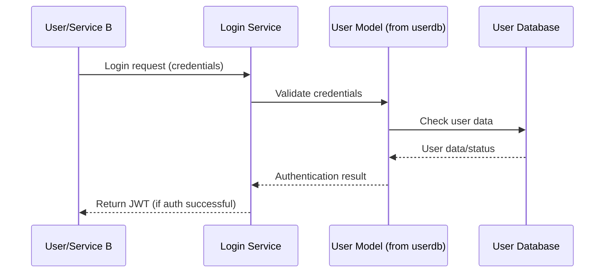
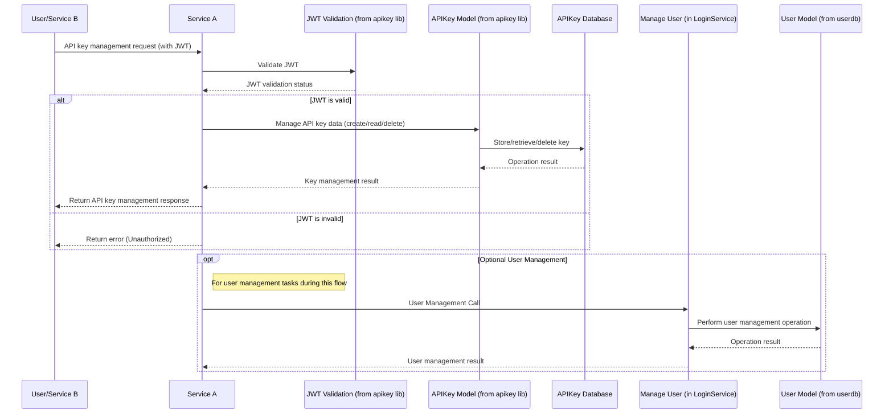
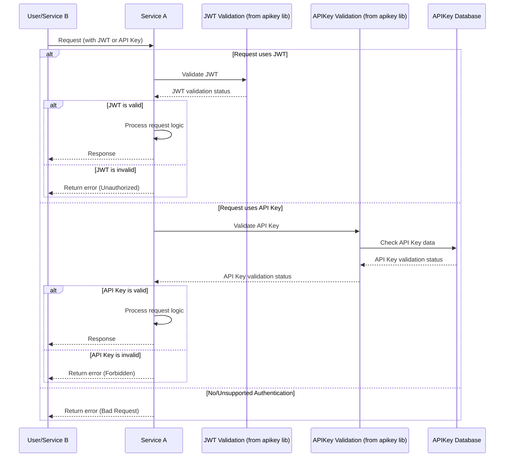

# System Architecture

## Overview
This architecture implements a distributed API key management pattern with centralized user authentication. It provides a secure, scalable, and maintainable approach to handling both user authentication and service-to-service authorization.

## Core Components

### 1. userdb (Shared Component)
- **Purpose**: Provides the core User data model and database access logic.
- **Key Features**:
  - User model and table definitions.
  - Database access layer for user data.
  - Utilities related to user data management.
- **Usage**: Imported as a dependency by services requiring direct interaction with the user data structure, like `Login Service`.

### 2. Login Service
- **Purpose**: Handles user authentication, JWT issuance, and user management.
- **Key Features**:
  - User login endpoints.
  - JWT generation.
  - User management functionalities.
- **Dependencies**:
  - `User Model` (from the `userdb` component) for interacting with user data.

### 3. API Key Management (apikey project/library)
- **Purpose**: Provides API key model, persistence, validation logic, and also bundles JWT validation logic.
- **Key Features**:
  - `APIKey Model` and table definitions.
  - Database access layer for API key data (`APIKey Database`).
  - API key generation and `API Key Validation` logic.
  - Key management endpoint logic (to be hosted by a service like Service A).
  - `JWT Validation` logic.
- **Usage**: Integrated as a direct dependency (library) by services like `Service A` that need to perform API key operations or JWT validation.

### 4. Service A (Example Downstream Service)
- **Purpose**: Business logic service that also handles API key management for its users and validates incoming requests.
- **Key Features**:
  - Core business functionality.
  - Hosts API key management endpoints (using logic from its `apikey` library dependency).
  - Validates user identity via JWTs for its own endpoints and for API key management actions.
  - Validates API keys for service-to-service or direct API key based user communication.
- **Dependencies**:
  - `Manage User` functionality (from `Login Service`) for user management tasks.
  - `apikey` library for its functionalities, which include:
    - `API Key Validation`.
    - `JWT Validation`.
    - Logic for interacting with the `APIKey Model`.

## Authentication Flow

### 1. User Authentication via Login Service
This diagram illustrates the process of a user or service authenticating via the Login Service to obtain a JWT.

### 2. API Key Management via Service A
This diagram shows how a user, authenticated with a JWT, manages their API keys through endpoints hosted on Service A.

### 3. Service/User Communication with Service A
This diagram details how an incoming request to Service A is authenticated, supporting both JWT and API Key methods.

## Architecture Diagrams

### Component Architecture

```mermaid
graph TB
    %% LoginService Subgraph
    subgraph LoginService [Login Service]
        style LoginService stroke:#ff0000,stroke-width:2px,stroke-dasharray:5
        LS[Login Service]
        MNG[Manage User]
    end

    %% ServiceB Subgraph
    subgraph ServiceB [User/Service B]
        style ServiceB stroke:#00ff00,stroke-width:2px,stroke-dasharray:5
        SB[User/Service B]
    end

    %% ServiceA Subgraph
    subgraph ServiceA [Service A]
        style ServiceA stroke:#0000ff,stroke-width:2px,stroke-dasharray:5
        SA[Service A]

        %% APIKey Subgraph
        subgraph APIKey [apikey]
            AP[apikey]
            subgraph APIKeyPersistence
                AKM[APIKey Model]
                AKDB[(APIKey Database)]
            end
            JWTV[JWT Validation]
            AKV[API Key Validation]
        end
    end

    %% UserDB Subgraph
    subgraph UserDB [User Database]
        style UserDB stroke:#ffa500,stroke-width:2px,stroke-dasharray:5
        UM[User Model]
        UDB[(User Database)]
    end

    %% Connections
    LS --> UM
    SA --> MNG
    AP --> AKM
    SA --> AKV
    SA --> JWTV
    UM --> UDB
    AKM --> AKDB
    AKV --> AKDB
    SA --> AP
    SB -.-> LS
    SB -.-> SA
    MNG --> UM

    %% Comments for additional context
    %% Each styled subgraph (LoginService, ServiceA, ServiceB, UserDB) represents a service deployable on a separate machine.
    %% The dashed borders and distinct colors emphasize separate deployment boundaries.
```

## Key Design Principles

1. **Separation of Concerns**
   - User data modeling and persistence logic in the `userdb` component.
   - User authentication and active user management in `Login Service`.
   - API key data modeling, persistence, API key validation, and JWT validation logic bundled within the `apikey` library/project.
   - Business logic and hosting of API key management endpoints in individual services like `Service A`.

2. **Shared Component Pattern & Direct Dependencies**
   - `userdb` is a shared component providing the `User Model` used by `Login Service`.
   - `apikey` is a library directly owned and used by services like `Service A`, providing a suite of functionalities including API key operations and JWT validation.

3. **Distributed API Key Management**
   - Services like `Service A` host endpoints for API key management, utilizing the `apikey` library.
   - `APIKey Database` is independent.

4. **Security**
   - JWT-based user authentication initiated by `Login Service`.
   - JWTs validated by services (like `Service A`) using the `JWT Validation` capability from their `apikey` library dependency.
   - API key-based service authorization, validated by services (like `Service A`) using the `API Key Validation` capability from their `apikey` library dependency.
   - User data centrally accessed via `User Model` (typically by `Login Service`).
   - API key data managed via `APIKey Model` (by services owning the `apikey` library).

## Deployment Considerations

1. **Database**
   - Separate databases: `User Database` for user data and `APIKey Database` for API key data.
   - `Login Service` (via its `userdb` dependency's `User Model`) interacts with `User Database`.
   - Services like `Service A` (via their `apikey` library dependency) interact with `APIKey Database`.

2. **Services & Libraries**
   - `Login Service` and `Service A` are deployed as independent services.
   - `userdb` is a library, primarily a dependency for `Login Service`.
   - `apikey` is a library, a direct dependency for services like `Service A`.
   - `Service A` depends on `Login Service` for user management functionalities (via `MNG`).

3. **Scaling**
   - Services (`Login Service`, `Service A`) can scale independently.
   - Databases (`User Database`, `APIKey Database`) can be scaled based on load.

## Security Considerations

1. **Authentication**
   - User authentication handled by `Login Service` using the `User Model` (from `userdb`).
   - JWTs issued by `Login Service`.
   - JWT validation performed by services like `Service A` using the `JWT Validation` logic from their integrated `apikey` library (assuming JWT_SECRET is available to this logic).

2. **Authorization**
   - API key validation performed by services like `Service A` using the `API Key Validation` logic from their integrated `apikey` library.
   - Clear separation of user authentication (JWT) and service/API authorization (API key).
   - API key management endpoints on `Service A` are protected by JWT authentication.

3. **Data Protection**
   - Secure storage of user data in `User Database`.
   - API key hashing and secure storage in `APIKey Database`.
   - Access to user data governed by `Login Service` and its use of `User Model`.
   - Access to API key data governed by services like `Service A` through their integrated `apikey` library.
