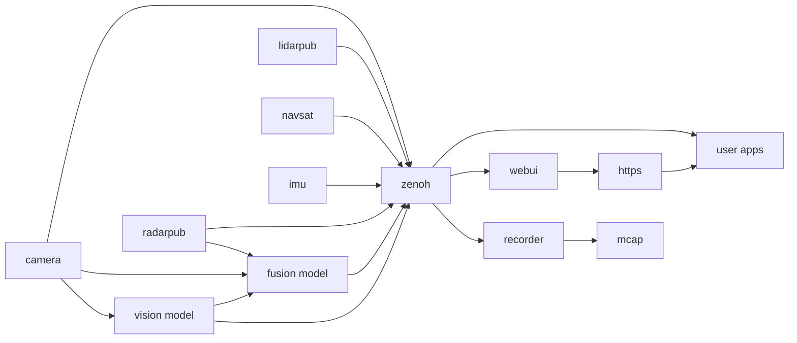

# EdgeFirst Middleware Schemas

This repository hosts the messaging schemas for the EdgeFirst Middleware Services.  This includes the custom schemas as well as the ROS2 Common Interfaces and Foxglove schemas used by EdgeFirst Middleware Services.  The EdgeFirst Middleware Services communicate over the Zenoh messaging framework and follow a ROS2 styled design.  EdgeFirst Middleware Services do not directly work with ROS2 but can be bridged to a system running ROS2 through the Zenoh ROS2 DDS Bridge.  Where relevant we base our ROS2 compatibility on the [ROS2 Humble Hawksbill](https://docs.ros.org/en/rolling/Releases/Release-Humble-Hawksbill.html) LTS release.

The messaging schemas are provided as CDR IDL as well as the Rust and Python structures for working with the schemas, these are also available through crates.io and pypi.org for easy installation into client applications.

# EdgeFirst Middleware Services

The EdgeFirst Perception Middleware is a modular software stack designed as a collection of services
communicating over a ROS2-like communication middleware called Zenoh. The various application services 
are each focused on a general task.  For example a camera service is charged with interfacing with the 
camera and ISP (Image Signal Processor) to efficiently deliver camera frames to other services which
require access to the camera.  The camera service is also responsible for encoding camera frames using 
a video codec into H.265 video for efficient recording or remote streaming, this feature of the camera
service can be configured or disabled if recording or streaming are not required.

The middleware services communicate with each other using the Zenoh networking middleware which provides 
a highly efficient publisher/subscriber communications stack.  While we do not directly depend on ROS2
the services do encode their messages using the ROS2 CDR (Common Data Representation). The middleware
uses the ROS2 standard schemas where applicable and augment them with custom schemas where required.
The Recorder and Foxglove chapters go into more detail on how this allows efficient streaming and 
recording of messages and interoperability with industry standard tools.



The camera service captures from the camera device and publishes topics for the camera info (format, size, calibration profiles), h264 or jpeg encoded streams, and a DMA topic.  The camera DMA topic replaces the typical Image schema in ROS2 with a schema optimized for embedded devices. Instead of costly memory copies the topic publishes file descriptors for the underlying dmabuf camera buffers which client applications can then use for high-performances video processing.  For example the detect service can map these camera buffers directly into the NPU accelerator with the VAAL library.

The detect topic handles object detection and tracking by running object detection models on the i.MX 8M Plus NPU and performing object tracking on the results.  The bounding boxes and track information along with model instrumentation are published on the boxes2d topic.  The detect service can also publish to a viz2d topic which provides out of the box visualizations in Foxglove but does not contain all the meta-data and instrumentation of the dedicated boxes2d topic.

The navsat and imu services publish GNSS (GPS and friends) and IMU sensor data, respectively.  These are used for localization and orientation tracking allowing the object detection and tracking topics to provide environmental context: where in the world are the objects being perceived.

# ROS2 Debian Packages

Debian/Ubuntu packages are provided to integrate the EdgeFirst Schemas into a standard ROS2 installation.  The package is available under releases and will target the current ROS2 LTS release.

## Building Debian Package

The EdgeFirst Schemas Debian package can be built from these sources, for example if targetting an alternative ROS2 release.

First source your desired ROS2 environment, then build using the colcon command.

```shell
source /opt/ros/humble/setup.bash
cd edgefirst_msgs
fakeroot debian/rules build
```

The package is then found in the project root as ros-DISTRO-edgefirst-msgs_VERSION_ARCH.deb and can be installed using dpkg -i PACKAGE.deb.

# Licenses

The EdgeFirst Middleware Schemas and libraries are dual-licensed under the Affero GPL 2.0 license or the EdgeFirst Middleware Commercial License for customers who have such a license.

The [ROS2 Common Interfaces](https://github.com/ros2/common_interfaces/tree/humble) schemas are under the Apache-2.0 license.

The [Foxglove Schemas](https://github.com/foxglove/schemas) are under the MIT license.

The Rust library is originally based on the [zenoh-ros-type](https://github.com/evshary/zenoh-ros-type) under the Apache-2.0 license.
