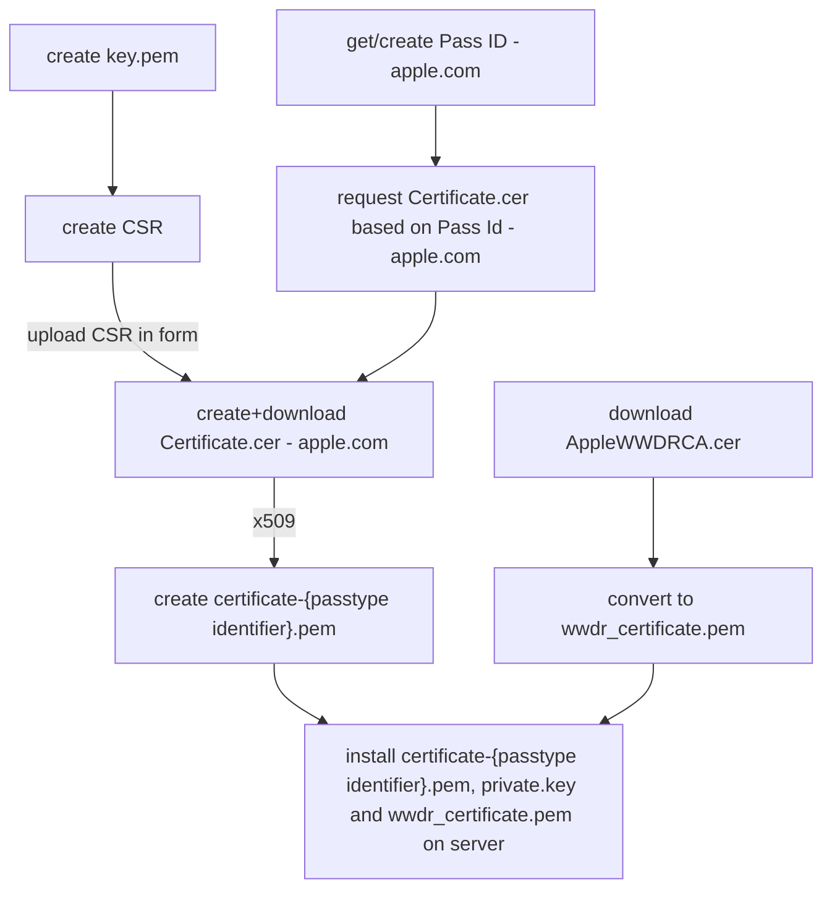

# Installation And Running Tests

## Preconditions

Python 3.10+, currently up to 3.13 is tested.
If [uv](https://github.com/astral-sh/uv) is installed Python does not need to be installed first.

## Installation

The package is hosted at the Python Package Index (PyPI) and can be installed using `pip install edutap.wallet_apple`.

We recommend working with `uv`

```bash
uv venv -p 3.13.0
source .venv/bin/activate
uv pip install edutap.wallet_apple
```

If you also need the [Apple Update Services](https://developer.apple.com/documentation/walletpasses/adding-a-web-service-to-update-passes) you need FastAPI as a dependency. In this case install with

```bash
uv pip install -e edutap.wallet_apple[fastapi]
```

## Running Tests for Development

Clone the repository and enter the directory.

```bash
uv pip install -e .[test,fastapi]
```

The unit tests can be run without the cert files:

```bash
pytest
```

Don't be surprised if many tests are skipped, that is because for many tests it is needed to install apple certificates for passes which is explained in the next section.

### Installation of Certificates

PKPASS is a file format, used for storage and exchange of digital passes, developed by Apple for its Wallet application (Formerly known as PassBook until iOS 9)

For signing the .pkpass files we need certificate and key files that need to be created.
Please follow exactly the steps described below.
You need an Apple developer account to obtain the certificate for the pass identifier.

To run integration tests a private key, a certificate and the Apple root certificate needs to be prepared.

This is the overall process to get the necessary certificates for issuing passes:



#### Preparing Private Key and Certificate Signing Request

> **_NOTE:_**  This is only necessary when you create a new certificate, if you already have certificates in your account you can download them.

1. Create your own private key
   ```shell
   openssl genrsa -out private.key 2048
   ```

2. Create a certificate signing request (CSR) with the private key

   Name and email do not necessarily have to match with the account data of your apple developer account.

   ```shell
   openssl req -new -key private.key -out request.csr -subj="/emailAddress=[your email addr],CN=[your full name],C=[your country ISO code]"
   ```

#### Get a Pass Type ID and Certificate from Apple

You need a developer account at Apple to get a pass type ID and a certificate for signing passes.
You can get a free developer account at [developer.apple.com](https://developer.apple.com/programs/)

To get the certificate:

* Visit the iOS Provisioning [Portal -> Pass Type IDs -> New Pass Type ID](https://developer.apple.com/account/resources/identifiers/list/passTypeId)
    - either create a new pass type ID by clicking the blue (+) icon on top of the menu
    - or select one of the existing pass type IDs

* In the screen labelled `Edit your Identifier Configuration` either
    - select an existing certificate and hit the `Download` button
    - or hit `Create Certificate` on the bottom of the page (there you need the above mentioned `request.cer`) and download it

* Convert the `certificate.cer` (X509 format) to a `certificate.pem` file by calling

 ⚠️ **Attention:**
the name of the certificate must be in the form `certificate-{passtype identifier}.pem` since the certificate is bound to the pass type identifier.

  ```shell
  openssl x509 -inform der -in pass.cer -out certificate-{passtype identifier}.pem
  ```

#### Apple Worldwide Developer Relations (WWDR) root certificate

The certificate is usually preinstalled in your OS, but either in case of expiration or if you want to run the integration tests, the most recent can be downloaded at
[Apple Certification Authority AppleWWDRCA.cer download](https://developer.apple.com/certificationauthority/AppleWWDRCA.cer)

```shell
curl https://www.apple.com/certificateauthority/AppleWWDRCAG4.cer -o AppleWWDRCA.cer
```

For more on expiration read [Apple Support - Expiration](https://developer.apple.com/support/certificates/expiration/).
There is also an [overview of downloadable Apple certificates](https://www.apple.com/certificateauthority/)

Once downloaded, convert the root certificate into a pem file"

```shell
openssl x509 -inform der -in AppleWWDRCA.cer -out wwdr_certificate.pem
```

Further reading: [Building a Pass - documentation at Apple](https://developer.apple.com/documentation/walletpasses/building_a_pass)

To check the expiration date of the certificate use:

```shell
openssl x509 -enddate -noout -in wwdr_certificate.pem
```

In case the provided certificate is expired, copy the certificate to the OS certificates folder (this depends on the system).

## Running the Integration Tests

⚠️ **Attention:**
 To run integration tests, the above mentioned files (`certificate.pem`, `private.key` and `wwdr_certificate.pem`) have to be located at `tests/data/certs/private`.
Create the folder if it is missing, do *never* add/commit them it to Git!

The call is the same as above, but with the certificates in place integration tests are detected.

```shell
pytest
```

The test `test_passbook_creation_integration` will create a passbook file and display it with the passbook viewer.
Displaying the pass works only under OSX since the passbook viewer is part of it.

It creates some `.pkpass`-files.
Those are located under `tests/data/generated_passes`.


Format code and run checks:

```bash
uvx --with tox-uv tox -e lint
```
