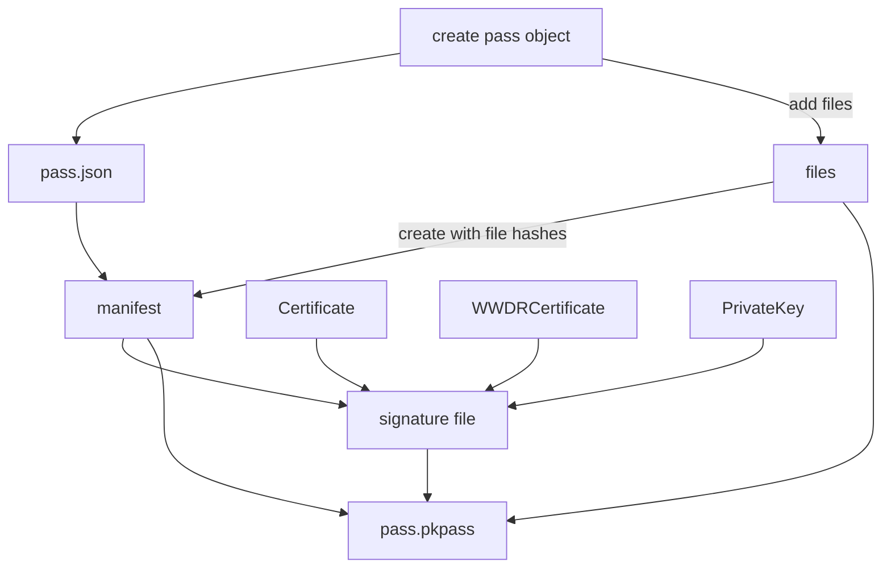

# Pass Lifecycle

## PkPass creation

The `edutap.wallet_apple` package provides a Python API to create Apple Wallet Passes.
The following diagram shows the process of creating a signed pass file.

## Notification

TODO document it

### Create a certificate for push notifications

TODO document it

### Further readings

- [apple doc for updating passes](https://developer.apple.com/documentation/walletpasses/adding_a_web_service_to_update_passes)

- [Apple Wallet Design Guideline](https://developer.apple.com/design/human-interface-guidelines/wallet)

- [Old Apple Documentation for pass design - specifies the image file names and dimensions](https://developer.apple.com/library/archive/documentation/UserExperience/Conceptual/PassKit_PG/Creating.html#//apple_ref/doc/uid/TP40012195-CH4-SW1)

- [apple instructions for building passes](https://developer.apple.com/documentation/walletpasses/building-a-pass)

- [passninja docs](https://www.passninja.com/tutorials/apple-platform/how-does-pass-updating-work-on-apple-wallet)

- [some useful diagrams](http://www.31a2ba2a-b718-11dc-8314-0800200c9a66.com/2016/08/apple-store-passbook-uml-diagrams-and.html)
