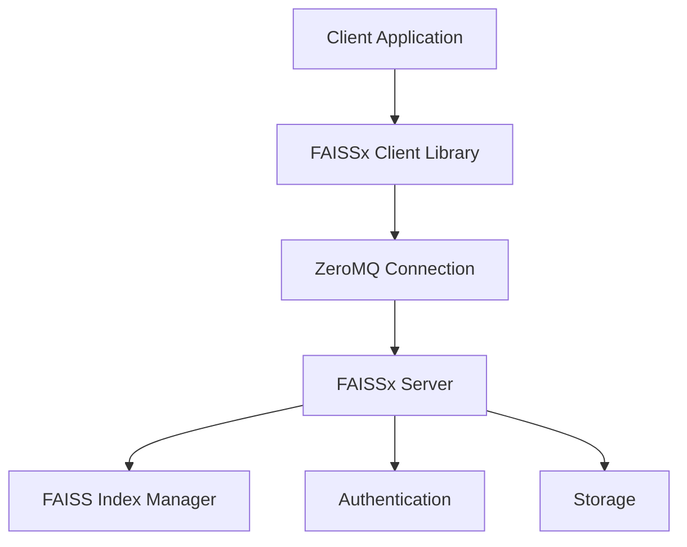

# FAISSx (FAISS Extended)

[](https://github.com/muxi-ai/faissx)
[](https://opensource.org/licenses/Apache-2.0)
&nbsp;
[](./CONTRIBUTING.md)

### A high-performance vector database proxy built with FAISS and ZeroMQ, providing a drop-in replacement for FAISS with scalable, distributed vector operations.

---

> [!TIP]
> #### Support this project by starring this repo on GitHub!
>
> More stars → more visibility → more contributors → better features → more robust tool for everyone 🎉
>
> <a href="https://github.com/muxi-ai/faissx" target="_blank"></a>
>
> Thank you for your support! 🙏

---

## 📚 Table of Contents

- [Overview](#-overview)
- [Getting Started](#-getting-started)
- [Key Features](#-key-features)
- [Architecture](#-architecture)
- [Server Setup](#-server-setup)
- [Client Implementation](#-client-implementation)
- [Docker Deployment](#-docker-deployment)
- [Performance](#-performance)
- [Development](#-development)
- [Project Structure](#-project-structure)
- [License](#-license)

## 👉 Overview

**FAISSx** is a lightweight, high-performance vector database proxy that runs [Facebook AI Similarity Search (FAISS)](https://github.com/facebookresearch/faiss) as a service. It provides a client-server architecture for efficient vector operations with significantly better performance than HTTP-based alternatives.

The client library acts as a true drop-in replacement for FAISS, meaning you can use it without changing your existing code - simply change your import statements and optionally configure remote execution. FAISSx seamlessly transitions between local FAISS execution and remote server operations based on your configuration.

FAISSx is designed for production workloads with multi-tenant support, authentication, and efficient binary messaging protocol using ZeroMQ and msgpack serialization.

---

## 🚀 Getting Started

### Installation

```bash
# Install from PyPI
pip install faissx

# For development
git clone https://github.com/muxi-ai/faissx.git
cd faissx
pip install -e .
```

### Quick Start: Running FAISSx Server

```bash
# Start the server with default settings
faissx.server run

# Start with custom options
faissx.server run --port 45678 --data-dir ./data --enable-auth --auth-keys "key1:tenant1,key2:tenant2"
```

### Quick Start: Using FAISSx Client

**1. Using FAISS locally - no configuration needed**

```python
from faissx import client as faiss
import numpy as np

# Do FAISS stuff...
dimension = 128
index = faiss.IndexFlatL2(dimension)
vectors = np.random.rand(100, dimension).astype(np.float32)
index.add(vectors)
D, I = index.search(np.random.rand(1, dimension).astype(np.float32), k=5)
```

**2. Using a remote FAISSx server**

```python
from faissx import client as faiss
import numpy as np

# Connect to a remove FAISSx server
faiss.configure(
    server="tcp://localhost:45678",  # ZeroMQ server address
    api_key="test-key-1",            # API key for authentication
    tenant_id="tenant-1"             # Tenant ID for multi-tenant isolation
)

# All operations after configure() will use the remote server
index = faiss.IndexFlatL2(128)
vectors = np.random.rand(100, 128).astype(np.float32)
index.add(vectors)
D, I = index.search(np.random.rand(1, 128).astype(np.float32), k=5)
```

---

## ✨ Key Features

| Feature | Description |
|---------|-------------|
| **📦 Drop-in replacement** | Use your existing FAISS code with minimal changes |
| **🔄 Binary protocol** | ZeroMQ and msgpack for efficient data transfer |
| **🌐 Multi-tenant support** | API key authentication for secure multi-tenant deployment |
| **📊 Vector operations** | Create indices, add vectors, and perform similarity searches |
| **🚀 High performance** | Significantly faster than HTTP-based alternatives |
| **📦 Persistent storage** | Optional persistence for vector indices |
| **🐳 Docker deployment** | Easy deployment with Docker images (Server) |

---

## 🏗️ Architecture

FAISSx follows a client-server architecture with high-performance binary communication:



### Components

1. **Client Library**: Drop-in replacement for FAISS with remote execution capabilities
   - Uses the same API as FAISS
   - Implements local FAISS by default when unconfigured
   - Supports remote execution when explicitly configured

2. **ZeroMQ Communication**: High-performance binary messaging
   - Zero-copy binary protocol
   - Efficient msgpack serialization
   - Low latency, persistent connections

3. **Server**: Main service that handles client requests
   - Multi-tenant support
   - Authentication
   - Vector index management

4. **FAISS Index Manager**: Core component that handles vector operations
   - Creates and manages multiple indices
   - Performs vector addition and search operations
   - Optimizes memory usage

---

## 🖥️ Server Setup

FAISSx server can be set up in multiple ways:

### Python API

```python
from faissx import server

server.configure(
    port=45678,  # default is 45678
    bind_address="0.0.0.0",  # default is "0.0.0.0"
    data_dir="/data",  # if omitted, faissx it will use in-memory indices
    auth_keys={"test-key-1": "tenant-1", "test-key-2": "tenant-2"},  # default is empty dict
    enable_auth=True,  # default is False
)

# Alternative: load API keys from a JSON file
# server.configure(
#     port=45678,
#     bind_address="0.0.0.0",
#     auth_file="path/to/auth.json",  # JSON file with API keys mapping
#     enable_auth=True,
# )

server.run()
```

### Command-Line Interface

```bash
# Start the server with default settings
faissx.server run

# Start with custom options
faissx.server run --port 45678 --data-dir ./data --enable-auth --auth-keys "key1:tenant1,key2:tenant2"

# Using authentication file instead of inline keys
faissx.server run --enable-auth --auth-file path/to/auth.json

# Show help
faissx.server run --help

# Show version
faissx.server --version
```

Note: For authentication, you can provide API keys either inline with `--auth-keys` or from a JSON file with `--auth-file`. The JSON file should have the format `{"api_key1": "tenant1", "api_key2": "tenant2"}`. Only one authentication method can be used at a time.

---

## 📱 Client Implementation

The FAISSx client provides a true drop-in replacement for FAISS, with the ability to transparently use either local FAISS or a remote FAISSx server:

### Local Mode (Default)

By default, FAISSx will use your local FAISS installation with no extra configuration required:

```python
# Just change the import - everything else stays the same
from faissx import client as faiss
import numpy as np

# Create and use FAISS exactly as you would normally
dimension = 128
index = faiss.IndexFlatL2(dimension)
vectors = np.random.random((100, dimension)).astype('float32')
index.add(vectors)
D, I = index.search(np.random.random((1, dimension)).astype('float32'), k=5)
```

### Remote Mode

When you want to use the remote FAISSx server instead of local processing, just add a configure() call:

```python
from faissx import client as faiss
import numpy as np

# Configure to use the remote server
faiss.configure(
    server="tcp://your-server:45678",
    api_key="your-api-key",
    tenant_id="your-tenant-id"
)

# After configure(), all operations will use the remote server
dimension = 128
index = faiss.IndexFlatL2(dimension)
vectors = np.random.random((100, dimension)).astype('float32')
index.add(vectors)
D, I = index.search(np.random.random((1, dimension)).astype('float32'), k=5)
```

**Note**: When you call `configure()`, all subsequent operations MUST use the remote server. If the server connection fails, operations will fail - there is no automatic fallback to local mode after `configure()` is called.

### Environment Variables

You can configure the client using environment variables:

- `FAISSX_SERVER`: ZeroMQ server address (default: `tcp://localhost:45678`)
- `FAISSX_API_KEY`: API key for authentication
- `FAISSX_TENANT_ID`: Tenant ID for multi-tenant isolation

---

## 🐳 Docker Deployment

FAISSx provides Docker images for easy deployment:

```bash
# Run with default settings
docker run -p 45678:45678 muxi/faissx:latest

# Run with persistent data and authentication
docker run -p 45678:45678 \
  -v /path/to/data:/data \
  -v /path/to/auth.json:/auth.json \
  -e FAISSX_DATA_DIR=/data \
  -e FAISSX_AUTH_FILE=/auth.json \
  -e FAISSX_ENABLE_AUTH=true \
  muxi/faissx:latest
```

You can also use docker-compose:

```bash
git clone https://github.com/muxi-ai/faissx.git
cd faissx
docker-compose up
```

---

## 📊 Performance

The ZeroMQ-based implementation provides significant performance improvements over HTTP-based alternatives:

- Binary protocol minimizes serialization overhead
- Persistent connections reduce latency
- Efficient vector operations through direct numpy integration
- No JSON encoding/decoding overhead for large vector data

---

## 🛠️ Development

To set up a development environment:

```bash
# Clone the repository
git clone https://github.com/muxi-ai/faissx.git
cd faissx

# Install in development mode with all dependencies
pip install -e .

# Run tests
pytest

# Run examples
python examples/server_example.py
```

### Running Client Tests

To run tests for the client component:

```bash
cd client
./run_tests.sh
```

### Docker Development

To build the Docker images:

```bash
cd server
./build_docker.sh
```

---

## 📁 Project Structure

```
/faissx       - Python package source code
  /server     - Server implementation
  /client     - Client library implementation
/server       - Server utilities, docker configs, tests
/client       - Client utilities and tests
/examples     - Example code for both client and server
/data         - Default directory for FAISS data files
```

---

## 📄 License

FAISSx is licensed under the [Apache 2.0 license](./LICENSE).

### Why Apache 2.0?

I chose the Apache 2.0 license to make FAISSx easy to adopt, integrate, and build on. This license:

- Allows you to freely use, modify, and distribute the library in both open-source and proprietary software
- Encourages wide adoption by individuals, startups, and enterprises alike
- Includes a clear patent grant for legal peace of mind
- Enables flexible usage without the complexity of copyleft restrictions

---

## 🙏 Thank You

Thank you for trying out FAISSx! Your interest and support mean a lot to this project. Whether you're using it in your applications or just exploring the capabilities, your participation helps drive this project forward.

If you find FAISSx useful in your work:

- Consider starring the repository on GitHub
- Share your experiences or use cases with the community
- Let me know how I can make it better for your needs

~ **Ran Aroussi**
