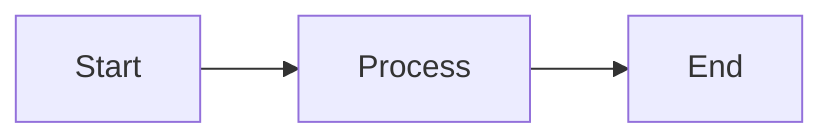

# LDA Documentation

This is the documentation source for the Linked Document Analysis (LDA) project.

## Building Documentation

### Requirements

Install the documentation dependencies:

```bash
pip install -e .[docs]
```

### Local Development

Serve the documentation locally:

```bash
# Using MkDocs directly
mkdocs serve

# Using LDA CLI
lda docs serve

# With custom port
lda docs serve --port 8080
```

The documentation will be available at `http://localhost:8000`.

### Building Static Site

Build the documentation:

```bash
# Using MkDocs
mkdocs build

# Using LDA CLI
lda docs build

# With custom output directory
lda docs build --output dist/docs
```

### Deployment

Deploy to GitHub Pages:

```bash
# Manual deployment
mkdocs gh-deploy

# Automatic deployment (via GitHub Actions)
# Triggered on push to main branch
```

## Documentation Structure

```
docs/
├── index.md                 # Landing page
├── getting-started/         # Getting started guides
│   ├── installation.md      # Installation instructions
│   ├── quickstart.md        # Quick start guide
│   └── first-project.md     # First project tutorial
├── user-guide/              # User guides
│   ├── concepts.md          # Core concepts
│   ├── configuration.md     # Configuration guide
│   ├── templates.md         # Project templates
│   ├── tracking.md          # File tracking
│   └── workflows.md         # Common workflows
├── cli-reference/           # CLI reference
│   ├── commands.md          # Command reference
│   └── options.md           # Global options
├── api-reference/           # API documentation
├── advanced/                # Advanced topics
├── contributing/            # Contributing guides
├── changelog.md             # Version history
├── stylesheets/             # Custom CSS
├── javascripts/             # Custom JavaScript
└── assets/                  # Images and other assets
```

## Writing Documentation

### Style Guide

- Use clear, concise language
- Provide practical examples
- Include code snippets with syntax highlighting
- Use admonitions for tips, warnings, and notes
- Keep sections focused and well-organized

### Markdown Extensions

The documentation uses these markdown extensions:

- **Admonitions**: Notes, warnings, tips
- **Code blocks**: Syntax highlighting, line numbers
- **Tabs**: Multiple content views
- **Mermaid**: Diagrams and flowcharts
- **Tables**: Enhanced table formatting
- **Task lists**: Checkboxes

### Examples

#### Admonitions

```markdown
!!! note "Important"
    This is an important note.

!!! warning "Caution"
    Be careful with this operation.

!!! tip "Pro Tip"
    Here's a helpful tip.
```

#### Code Tabs

```markdown
=== "Python"
    ```python
    def hello():
        print("Hello, World!")
    ```

=== "JavaScript"
    ```javascript
    function hello() {
        console.log("Hello, World!");
    }
    ```
```

#### Mermaid Diagrams

```markdown

```

## Contributing

1. Fork the repository
2. Create your feature branch
3. Make your changes
4. Test documentation locally
5. Submit a pull request

## Resources

- [MkDocs Documentation](https://www.mkdocs.org/)
- [Material for MkDocs](https://squidfunk.github.io/mkdocs-material/)
- [Markdown Guide](https://www.markdownguide.org/)