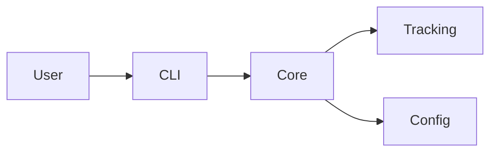

# Documentation Guide

This guide covers how to contribute to LDA documentation, including writing guidelines, build processes, and best practices.

## Documentation Structure

```
docs/
├── index.md                 # Home page
├── getting-started/        # Quick start guides
│   ├── installation.md
│   ├── quickstart.md
│   └── first-project.md
├── user-guide/            # User documentation
│   ├── concepts.md
│   ├── configuration.md
│   ├── templates.md
│   └── workflows.md
├── cli-reference/         # CLI documentation
│   ├── commands.md
│   └── options.md
├── api-reference/         # API documentation
│   ├── config.md
│   ├── core.md
│   └── utils.md
├── advanced/              # Advanced topics
│   ├── plugins.md
│   ├── integrations.md
│   └── performance.md
├── contributing/          # Contributor guides
│   ├── index.md
│   ├── development.md
│   ├── testing.md
│   └── docs.md
└── changelog.md           # Release notes
```

## Writing Guidelines

### Markdown Style

Follow these Markdown conventions:

```markdown
# Page Title

Brief introduction paragraph explaining what this page covers.

## Major Section

Content for the section.

### Subsection

More detailed content.

#### Minor Heading

Specific details.

**Bold text** for emphasis.
*Italic text* for terminology.
`code` for inline code.

- Bullet points
- For unordered lists

1. Numbered items
2. For ordered lists

> Note: Important information
> in blockquotes.
```

### Code Examples

Include practical, working examples:

````markdown
```python
# Python example with syntax highlighting
from lda.config import LDAConfig

config = LDAConfig("lda_config.yaml")
config.set("project.name", "My Project")
```

```bash
# Shell commands
lda init --name "My Project"
lda track --all
```

```yaml
# Configuration examples
project:
  name: My Project
  code: PROJ001
```
````

### API Documentation

Document APIs consistently:

```markdown
### `function_name()`

Brief description of what the function does.

```python
def function_name(param1: str, param2: int = 0) -> dict
```

**Parameters:**
- `param1`: Description of parameter 1
- `param2`: Description of parameter 2 (default: 0)

**Returns:**
- Description of return value

**Raises:**
- `ValueError`: When and why this is raised
- `FileNotFoundError`: When and why this is raised

**Example:**
```python
result = function_name("test", param2=5)
print(result)  # {"status": "success", "value": 5}
```
```

### Cross-References

Link to related content:

```markdown
See also:
- [Configuration Guide](../user-guide/configuration.md)
- [API Reference](../api-reference/config.md#function-name)
- [External Link](https://example.com)
```

## Building Documentation

### Setup

```bash
# Install dependencies
pip install mkdocs mkdocs-material

# Install additional plugins
pip install mkdocs-minify-plugin mkdocs-redirects
```

### Local Development

```bash
# Serve docs locally
mkdocs serve

# With specific host/port
mkdocs serve --dev-addr 0.0.0.0:8001

# With strict mode (fail on warnings)
mkdocs serve --strict
```

### Building Static Site

```bash
# Build documentation
mkdocs build

# Build with specific config
mkdocs build -f mkdocs.yml

# Clean build
mkdocs build --clean
```

## MkDocs Configuration

### Basic Configuration

```yaml
# mkdocs.yml
site_name: LDA Documentation
site_url: https://lda-docs.github.io
repo_url: https://github.com/user/lda

theme:
  name: material
  features:
    - navigation.instant
    - navigation.tracking
    - navigation.tabs
    - search.suggest
```

### Theme Customization

```yaml
theme:
  palette:
    - media: "(prefers-color-scheme: light)"
      scheme: default
      primary: indigo
      accent: indigo
    - media: "(prefers-color-scheme: dark)"
      scheme: slate
      primary: indigo
      accent: indigo
  
  font:
    text: Roboto
    code: Roboto Mono
```

### Extensions

```yaml
markdown_extensions:
  - admonition           # Note/warning boxes
  - codehilite          # Code syntax highlighting
  - toc:                # Table of contents
      permalink: true
  - pymdownx.emoji      # Emoji support
  - pymdownx.superfences: # Code blocks
      custom_fences:
        - name: mermaid
          class: mermaid
          format: !!python/name:pymdownx.superfences.fence_code_format
```

## Documentation Standards

### Page Structure

Every documentation page should have:

1. **Title**: Clear, descriptive H1 heading
2. **Introduction**: Brief overview paragraph
3. **Prerequisites**: If applicable
4. **Content**: Main documentation body
5. **Examples**: Practical examples
6. **See Also**: Related links

Example template:

```markdown
# Feature Name

Brief description of what this feature does and why it's useful.

## Prerequisites

- Requirement 1
- Requirement 2

## Overview

Detailed explanation of the feature...

## Usage

### Basic Usage

Example of basic usage...

### Advanced Usage

Example of advanced usage...

## Configuration

Configuration options...

## Examples

### Example 1: Basic Setup

Detailed example...

### Example 2: Complex Scenario

Detailed example...

## Troubleshooting

Common issues and solutions...

## See Also

- [Related Feature](../path/to/related.md)
- [API Reference](../api/reference.md)
```

### Writing for Different Audiences

#### For Users

```markdown
# Getting Started with LDA

LDA helps you track changes in your analysis projects. This guide 
will show you how to set up your first project.

## Installation

Install LDA using pip:

```bash
pip install lda-tool
```

## Creating Your First Project

1. Navigate to your project directory
2. Run `lda init`
3. Follow the prompts

That's it! You now have an LDA project.
```

#### For Developers

```markdown
# LDA Architecture

LDA follows a modular architecture with clear separation of concerns.

## Core Components

### Configuration Module (`lda.config`)

Handles configuration management using YAML files.

```python
from lda.config import LDAConfig

class LDAConfig:
    def __init__(self, config_file: Optional[str] = None):
        """Initialize configuration from file."""
        pass
```

### Tracking Module (`lda.core.tracking`)

Implements file tracking using content hashing...
```

## Documentation Tools

### Mermaid Diagrams

```markdown

```

### Admonitions

```markdown
!!! note "Important Note"
    This is important information.

!!! warning "Warning"
    This is a warning message.

!!! tip "Pro Tip"
    This is a helpful tip.

!!! example "Example"
    This is an example.
```

### Tabs

```markdown
=== "Python"
    ```python
    # Python code
    config = LDAConfig()
    ```

=== "YAML"
    ```yaml
    # YAML configuration
    project:
      name: Test
    ```

=== "CLI"
    ```bash
    # CLI command
    lda init --name Test
    ```
```

## Best Practices

### 1. Clear and Concise

- Use simple, direct language
- Avoid jargon when possible
- Define technical terms
- Keep paragraphs short

### 2. Practical Examples

- Include real-world examples
- Show both input and output
- Explain what the example does
- Provide complete, working code

### 3. Visual Aids

- Use diagrams for complex concepts
- Include screenshots for UI elements
- Create flowcharts for processes
- Add tables for comparisons

### 4. Consistent Formatting

- Use consistent heading levels
- Apply the same code style
- Maintain uniform terminology
- Follow naming conventions

### 5. Keep Up-to-date

- Update docs with code changes
- Review regularly for accuracy
- Fix broken links
- Update version numbers

## Documentation Review

### Checklist

Before submitting documentation:

- [ ] Spelling and grammar check
- [ ] Code examples tested
- [ ] Links verified
- [ ] Formatting consistent
- [ ] Technical accuracy confirmed
- [ ] Cross-references updated
- [ ] Build passes without warnings
- [ ] Renders correctly locally

### Review Process

1. Create feature branch
2. Write/update documentation
3. Build and test locally
4. Submit pull request
5. Address review feedback
6. Merge when approved

## Deployment

### GitHub Pages

```yaml
# .github/workflows/docs.yml
name: Deploy Docs

on:
  push:
    branches: [main]

jobs:
  deploy:
    runs-on: ubuntu-latest
    steps:
      - uses: actions/checkout@v3
      
      - name: Setup Python
        uses: actions/setup-python@v4
        with:
          python-version: '3.x'
      
      - name: Install dependencies
        run: |
          pip install mkdocs-material
          pip install mkdocs-minify-plugin
      
      - name: Build docs
        run: mkdocs build
      
      - name: Deploy to GitHub Pages
        uses: peaceiris/actions-gh-pages@v3
        with:
          github_token: ${{ secrets.GITHUB_TOKEN }}
          publish_dir: ./site
```

### Read the Docs

```yaml
# .readthedocs.yml
version: 2

build:
  os: ubuntu-22.04
  tools:
    python: "3.11"

mkdocs:
  configuration: mkdocs.yml

python:
  install:
    - requirements: docs/requirements.txt
```

## Common Issues

### Build Warnings

```bash
# Fix missing references
WARNING -  Doc file 'index.md' contains a link 'config.md#section', but the doc 'config.md' does not contain an anchor 'section'

# Solution: Add anchor
## Section {#section}
```

### Broken Links

```bash
# Check for broken links
mkdocs-linkcheck

# Fix relative paths
[Link](../user-guide/config.md)  # Good
[Link](/user-guide/config.md)    # May break
```

### Theme Issues

```yaml
# Fix theme not found
theme:
  name: material  # Must have mkdocs-material installed
  
# Fix custom theme
theme:
  name: null
  custom_dir: custom_theme/
```

## Resources

### Documentation Tools

- [MkDocs](https://www.mkdocs.org/)
- [Material for MkDocs](https://squidfunk.github.io/mkdocs-material/)
- [MyST Parser](https://myst-parser.readthedocs.io/)
- [Sphinx](https://www.sphinx-doc.org/)

### Style Guides

- [Google Developer Docs Style Guide](https://developers.google.com/style)
- [Microsoft Writing Style Guide](https://docs.microsoft.com/style-guide)
- [Write the Docs](https://www.writethedocs.org/guide/)

### Learning Resources

- [Technical Writing Course](https://developers.google.com/tech-writing)
- [Markdown Guide](https://www.markdownguide.org/)
- [Diátaxis Framework](https://diataxis.fr/)

## See Also

- [Development](development.md) - Development setup
- [Testing](testing.md) - Testing documentation
- [Contributing](index.md) - General contribution guide