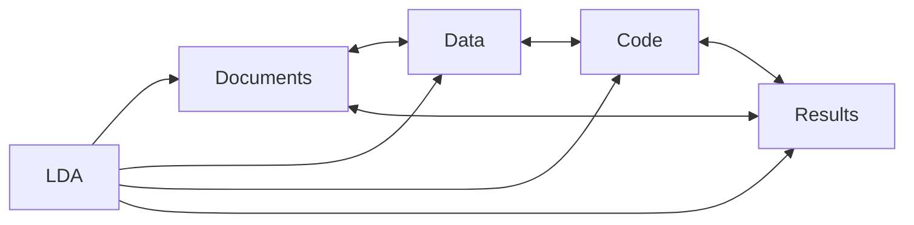
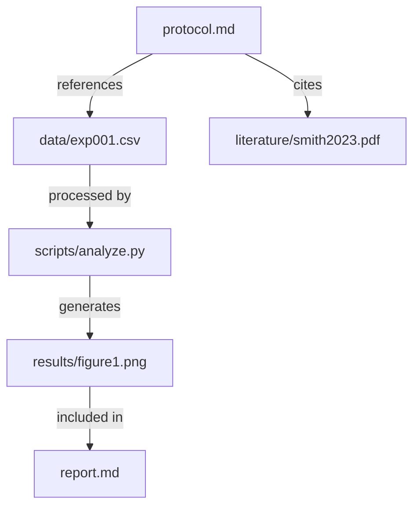
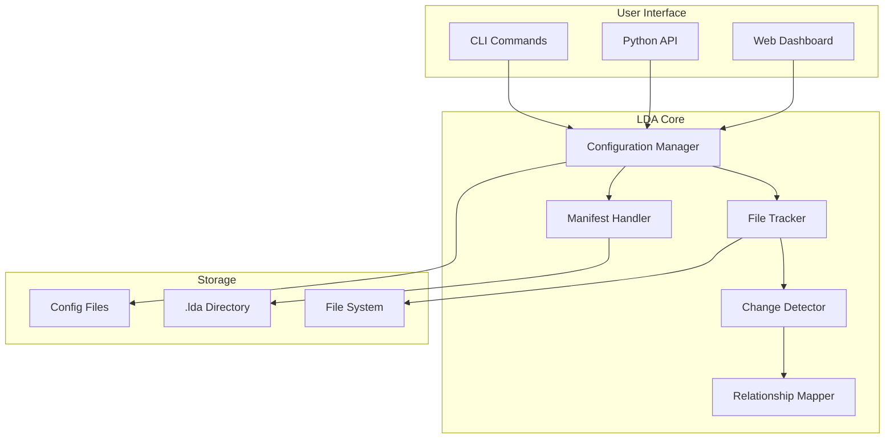

# Core Concepts

Understanding LDA's core concepts will help you get the most out of the tool. This guide explains the fundamental ideas behind Linked Document Analysis.

## What is Linked Document Analysis?

Linked Document Analysis (LDA) is a methodology for managing complex projects where documents, data, and code are interconnected. It provides:

- **Structural Organization**: Logical grouping of related files
- **Change Tracking**: Monitoring modifications across all project files
- **Relationship Mapping**: Understanding connections between documents
- **Historical Preservation**: Complete audit trail of project evolution



## Key Concepts

### 1. Projects

A **project** is the top-level container for your work. Each project has:

- Unique identifier (`project.code`)
- Descriptive name (`project.name`)
- Configuration file (`lda_config.yaml`)
- Tracking directory (`.lda/`)

```yaml
project:
  name: "Climate Research"
  code: "CLIMATE-2024"
  author: "Dr. Smith"
  description: "Analyzing temperature trends"
```

### 2. Sections

**Sections** are logical groupings of related files within your project. Think of them as chapters in a book or modules in a system.

```yaml
sections:
  literature:
    name: "Literature Review"
    type: "documentation"
    files:
      - "docs/papers/*.pdf"
      - "docs/notes/*.md"
  
  analysis:
    name: "Data Analysis"
    type: "code"
    files:
      - "scripts/*.py"
      - "notebooks/*.ipynb"
```

#### Section Types

- **documentation**: Text documents, reports, notes
- **data**: Raw and processed data files
- **code**: Scripts, programs, notebooks
- **outputs**: Results, figures, generated content
- **resources**: Supporting materials, references

### 3. File Tracking

LDA tracks files using multiple methods:

#### Content Hashing
- SHA-256 hash of file contents
- Detects even minor changes
- Ensures file integrity

#### Metadata Tracking
- File size
- Modification time
- Permissions
- Custom attributes

```python
tracked_file = {
    "path": "data/experiment_001.csv",
    "hash": "a34bf12c...",
    "size": 1024576,
    "modified": "2024-01-20T10:30:00",
    "section": "data",
    "metadata": {
        "experiment_id": "EXP-001",
        "researcher": "Dr. Smith"
    }
}
```

### 4. The Manifest

The **manifest** is LDA's central registry, stored in `.lda/manifest.yaml`. It contains:

- Project metadata
- Section definitions
- File tracking information
- Change history
- Relationship mappings

```yaml
manifest:
  version: "1.0"
  created: "2024-01-01"
  project:
    name: "Climate Research"
    code: "CLIMATE-2024"
  
  sections:
    documentation:
      files: 15
      last_modified: "2024-01-20"
    
    data:
      files: 42
      last_modified: "2024-01-19"
  
  tracking:
    total_files: 57
    total_size: 134217728  # 128 MB
```

### 5. Change Detection

LDA continuously monitors your project for changes:

#### Types of Changes
- **Added**: New files created
- **Modified**: Existing files changed
- **Deleted**: Files removed
- **Moved**: Files relocated
- **Renamed**: Files renamed

#### Change Attributes
```yaml
change:
  type: "modified"
  file: "docs/protocol.md"
  timestamp: "2024-01-20T14:30:00"
  size_before: 1024
  size_after: 1536
  hash_before: "abc123..."
  hash_after: "def456..."
```

### 6. Relationships

LDA maps relationships between files:



Types of relationships:
- **References**: Document cites another
- **Depends on**: Code requires data file
- **Generates**: Script produces output
- **Includes**: Document embeds content
- **Links to**: Explicit connections

### 7. Workflows

Workflows define how your project evolves:

```yaml
workflow:
  phases:
    - planning
    - data_collection
    - analysis
    - writing
    - review
    - publication
  
  current_phase: "analysis"
  
  rules:
    - "Data must be validated before analysis"
    - "All code must be reviewed"
    - "Documentation required for each phase"
```

### 8. Templates

Templates provide starting points for common project types:

```yaml
template: research
features:
  - structured_sections
  - citation_tracking
  - experiment_logging
  - result_validation
```

Available templates:
- **research**: Academic research projects
- **software**: Software development
- **documentation**: Technical writing
- **data-science**: ML/AI projects
- **minimal**: Basic structure

### 9. Configuration

LDA uses hierarchical configuration:

1. **System defaults**: Built-in settings
2. **User config**: `~/.ldarc`
3. **Project config**: `lda_config.yaml`
4. **Environment**: `LDA_*` variables
5. **Command line**: Runtime options

```yaml
# Project configuration
tracking:
  interval: 300  # 5 minutes
  ignore_patterns:
    - "*.tmp"
    - ".DS_Store"
  
display:
  theme: "modern"
  verbose: true
  
export:
  formats: ["html", "pdf", "json"]
  include_metadata: true
```

### 10. Export Formats

LDA can export project information in various formats:

| Format | Use Case | Features |
|--------|----------|----------|
| HTML | Web viewing | Interactive, styled |
| PDF | Printing/sharing | Formatted, portable |
| JSON | Integration | Machine-readable |
| CSV | Spreadsheets | Tabular data |
| Markdown | Documentation | Version control friendly |

## Architecture Overview



## Best Practices

### Project Organization

1. **Logical Sections**: Group related files
2. **Clear Naming**: Use descriptive names
3. **Consistent Structure**: Follow patterns
4. **Regular Commits**: Version control integration

### Configuration

1. **Start Simple**: Use defaults initially
2. **Customize Gradually**: Add as needed
3. **Document Changes**: Comment your config
4. **Use Templates**: Leverage existing patterns

### Workflow

1. **Regular Tracking**: Run `lda track` frequently
2. **Review Changes**: Check modifications daily
3. **Export Reports**: Create regular summaries
4. **Backup Manifest**: Preserve project state

## Advanced Concepts

### Custom Plugins

Extend LDA with custom functionality:

```python
from lda.plugin import Plugin

class CustomAnalyzer(Plugin):
    def analyze(self, project):
        # Custom analysis logic
        pass
```

### Integration APIs

```python
from lda import Project

# Load project
project = Project(".")

# Get file information
file_info = project.get_file("data/results.csv")

# Detect changes
changes = project.get_changes(since="1 hour ago")

# Export report
project.export(format="html", output="report.html")
```

### Performance Optimization

For large projects:

1. **Selective Tracking**: Track only relevant files
2. **Cached Operations**: Enable caching
3. **Parallel Processing**: Use multiple cores
4. **Incremental Updates**: Track changes efficiently

## Next Steps

Now that you understand the concepts:

<div class="grid cards" markdown>

-   :material-cog:{ .lg .middle } __Configuration__

    ---

    Detailed configuration options
    
    [:octicons-arrow-right-24: Configure](configuration.md)

-   :material-file-multiple:{ .lg .middle } __Templates__

    ---

    Using project templates
    
    [:octicons-arrow-right-24: Explore](templates.md)

-   :material-workflow:{ .lg .middle } __Workflows__

    ---

    Common workflow patterns
    
    [:octicons-arrow-right-24: Learn](workflows.md)

</div>