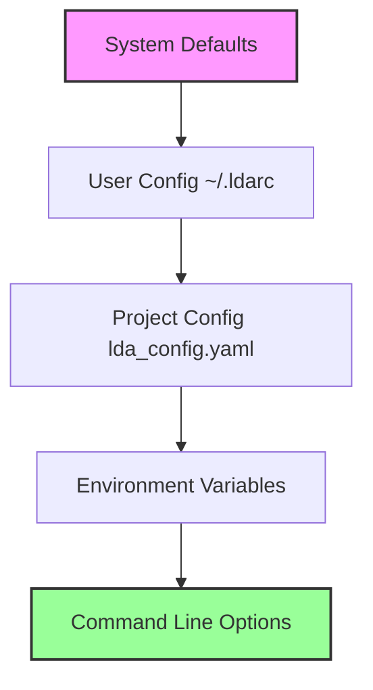

# Configuration Guide

LDA's configuration system is flexible and hierarchical, allowing you to customize behavior at multiple levels. This guide covers all configuration options and best practices.

## Configuration Hierarchy

LDA uses a layered configuration system:



1. **System Defaults**: Built-in settings
2. **User Configuration**: `~/.ldarc` or `$XDG_CONFIG_HOME/lda/config`
3. **Project Configuration**: `lda_config.yaml` in project root
4. **Environment Variables**: `LDA_*` variables
5. **Command Line**: Runtime options (highest priority)

## Project Configuration

The main configuration file is `lda_config.yaml`:

```yaml
# Complete project configuration example
version: 1.0

project:
  name: "Research Project"
  code: "PROJ-2024"
  description: "Comprehensive research on climate data"
  author: "Dr. Jane Smith"
  email: "jane.smith@university.edu"
  organization: "Climate Research Lab"
  date: "2024-01-15"
  tags: ["climate", "research", "data-analysis"]

sections:
  documentation:
    name: "Documentation"
    type: "docs"
    description: "Project documentation and reports"
    files:
      - "docs/**/*.md"
      - "docs/**/*.pdf"
    ignore:
      - "docs/drafts/**"
    
  data:
    name: "Data Files"
    type: "data"
    description: "Raw and processed data"
    files:
      - "data/raw/*.csv"
      - "data/processed/*.parquet"
    validation:
      size_limit: "100MB"
      required_files: ["metadata.json"]
    
  analysis:
    name: "Analysis Code"
    type: "code"
    description: "Scripts and notebooks"
    files:
      - "scripts/*.py"
      - "notebooks/*.ipynb"
    metadata:
      language: "python"
      version: "3.10"

tracking:
  monitor_changes: true
  interval: 300  # seconds
  track_file_hashes: true
  track_file_metadata: true
  track_relationships: true
  
  ignore_patterns:
    - "__pycache__"
    - "*.pyc"
    - ".DS_Store"
    - "*.tmp"
    - ".git"
    - ".venv"
  
  hash_algorithm: "sha256"
  compression: "gzip"
  
  backup:
    enabled: true
    retention_days: 30
    max_backups: 10

workflow:
  phases:
    planning:
      name: "Project Planning"
      duration: "2 weeks"
      deliverables: ["proposal.md", "timeline.md"]
    
    collection:
      name: "Data Collection"
      duration: "4 weeks"
      deliverables: ["data/raw/*", "data/metadata.json"]
    
    analysis:
      name: "Data Analysis"
      duration: "3 weeks"
      deliverables: ["scripts/*", "results/*"]
    
    writing:
      name: "Report Writing"
      duration: "2 weeks"
      deliverables: ["report.md", "paper.pdf"]
  
  current_phase: "analysis"
  
  rules:
    - "Complete data validation before analysis"
    - "Peer review required for all code"
    - "Documentation must be updated weekly"

display:
  theme: "modern"  # modern, classic, minimal
  colors:
    primary: "#2E7D32"
    secondary: "#1976D2"
    accent: "#FFC107"
  
  console:
    verbose: true
    show_timestamps: true
    show_file_sizes: true
    use_colors: true
    progress_bars: true
  
  reports:
    include_charts: true
    include_metadata: true
    date_format: "%Y-%m-%d %H:%M"

export:
  formats:
    html:
      enabled: true
      template: "modern"
      include_assets: true
    
    pdf:
      enabled: true
      page_size: "A4"
      margins: "1in"
    
    json:
      enabled: true
      pretty_print: true
      include_metadata: true
    
    csv:
      enabled: true
      delimiter: ","
      include_headers: true
  
  output_directory: "exports"
  
  schedule:
    daily_report:
      time: "18:00"
      format: "html"
      recipients: ["team@company.com"]
    
    weekly_summary:
      day: "friday"
      time: "17:00"
      format: "pdf"

integrations:
  git:
    enabled: true
    auto_commit: false
    commit_message_template: "LDA: {action} - {files_changed} files"
  
  github:
    enabled: true
    create_issues: true
    update_project_board: true
  
  slack:
    enabled: false
    webhook_url: "${SLACK_WEBHOOK}"
    notifications:
      - "file_changed"
      - "phase_completed"
  
  email:
    enabled: true
    smtp_server: "smtp.gmail.com"
    smtp_port: 587
    from_address: "lda@company.com"
    
hooks:
  pre_track:
    - "validate_files.py"
    - "check_permissions.sh"
  
  post_track:
    - "update_manifest.py"
    - "generate_report.py"
  
  on_change:
    - "notify_team.py"
    - "backup_changed_files.sh"

plugins:
  - name: "citation_tracker"
    enabled: true
    config:
      formats: ["bibtex", "ris"]
  
  - name: "diagram_generator"
    enabled: true
    config:
      format: "mermaid"
      auto_generate: true

advanced:
  cache:
    enabled: true
    directory: ".lda/cache"
    max_size: "1GB"
    ttl: 3600  # seconds
  
  parallel_processing:
    enabled: true
    max_workers: 4
  
  memory_limit: "2GB"
  
  logging:
    level: "INFO"  # DEBUG, INFO, WARNING, ERROR
    file: ".lda/lda.log"
    max_size: "10MB"
    backup_count: 5
```

## Section Configuration

Each section can have detailed configuration:

```yaml
sections:
  experiments:
    name: "Experiments"
    type: "data"
    
    # File patterns
    files:
      - "experiments/*/data.csv"
      - "experiments/*/config.yaml"
      - "experiments/*/results/*"
    
    # Ignore patterns
    ignore:
      - "experiments/*/temp/*"
      - "experiments/*/.cache/*"
    
    # Validation rules
    validation:
      required_files:
        - "config.yaml"
        - "data.csv"
      
      file_size_limits:
        "*.csv": "100MB"
        "*.json": "10MB"
      
      file_count_limit: 1000
    
    # Custom metadata
    metadata:
      department: "Research"
      project_phase: "active"
      data_classification: "internal"
    
    # Section-specific tracking
    tracking:
      interval: 60  # More frequent for active sections
      compression: "lz4"  # Faster compression
      
    # Relationships
    relationships:
      depends_on: ["protocols"]
      generates: ["results"]
      references: ["literature"]
```

## User Configuration

Create `~/.ldarc` for user-level settings:

```yaml
# User configuration file
user:
  name: "Dr. Jane Smith"
  email: "jane.smith@university.edu"
  organization: "Research Lab"

defaults:
  project:
    author: "${user.name}"
    email: "${user.email}"
    organization: "${user.organization}"
  
  tracking:
    interval: 300
    compression: "gzip"
  
  display:
    theme: "modern"
    verbose: true

aliases:
  st: "status --verbose"
  ch: "changes --since 1h"
  ex: "export --format html"

preferences:
  editor: "code"  # or vim, nano, emacs
  diff_tool: "meld"
  merge_tool: "kdiff3"
  
  confirmations:
    delete_files: true
    overwrite_files: true
    
  auto_update: true
  
paths:
  templates: "~/.lda/templates"
  plugins: "~/.lda/plugins"
  cache: "~/.lda/cache"
```

## Environment Variables

LDA recognizes these environment variables:

```bash
# Configuration paths
export LDA_CONFIG_HOME="$HOME/.config/lda"
export LDA_DATA_HOME="$HOME/.local/share/lda"
export LDA_CACHE_HOME="$HOME/.cache/lda"

# Runtime options
export LDA_LOG_LEVEL="DEBUG"
export LDA_MAX_WORKERS="8"
export LDA_MEMORY_LIMIT="4GB"

# Feature flags
export LDA_EXPERIMENTAL_FEATURES="true"
export LDA_DISABLE_TELEMETRY="true"
export LDA_OFFLINE_MODE="false"

# Integration tokens
export LDA_GITHUB_TOKEN="ghp_xxxxxxxxxxxx"
export LDA_SLACK_WEBHOOK="https://hooks.slack.com/..."
```

## Command Line Options

Override configuration at runtime:

```bash
# Override tracking interval
lda track --interval 60

# Use different config file
lda --config custom_config.yaml status

# Set verbosity
lda --verbose track
lda -vvv status  # Extra verbose

# Disable color output
lda --no-color export

# Specify working directory
lda --project-dir /path/to/project status
```

## Configuration Validation

LDA validates configuration on load:

```yaml
# Validation rules
validation:
  project:
    name:
      required: true
      type: string
      max_length: 100
    
    code:
      required: true
      type: string
      pattern: "^[A-Z0-9-]+$"
  
  tracking:
    interval:
      type: integer
      min: 10
      max: 3600
    
    compression:
      type: string
      enum: ["none", "gzip", "lz4", "zstd"]
```

## Dynamic Configuration

Use placeholders and environment variables:

```yaml
project:
  name: "${PROJECT_NAME}"
  author: "${USER}"
  date: "${datetime.now()}"
  
paths:
  data: "${env.DATA_DIR}/project_${project.code}"
  output: "${HOME}/Documents/${project.name}/output"
  
integrations:
  api_key: "${env.API_KEY}"
  endpoint: "${env.API_ENDPOINT:-https://api.example.com}"
```

## Configuration Examples

### Research Project

```yaml
# Research-focused configuration
project:
  name: "Climate Study 2024"
  type: "research"

sections:
  literature:
    type: "references"
    citation_format: "apa"
    
  data:
    type: "experimental"
    validation_strict: true
    
  analysis:
    type: "computational"
    reproducible: true

features:
  bibliography_management: true
  experiment_tracking: true
  peer_review_workflow: true
```

### Software Project

```yaml
# Software development configuration
project:
  name: "Web Application"
  type: "software"

sections:
  source:
    type: "code"
    languages: ["javascript", "python"]
    
  tests:
    type: "testing"
    frameworks: ["jest", "pytest"]
    
  docs:
    type: "documentation"
    format: "markdown"

integrations:
  ci_cd: "github_actions"
  issue_tracking: "github"
  code_review: "pull_requests"
```

### Data Science Project

```yaml
# Data science configuration
project:
  name: "ML Pipeline"
  type: "data_science"

sections:
  datasets:
    type: "data"
    formats: ["csv", "parquet", "hdf5"]
    
  models:
    type: "ml_models"
    frameworks: ["tensorflow", "pytorch"]
    
  notebooks:
    type: "jupyter"
    kernel: "python3"

features:
  experiment_tracking: "mlflow"
  model_versioning: true
  dataset_lineage: true
```

## Best Practices

### 1. Start Simple

Begin with minimal configuration:

```yaml
project:
  name: "My Project"
  code: "PROJ"

sections:
  docs:
    files: ["*.md"]
```

### 2. Use Templates

Base configuration on templates:

```bash
lda init --template research
```

### 3. Version Control

Always commit `lda_config.yaml`:

```bash
git add lda_config.yaml
git commit -m "Update LDA configuration"
```

### 4. Environment Separation

Use different configs for different environments:

```yaml
# config.dev.yaml - Development
tracking:
  interval: 60  # Frequent updates

# config.prod.yaml - Production  
tracking:
  interval: 3600  # Less frequent
```

### 5. Security

Never commit sensitive data:

```yaml
# Bad - Don't do this
api_key: "sk-1234567890abcdef"

# Good - Use environment variables
api_key: "${env.API_KEY}"
```

## Troubleshooting

### Common Issues

1. **Configuration not loading**
   ```bash
   lda --debug status
   ```

2. **Invalid configuration**
   ```bash
   lda validate-config
   ```

3. **Merge conflicts**
   ```bash
   lda config --merge-strategy ours
   ```

### Configuration Debugging

```bash
# Show effective configuration
lda config --show

# Show configuration source
lda config --show-sources

# Validate configuration
lda config --validate

# Export configuration
lda config --export > config_dump.yaml
```

## Advanced Topics

### Custom Validators

```python
# validators.py
def validate_project_code(value):
    """Ensure project code follows naming convention."""
    import re
    if not re.match(r'^[A-Z]{2,10}-\d{4}$', value):
        raise ValueError("Project code must be FORMAT-YYYY")
    return value
```

### Configuration Plugins

```python
# plugins/custom_config.py
from lda.config import ConfigPlugin

class CustomConfigPlugin(ConfigPlugin):
    def process_config(self, config):
        # Add custom processing
        config['custom_field'] = compute_value()
        return config
```

### Migration Scripts

```python
# migrate_config.py
from lda.config import migrate_config

def migrate_v1_to_v2(old_config):
    new_config = old_config.copy()
    # Transform old format to new
    new_config['version'] = 2.0
    return new_config
```

## Next Steps

<div class="grid cards" markdown>

-   :material-file-multiple:{ .lg .middle } __Templates__

    ---

    Explore project templates
    
    [:octicons-arrow-right-24: View templates](templates.md)

-   :material-workflow:{ .lg .middle } __Workflows__

    ---

    Common workflow patterns
    
    [:octicons-arrow-right-24: Learn workflows](workflows.md)

-   :material-cli:{ .lg .middle } __CLI Reference__

    ---

    Command line options
    
    [:octicons-arrow-right-24: View commands](../cli-reference/commands.md)

</div>