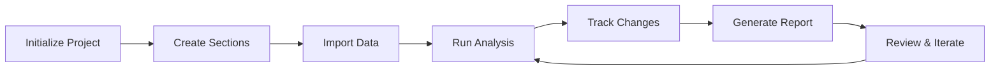

# Workflows

LDA supports various workflows to match different research and analysis patterns. This guide covers common workflows and best practices for organizing your analytical projects.

## Standard Research Workflow

The most common workflow for research projects:



### Step-by-Step Process

1. **Initialize the project**
   ```bash
   lda init --name "MyStudy" --analyst "jane.doe"
   ```

2. **Create document sections**
   ```yaml
   # lda_config.yaml
   sections:
     - id: "sec01_preprocessing"
       name: "Data Preprocessing"
     - id: "sec02_analysis"
       name: "Statistical Analysis"
     - id: "sec03_visualization"
       name: "Results Visualization"
   ```

3. **Import input data**
   ```bash
   cd sec01_preprocessing/inputs
   cp /path/to/raw_data.csv .
   lda track --message "Import raw data"
   ```

4. **Run analysis**
   ```bash
   cd ..
   python run.py
   lda track --message "Complete preprocessing"
   ```

5. **Generate outputs**
   ```bash
   cd ../sec03_visualization
   python run.py
   lda track outputs/*.png --message "Generate figures"
   ```

## Regulatory Submission Workflow

For projects requiring regulatory compliance:

### FDA Submission Pattern

```yaml
sections:
  - id: "sec01_protocol"
    name: "Study Protocol"
    validation: strict
  - id: "sec02_sap"
    name: "Statistical Analysis Plan"
    validation: strict
  - id: "sec03_datasets"
    name: "Analysis Datasets"
    validation: strict
  - id: "sec04_tables"
    name: "Tables, Listings, Figures"
    validation: strict
```

### Key Requirements

1. **Strict validation**
   ```bash
   lda validate --strict
   ```

2. **Complete audit trail**
   ```bash
   lda history --output audit_trail.pdf --format pdf
   ```

3. **Locked sections**
   ```bash
   lda lock sec01_protocol --reason "Protocol finalized"
   ```

## Multi-Analyst Collaboration

For projects with multiple contributors:

### Setup

```yaml
project:
  analysts:
    - id: "john.doe"
      role: "lead"
      sections: ["sec01", "sec02"]
    - id: "jane.smith"
      role: "analyst"
      sections: ["sec03", "sec04"]
```

### Workflow

1. **Assign sections**
   ```bash
   lda assign sec03 --analyst jane.smith
   ```

2. **Review changes**
   ```bash
   lda changes --analyst jane.smith
   ```

3. **Merge work**
   ```bash
   lda merge sec03 --from feature/jane-analysis
   ```

## Continuous Analysis Workflow

For projects with ongoing data collection:

### Configuration

```yaml
workflow:
  type: continuous
  schedule:
    data_import: "daily"
    analysis: "weekly"
    reporting: "monthly"
```

### Automation

```bash
# Cron job for daily imports
0 2 * * * cd /project && lda workflow run --stage import

# Weekly analysis
0 3 * * 1 cd /project && lda workflow run --stage analysis

# Monthly reports
0 4 1 * * cd /project && lda workflow run --stage report
```

## Publication Workflow

For academic publications:

### Structure

```yaml
sections:
  - id: "sec01_data"
    name: "Data Preparation"
  - id: "sec02_methods"
    name: "Methods Implementation"
  - id: "sec03_results"
    name: "Results Generation"
  - id: "sec04_figures"
    name: "Publication Figures"
  - id: "sec05_supplement"
    name: "Supplementary Materials"
```

### Best Practices

1. **Version control integration**
   ```bash
   git checkout -b manuscript-v1
   lda track --all
   git commit -m "Manuscript v1 submission"
   git tag -a v1.0 -m "Nature submission"
   ```

2. **Reproducible environments**
   ```yaml
   environment:
     python: "3.9.10"
     packages:
       - numpy==1.21.0
       - pandas==1.3.0
       - matplotlib==3.4.2
   ```

## Clinical Trial Workflow

For clinical research:

### Phases

```yaml
phases:
  - name: "Protocol Development"
    sections: ["protocol", "sap"]
  - name: "Data Collection"
    sections: ["crf", "data_entry"]
  - name: "Analysis"
    sections: ["cleaning", "analysis", "reporting"]
  - name: "Submission"
    sections: ["csr", "regulatory"]
```

### Milestones

```bash
# Lock protocol
lda milestone create --name "Protocol Final" --lock sec01_protocol

# Database lock
lda milestone create --name "Database Lock" --lock sec03_data

# Analysis freeze
lda milestone create --name "Analysis Complete" --freeze
```

## Machine Learning Workflow

For ML projects:

### Experiment Tracking

```yaml
experiments:
  - id: "exp01"
    model: "random_forest"
    parameters:
      n_estimators: 100
      max_depth: 10
  - id: "exp02"
    model: "xgboost"
    parameters:
      learning_rate: 0.01
      n_estimators: 200
```

### Model Management

```bash
# Track model artifacts
lda track models/exp01/model.pkl --tag "experiment:exp01"

# Compare experiments
lda compare exp01 exp02 --metrics accuracy,f1_score

# Promote best model
lda promote exp02 --to production
```

## Integration Patterns

### With Jupyter Notebooks

```python
# In notebook
import lda

# Auto-track cell outputs
lda.enable_notebook_tracking()

# Manual checkpoint
lda.checkpoint("Completed feature engineering")
```

### With R Projects

```r
# In R script
library(lda)

# Track R objects
lda::track_object(model, "logistic_model.rds")

# Track plots
lda::track_plot("residuals.png", {
  plot(model$residuals)
})
```

### With CI/CD

```yaml
# .github/workflows/lda.yml
name: LDA Validation

on: [push, pull_request]

jobs:
  validate:
    runs-on: ubuntu-latest
    steps:
      - uses: actions/checkout@v2
      - name: Validate LDA project
        run: |
          pip install lda-tool
          lda validate --strict
          lda test --all
```

## Best Practices

### 1. Consistent Naming

Use consistent section and file naming:

```yaml
naming:
  sections: "{id}_{name}"  # sec01_preprocessing
  files: "{section}_{type}_{date}.{ext}"  # sec01_data_20240101.csv
```

### 2. Regular Validation

Schedule regular validation checks:

```bash
# Daily validation
0 0 * * * cd /project && lda validate --fix

# Weekly deep check
0 0 * * 0 cd /project && lda validate --deep --report
```

### 3. Documentation

Maintain documentation alongside code:

```markdown
# sec01_preprocessing/README.md

## Purpose
This section handles initial data cleaning and preparation.

## Inputs
- raw_data.csv: Raw survey responses

## Outputs
- cleaned_data.csv: Cleaned dataset
- cleaning_log.txt: Record of cleaning operations

## Dependencies
- Python 3.9+
- pandas >= 1.3.0
```

### 4. Change Management

Document significant changes:

```bash
# Before major changes
lda snapshot create --name "pre-refactor"

# After changes
lda track --message "Refactored preprocessing pipeline"
lda snapshot create --name "post-refactor"

# Compare snapshots
lda compare snapshots pre-refactor post-refactor
```

## See Also

- [Configuration](configuration.md) - Workflow configuration options
- [Templates](templates.md) - Pre-built workflow templates
- [Tracking](tracking.md) - File tracking in workflows