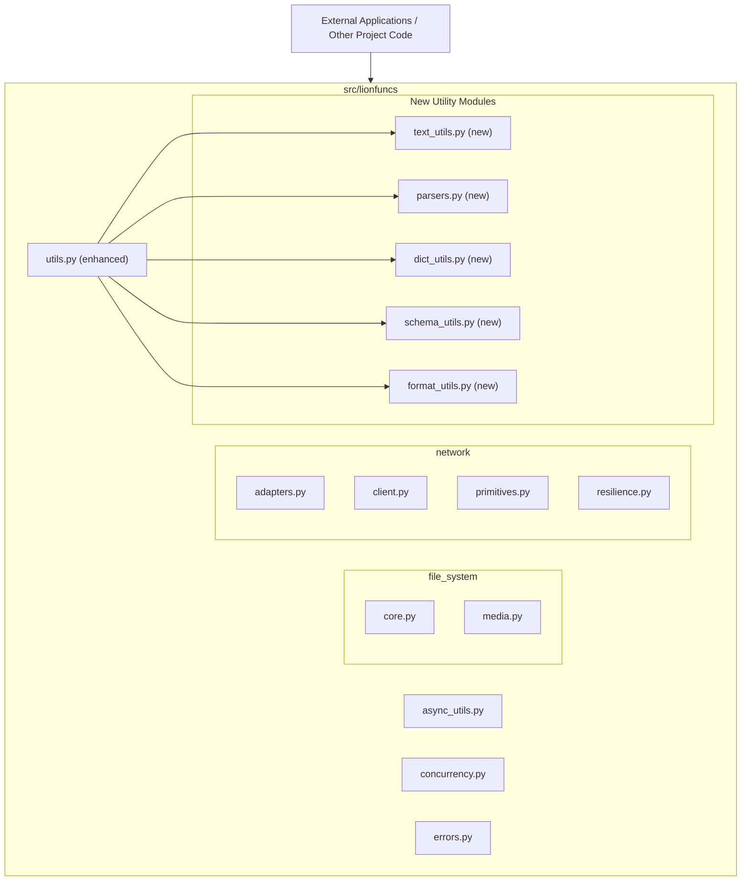

# Guidance

**Purpose**\
Lay out an **implementation-ready** blueprint for a microservice or feature:
data models, APIs, flows, error handling, security, etc.

**When to Use**

- After the Research is done, to guide the Implementer.
- Before Implementation Plan or simultaneously with it.

**Best Practices**

- Keep the design as **complete** as possible so coders can proceed with minimal
  guesswork.
- Emphasize any performance or security corners.
- Use diagrams (Mermaid) for clarity.

---

# Technical Design Specification: Integration of .khive/dev/ Utilities into src/lionfuncs

## 1. Overview

### 1.1 Purpose

This document provides the technical design for integrating selected utility
functions from the `.khive/dev/` directory into the main `src/lionfuncs`
library. The goal is to enhance `lionfuncs` with well-tested, general-purpose
utilities, making them available for broader use within the project and
potentially by other users of the library.

### 1.2 Scope

**In Scope:**

- Finalizing the list of functions from `.khive/dev/` to be integrated.
- Defining target modules (new or existing) within `src/lionfuncs` for these
  functions.
- Specifying necessary refactoring for each function, including:
  - Changes to function signatures and naming conventions.
  - Logic adjustments to align with `lionfuncs` standards.
  - Optimizations for performance or clarity.
  - Dependency management (internal to `lionfuncs` and external).
- Providing pseudocode for complex new functions or significant refactors,
  informed by best practices (e.g., Perplexity searches).
- Defining the scope and structure of any new modules created within
  `src/lionfuncs`.
- Outlining a testing strategy for the integrated and refactored functions.

**Out of Scope:**

- Full implementation of the integration (this TDS guides the Implementer).
- Integration of utilities explicitly marked as "Non-Candidates" in the research
  report
  [`RR-52-dev-integration-analysis.md`](.khive/reports/rr/RR-52-dev-integration-analysis.md:174).
- Major architectural overhaul of `lionfuncs` beyond what is necessary for
  integrating these utilities.

### 1.3 Background

The `lionfuncs` library is a collection of general-purpose Python utilities. The
`.khive/dev/` directory contains various helper functions developed ad-hoc
during the project. Research Report
[`RR-52-dev-integration-analysis.md`](.khive/reports/rr/RR-52-dev-integration-analysis.md:1)
analyzed these utilities and identified candidates for formal integration into
`src/lionfuncs` to improve code reuse, maintainability, and library
completeness. This TDS builds upon that research to provide a concrete
implementation plan. This work is tracked under GitHub Issue #52.

### 1.4 Design Goals

- **Modularity:** Integrated functions should be well-organized into logical
  modules within `src/lionfuncs`.
- **Clarity:** Function names, signatures, and internal logic should be clear
  and easy to understand.
- **Maintainability:** Code should be well-documented, follow `lionfuncs` coding
  standards, and be easy to maintain and extend.
- **Testability:** All integrated functions must have comprehensive unit tests.
- **Robustness:** Functions should handle edge cases and potential errors
  gracefully.
- **Alignment:** The integration should align with the existing architecture and
  conventions of `lionfuncs`.
- **Evidence-Based:** Key design decisions are supported by research and
  external verification where appropriate (e.g., Perplexity citations).

### 1.5 Key Constraints

- Adherence to `lionfuncs` coding standards and best practices.
- Minimize introduction of new external dependencies unless strongly justified
  and approved.
- Ensure backward compatibility if any existing `lionfuncs` interfaces are
  inadvertently affected (though this is not expected for new utility
  integrations).
- All design decisions requiring external validation (e.g., complex refactoring
  choices, performance optimizations) should be supported by search results
  (e.g., Perplexity) and cited.

## 2. Architecture

### 2.1 Component Diagram

This integration primarily involves adding new utility functions and potentially
new utility modules to the existing `src/lionfuncs` library structure.

A conceptual view of `lionfuncs` post-integration:



### 2.2 Dependencies

**Internal Dependencies (within `src/lionfuncs`):**

- Newly integrated functions may depend on existing `lionfuncs` utilities (e.g.,
  error handling from [`errors.py`](src/lionfuncs/errors.py:1)).
- Some new utilities might depend on each other (e.g., `fuzzy_match_keys` from
  the proposed `dict_utils.py` will depend on string similarity functions from
  the proposed `text_utils.py`). These will be detailed per function.

**External Dependencies:**

- The primary goal is to use standard Python library features.
- Existing `lionfuncs` dependencies (e.g., Pydantic) will continue to be used.
- Introduction of new third-party libraries will be avoided unless a strong
  justification is provided and verified.
  - The research report
    ([`RR-52-dev-integration-analysis.md`](.khive/reports/rr/RR-52-dev-integration-analysis.md:1))
    notes that `string_similarity.py` (line 67) has minimal dependencies
    (standard library only). This is the preferred approach.

### 2.3 Data Flow

Data flow is specific to each utility function. For example:

- A string similarity function in `text_utils.py` would take two strings as
  input and return a similarity score (float).
- `fuzzy_parse_json` in `parsers.py` would take a potentially malformed JSON
  string and attempt to return a parsed Python dictionary or list.
- `function_to_openai_schema` in `schema_utils.py` would take a Python function
  object and return a JSON schema dictionary. Detailed input/output for each
  function will be specified in Section 3.2.

## 3. Interface Definitions

### 3.1 API Endpoints

Not applicable, as `lionfuncs` is a library, not a service with API endpoints.

### 3.2 Internal Interfaces (New/Refactored Functions and Modules)

#### 3.2.1 Module: `src/lionfuncs/text_utils.py` (New)

**Purpose:** Houses utilities for text processing and string manipulation.

**Integration Candidate 1: String Similarity Utilities**

- **Source:** `.khive/dev/string_similarity.py`
- **Functions to Integrate & Proposed Signatures:**
  - `def string_similarity(s1: str, s2: str, method: str = 'levenshtein', **kwargs) -> float:`
  - `def _levenshtein_distance(s1: str, s2: str) -> int:` (private helper)
  - `def _levenshtein_similarity(s1: str, s2: str) -> float:` (private helper)
  - `def _jaro_winkler_similarity(s1: str, s2: str, scaling_factor: float = 0.1) -> float:`
    (private helper)
  - `def _hamming_distance(s1: str, s2: str) -> int:` (private helper)
  - `def _hamming_similarity(s1: str, s2: str) -> float:` (private helper)
  - `def _cosine_similarity(text1: str, text2: str) -> float:` (private helper)
    - Refactoring: Will use word tokenization (lowercase, punctuation removed)
      and `collections.Counter` for vectorization, per Perplexity search
      (pplx:9d6fb09e-d957-4d77-84f5-885f4135a3d5).
  - `def _sequence_matcher_similarity(s1: str, s2: str) -> float:` (private
    helper, uses `difflib.SequenceMatcher`)
- **Refactoring Notes:** Supporting algorithm functions made private.
  Comprehensive type hints. Updated docstrings with examples. Unit tests for all
  methods.
- **Dependencies:** `difflib`, `collections.Counter`, `re` (standard library).
- **Pseudocode for `string_similarity`:**
  ```python
  # def string_similarity(s1: str, s2: str, method: str = 'levenshtein', **kwargs) -> float:
  #   method = method.lower()
  #   if method == 'levenshtein': return _levenshtein_similarity(s1, s2)
  #   elif method == 'jaro_winkler': return _jaro_winkler_similarity(s1, s2, **kwargs)
  #   elif method == 'hamming':
  #     if len(s1) != len(s2): raise ValueError("Hamming distance requires strings of equal length.")
  #     return _hamming_similarity(s1, s2)
  #   elif method == 'cosine': return _cosine_similarity(s1, s2)
  #   elif method == 'sequence_matcher': return _sequence_matcher_similarity(s1, s2)
  #   else: raise ValueError(f"Unsupported similarity method: {method}")
  ```
- **Pseudocode for `_cosine_similarity`:**
  ```python
  # import re
  # from collections import Counter
  # def _cosine_similarity(text1: str, text2: str) -> float:
  #   s1_processed = re.sub(r'[^\w\s]', '', text1).lower()
  #   s2_processed = re.sub(r'[^\w\s]', '', text2).lower()
  #   tokens1 = s1_processed.split()
  #   tokens2 = s2_processed.split()
  #   vec1 = Counter(tokens1)
  #   vec2 = Counter(tokens2)
  #   all_words = set(vec1.keys()) | set(vec2.keys())
  #   dot_product = sum(vec1.get(word, 0) * vec2.get(word, 0) for word in all_words)
  #   magnitude1 = sum(vec1.get(word, 0)**2 for word in all_words)**0.5
  #   magnitude2 = sum(vec2.get(word, 0)**2 for word in all_words)**0.5
  #   if magnitude1 == 0 or magnitude2 == 0: return 0.0
  #   return dot_product / (magnitude1 * magnitude2)
  ```

#### 3.2.2 Module: `src/lionfuncs/parsers.py` (New)

**Purpose:** Provides robust parsing utilities.

**Integration Candidate 2: Fuzzy JSON Parsing**

- **Source:** `.khive/dev/fuzzy_parse_json.py`
- **Functions & Signatures:**
  - `def fuzzy_parse_json(json_string: str, *, attempt_fix: bool = True, strict: bool = False, log_errors: bool = False) -> Any | None:`
  - `def _fix_json_string(json_string: str) -> str:` (private helper)
- **Refactoring Notes:** Improve error messages. `attempt_fix` controls
  fuzziness. Docstrings with examples. `_fix_json_string` uses regex for common
  issues (trailing commas, quote types, boolean casing) (Perplexity
  pplx:c5d3c177-39b4-4f08-a6f9-48ee9dcf2a17 confirmed error handling
  importance).
- **Dependencies:** `json`, `re`, `logging` (standard library).
- **Pseudocode for `fuzzy_parse_json`:**
  ```python
  # import json
  # import logging
  # def fuzzy_parse_json(json_string: str, *, attempt_fix: bool = True, strict: bool = False, log_errors: bool = False) -> Any | None:
  #   original_string = json_string
  #   if attempt_fix:
  #     try:
  #       fixed_string = _fix_json_string(json_string)
  #       return json.loads(fixed_string)
  #     except json.JSONDecodeError as e_fixed:
  #       if log_errors: logging.warning(f"Failed to parse fixed JSON: {e_fixed}. Trying original.")
  #       json_string = original_string
  #   try:
  #     return json.loads(json_string)
  #   except json.JSONDecodeError as e_orig:
  #     if log_errors: logging.warning(f"Failed to parse original JSON: {e_orig}")
  #     if strict: raise
  #     return None
  ```
- **Pseudocode for `_fix_json_string`:**
  ```python
  # import re
  # def _fix_json_string(json_string: str) -> str:
  #   s = json_string.strip()
  #   s = re.sub(r"(?<!\\)'", "\"", s) # Single to double quotes (basic)
  #   s = re.sub(r",\s*([\}\]])", r"\1", s) # Trailing commas
  #   s = re.sub(r"\bTrue\b", "true", s, flags=re.IGNORECASE) # Boolean casing
  #   s = re.sub(r"\bFalse\b", "false", s, flags=re.IGNORECASE)
  #   s = re.sub(r"\bNone\b|\bNull\b", "null", s, flags=re.IGNORECASE) # Null casing
  #   # Consider more specific regex for unescaped newlines within strings if common.
  #   return s
  ```

#### 3.2.3 Module: `src/lionfuncs/utils.py` (Enhancement)

**Purpose:** General utility functions.

**Integration Candidate 3: Dictionary Conversion Utilities**

- **Source:** `.khive/dev/to_dict.py`
- **Functions & Signatures:**
  - `def to_dict(obj: Any, *, fields: list[str] | None = None, exclude: list[str] | None = None, by_alias: bool = False, exclude_none: bool = False, exclude_unset: bool = False, exclude_defaults: bool = False) -> dict | list | Any:`
- **Refactoring Notes:** Implementation based on Perplexity search
  (pplx:132c25ed-22f0-4666-b2eb-c82bad7cf574). Handles Pydantic v2
  `model_dump()` (passing kwargs like `include=fields`, `exclude`, `by_alias`,
  etc.), dataclasses, dicts, lists/tuples/sets, general objects (`__dict__`),
  and primitives.
- **Dependencies:** `pydantic.BaseModel`, `dataclasses.is_dataclass`,
  `dataclasses.asdict` (standard library).
- **Pseudocode for `to_dict`:**
  ```python
  # from dataclasses import is_dataclass, asdict
  # from pydantic import BaseModel # Assuming BaseModel is imported or accessible
  # from typing import Any, Callable # For Callable in function_to_openai_schema
  #
  # def to_dict(obj: Any, *, fields: list[str] | None = None, exclude: list[str] | None = None,
  #             by_alias: bool = False, exclude_none: bool = False,
  #             exclude_unset: bool = False, exclude_defaults: bool = False) -> dict | list | Any:
  #   if isinstance(obj, BaseModel):
  #     dump_kwargs = {"by_alias": by_alias, "exclude_none": exclude_none,
  #                    "exclude_unset": exclude_unset, "exclude_defaults": exclude_defaults}
  #     # Pydantic's include/exclude takes a dict/set of fields, not just a list for top level.
  #     # For simplicity, if 'fields' (include) is given, we assume it's for the top level.
  #     # More complex include/exclude structures for nested models are handled by Pydantic internally.
  #     if fields is not None: dump_kwargs["include"] = {f: True for f in fields}
  #     if exclude is not None: dump_kwargs["exclude"] = {f: True for f in exclude}
  #     return obj.model_dump(**dump_kwargs)
  #
  #   if is_dataclass(obj):
  #     # dataclasses.asdict is recursive. To apply further options, recurse with to_dict.
  #     base_dict = asdict(obj)
  #     return {k: to_dict(v, by_alias=by_alias, exclude_none=exclude_none) for k, v in base_dict.items()} # Pass relevant options
  #
  #   if isinstance(obj, dict):
  #     return {k: to_dict(v, by_alias=by_alias, exclude_none=exclude_none) for k, v in obj.items()} # Pass relevant options
  #
  #   if isinstance(obj, (list, tuple, set)):
  #     return type(obj)(to_dict(item, by_alias=by_alias, exclude_none=exclude_none) for item in obj) # Pass relevant options
  #
  #   if hasattr(obj, '__dict__'):
  #     # For general objects, vars() gives __dict__. Recurse.
  #     # fields/exclude are not directly applied here unless custom logic is added.
  #     return {k: to_dict(v, by_alias=by_alias, exclude_none=exclude_none) for k, v in vars(obj).items()} # Pass relevant options
  #
  #   if isinstance(obj, (str, int, float, bool)) or obj is None:
  #       return obj
  #
  #   # Fallback for other types (e.g., datetime, Decimal) could be str(obj) or raise TypeError
  #   try:
  #       json.dumps(obj) # Check if JSON serializable directly
  #       return obj
  #   except TypeError:
  #       # If not directly serializable, and not handled above, convert to string as a last resort, or raise.
  #       # For now, let's be strict for unhandled complex types.
  #       raise TypeError(f"Object of type {type(obj)} is not automatically convertible to dict/JSON serializable structure.")
  ```

#### 3.2.4 Module: `src/lionfuncs/format_utils.py` (New)

**Purpose:** Utilities for formatting data into human-readable strings.

**Integration Candidate 4: Human-Readable Data Formatting**

- **Source:** `.khive/dev/as_readable.py`
- **Functions & Signatures:**
  - `def as_readable(data: Any, *, format_type: str = 'auto', indent: int = 2, max_depth: int | None = None, in_notebook_override: bool | None = None) -> str:`
  - `def _format_dict_yaml_like(data_dict: dict, indent_level: int = 0, base_indent: int = 2, max_depth: int | None = None, current_depth: int = 0) -> str:`
    (private helper)
  - `def _is_in_notebook() -> bool:` (private helper)
    - Refactoring: Use `IPython.get_ipython()` and `ip.has_trait('kernel')` per
      Perplexity search (pplx:8f94d47e-cda1-4374-abe8-c131df82556c).
- **Dependencies:** `src.lionfuncs.utils.to_dict`, `json` (standard library).
  `IPython` (optional, for `_is_in_notebook`).
- **Pseudocode for `as_readable`:** (Conceptual, depends on `to_dict`)
  ```python
  # import json
  # from .utils import to_dict # Assuming relative import
  # def as_readable(...):
  #   use_rich_display = in_notebook_override if in_notebook_override is not None else _is_in_notebook()
  #   # Convert data to a dict/list structure first for consistent formatting
  #   try:
  #       processed_data = to_dict(data, exclude_none=True) # exclude_none for cleaner display
  #   except TypeError: # if to_dict fails for the root object
  #       processed_data = data # use original if not convertible by to_dict
  #
  #   effective_format = format_type.lower()
  #   if effective_format == 'auto': effective_format = 'yaml_like'
  #
  #   if effective_format == 'yaml_like':
  #     if not isinstance(processed_data, dict): return str(processed_data) # Or repr
  #     return _format_dict_yaml_like(processed_data, base_indent=indent, max_depth=max_depth)
  #   elif effective_format == 'json':
  #     return json.dumps(processed_data, indent=indent, default=str) # default=str for non-serializable parts
  #   elif effective_format == 'repr': return repr(data)
  #   else: raise ValueError(f"Unsupported format_type: {format_type}")
  ```
- **Pseudocode for `_is_in_notebook`:**
  ```python
  # def _is_in_notebook() -> bool:
  #   try:
  #     from IPython import get_ipython
  #     ip = get_ipython()
  #     if ip is not None and hasattr(ip, 'has_trait') and ip.has_trait('kernel'):
  #       return True # Jupyter notebook, lab, qtconsole
  #   except (NameError, ImportError): pass
  #   return False
  ```

#### 3.2.5 Module: `src/lionfuncs/dict_utils.py` (New)

**Purpose:** Utilities for advanced dictionary manipulation.

**Integration Candidate 5: Key Fuzzy Matching**

- **Source:** `.khive/dev/fuzzy_match_keys.py`
- **Functions & Signatures:**
  - `def fuzzy_match_keys(data_dict: dict, reference_keys: list[str] | dict, *, threshold: float = 0.8, default_method: str = 'levenshtein', case_sensitive: bool = False) -> dict:`
- **Refactoring Notes:** Depends on `string_similarity` from
  `src.lionfuncs.text_utils`. Operates on standard dicts/lists. (Perplexity
  pplx:f535e40d-5bc2-4888-8771-4a7df3111223 confirmed general approach).
- **Dependencies:** `src.lionfuncs.text_utils.string_similarity`.
- **Pseudocode for `fuzzy_match_keys`:** (As previously detailed in earlier
  thought process, ensuring it iterates reference keys and finds best match in
  data_dict keys).

#### 3.2.6 Module: `src/lionfuncs/schema_utils.py` (New)

**Purpose:** Utilities for generating and manipulating schemas.

**Integration Candidate 6: Function Schema Generation**

- **Source:** `.khive/dev/function_to_schema.py`
- **Functions & Signatures:**
  - `def function_to_openai_schema(func: Callable) -> dict:`
- **Refactoring Notes:** Will use `inspect` and
  `pydantic.create_model().model_json_schema()` for parameters schema, per
  Perplexity search (pplx:3bcb34b5-633e-404f-8185-62b07544e0d1).
- **Dependencies:** `inspect`, `typing.get_type_hints`, `typing.Any`,
  `pydantic.create_model`, `pydantic.BaseModel` (for type checking if a param is
  Pydantic).
- **Pseudocode for `function_to_openai_schema`:**
  ```python
  # import inspect
  # from pydantic import create_model, BaseModel
  # from typing import get_type_hints, Any, Callable
  #
  # def function_to_openai_schema(func: Callable) -> dict:
  #   sig = inspect.signature(func)
  #   func_name = func.__name__
  #   docstring = inspect.getdoc(func) or ""
  #   # Basic docstring parsing for function description
  #   func_description = docstring.split('\n\n')[0].strip() if docstring else ""
  #   # TODO: More sophisticated docstring parsing for parameter descriptions
  #   # param_descriptions = _parse_param_descriptions_from_docstring(docstring)
  #
  #   fields_for_model = {}
  #   try:
  #       type_hints = get_type_hints(func)
  #   except Exception: # Handle cases where get_type_hints might fail
  #       type_hints = {}
  #
  #   for name, param in sig.parameters.items():
  #     if name in ("self", "cls"): continue
  #
  #     annotation = type_hints.get(name, param.annotation)
  #     if annotation == inspect.Parameter.empty: annotation = Any
  #
  #     # If param.default is a Pydantic model, it might cause issues with create_model if not handled.
  #     # For now, assume defaults are simple types or None.
  #     default_value = param.default
  #     if isinstance(default_value, BaseModel): # Avoid passing model instance as default to create_model field
  #         default_value = ... # Or handle appropriately if default factory is needed
  #
  #     if param.default == inspect.Parameter.empty:
  #       fields_for_model[name] = (annotation, ...) # Required
  #     else:
  #       fields_for_model[name] = (annotation, default_value)
  #
  #   if fields_for_model:
  #     safe_model_name = f"{func_name}_ParamsModel" # Ensure valid Python identifier
  #     ParamsModel = create_model(safe_model_name, **fields_for_model)
  #     parameters_schema = ParamsModel.model_json_schema()
  #     # OpenAI schema for 'parameters' typically doesn't have its own 'title'.
  #     # Pydantic's model_json_schema() output is the schema for the *model itself*.
  #     # We need its 'properties' and 'required' fields.
  #     final_params_schema = {
  #         "type": "object",
  #         "properties": parameters_schema.get("properties", {}),
  #     }
  #     if "required" in parameters_schema:
  #         final_params_schema["required"] = parameters_schema["required"]
  #     # TODO: Add parameter descriptions from parsed docstring into properties schema
  #   else:
  #     final_params_schema = {"type": "object", "properties": {}}
  #
  #   openai_schema = {
  #     "name": func_name,
  #     "description": func_description,
  #     "parameters": final_params_schema
  #   }
  #   return openai_schema
  ```

## 4. Data Models

This integration primarily deals with utility functions. No new persistent data
models are defined for storage.

- `function_to_openai_schema` processes Python functions which can include
  Pydantic models as type hints. The schema generation itself will reflect these
  models.
- `to_dict` is designed to work with Pydantic models among other object types.

### 4.1 API Models

Not applicable.

### 4.2 Domain Models

Not applicable beyond function parameters and return types.

### 4.3 Database Schema

Not applicable.

## 5. Behavior

### 5.1 Core Workflows

Core workflows are encapsulated within each utility function as described in
their pseudocode and purpose (e.g., string comparison, JSON parsing,
object-to-dict conversion, schema generation).

### 5.2 Error Handling

- Functions will use standard Python exceptions (`ValueError`, `TypeError`,
  `json.JSONDecodeError`) where appropriate.
- Custom exceptions from [`src/lionfuncs/errors.py`](src/lionfuncs/errors.py:1)
  can be used if a more specific error category is needed, but standard
  exceptions are preferred for general utilities.
- Error messages will be clear and informative.
- `fuzzy_parse_json` includes optional logging for parsing issues.

### 5.3 Security Considerations

- **Input Sanitization:** For `fuzzy_parse_json`, the `_fix_json_string` logic
  should be carefully implemented to avoid introducing vulnerabilities (e.g.,
  ensure regexes are not overly broad). Standard `json.loads` is generally safe.
- **Resource Consumption:** String similarity algorithms or recursive
  conversions (`to_dict`) on very large/deep inputs could be resource-intensive.
  This should be noted in documentation. No external calls that could leak data
  are planned.

## 6. External Interactions

### 6.1 Dependencies on Other Services

None of these utilities are expected to call external network services.

### 6.2 External API Integrations

Not applicable for these internal utilities.

## 7. Performance Considerations

### 7.1 Expected Load

These are library functions; load depends on application usage. Performance
varies by algorithm and input size.

- `string_similarity`: Levenshtein O(m*n). Cosine similarity depends on
  vectorization.
- `fuzzy_parse_json`: Regex operations and multiple parsing attempts add
  overhead.
- `to_dict`: Recursive conversion can be impacted by object depth and size.
- `function_to_schema`: `inspect` module usage is generally efficient.

### 7.2 Scalability Approach

Not applicable in the sense of a scalable service. Performance is per-call.

### 7.3 Optimizations

- Use efficient underlying implementations (e.g., `difflib.SequenceMatcher`,
  Pydantic's `model_dump`).
- Optimize regex patterns in `_fix_json_string`.
- Memoization/caching is not planned for initial implementation but could be
  considered later if profiling shows a clear need for specific functions.

### 7.4 Caching Strategy

Not planned for initial implementation.

## 8. Observability

### 8.1 Logging

- Standard Python `logging` module.
- `fuzzy_parse_json` has an optional `log_errors` parameter.
- Utilities should generally be quiet, primarily returning values or raising
  exceptions.

### 8.2 Metrics & Tracing

Not applicable for these library functions in this context.

## 9. Testing Strategy

### 9.1 Unit Testing

- **Requirement:** Comprehensive unit tests for each public function and
  significant private helper.
- **Coverage:** Aim for >90% for new modules.
- **Test Cases:**
  - `string_similarity`: Test each algorithm, edge cases (empty, identical,
    different strings).
  - `fuzzy_parse_json`: Various malformed JSON, `strict` mode, cases
    `_fix_json_string` handles.
  - `to_dict`: Pydantic models, dataclasses, simple objects, dicts, lists;
    options like `fields`, `exclude`, `by_alias`. Test unconvertible types.
  - `as_readable`: Different `format_type` options, nested data, `max_depth`,
    `_is_in_notebook` (mocking).
  - `fuzzy_match_keys`: Exact/fuzzy matches, thresholds, case sensitivity,
    list/dict `reference_keys`.
  - `function_to_openai_schema`: Functions with various parameter types (basic,
    `Optional`, `List`, `Dict`, `Literal`, Pydantic models), default values,
    docstrings. Verify schema structure.
- **Location:** `tests/unit/` mirroring `src/lionfuncs` structure (e.g.,
  `tests/unit/test_text_utils.py`).

### 9.2 Integration Testing

- Light integration tests: `fuzzy_match_keys` using `string_similarity`;
  `as_readable` using `to_dict`. These can be part of the unit tests for the
  dependent functions.

### 9.3 Performance Testing

Basic benchmarks for performance-sensitive functions if concerns arise during
implementation.

## 10. Deployment and Configuration

### 10.1 Deployment Requirements

Changes will be part of a new version of the `lionfuncs` package, published to
PyPI.

### 10.2 Configuration Parameters

No external configuration parameters. Behavior is controlled by function
arguments.

## 11. Open Questions

- **`_cosine_similarity` vectorization:** Default confirmed to simple char
  n-gram with `collections.Counter` (pplx:9d6fb09e-d957-4d77-84f5-885f4135a3d5).
- **`fuzzy_match_keys` ambiguity:** Current pseudocode picks the best match for
  each reference key and uses a data key once. This is the accepted default.
- **`to_dict` with list inputs:** Main `to_dict` is for single objects or dicts.
  For collections, it processes elements recursively. If a list/tuple/set is
  passed as the top-level `obj`, it will return a new list/tuple/set with
  processed elements.
- **Parameter descriptions in `function_to_openai_schema`:** The current
  pseudocode has a TODO for more sophisticated docstring parsing to extract
  individual parameter descriptions. This can be an initial implementation
  detail or a follow-up enhancement. For now, the function description is
  extracted.

## 12. Risks and Mitigations

### 12.1 Risk: Incorrect Refactoring or Integration Bugs

- **Description:** Introducing new utilities or refactoring existing ones always
  carries a risk of introducing subtle bugs or not perfectly matching the
  intended behavior from `.khive/dev/` if requirements are misunderstood.
- **Mitigation:**
  - Thorough unit testing for all integrated functions, covering edge cases.
  - Peer review of the implementation against this TDS.
  - Clear pseudocode and interface definitions in this TDS, informed by best
    practices (e.g., Perplexity searches for `to_dict`
    (pplx:132c25ed-22f0-4666-b2eb-c82bad7cf574) and schema generation
    (pplx:3bcb34b5-633e-404f-8185-62b07544e0d1)).

### 12.2 Risk: Performance Issues

- **Description:** Some utilities, like complex string similarity algorithms or
  recursive `to_dict` on very large/deep objects, might have performance
  implications.
- **Mitigation:**
  - Document potential performance characteristics.
  - Implement efficient algorithms using standard library features (e.g.,
    `collections.Counter` for cosine similarity vectorization
    (pplx:9d6fb09e-d957-4d77-84f5-885f4135a3d5)).
  - Leverage Pydantic's optimized methods (e.g., `model_dump()`).
  - Basic benchmarking by the Implementer for critical utilities if concerns
    arise.

### 12.3 Risk: Dependency Management

- **Description:** Ensuring new utilities rely only on the standard library or
  existing `lionfuncs` dependencies.
- **Mitigation:**
  - Explicitly list dependencies in this TDS.
  - Code reviews to check for unintentional new external dependencies.
  - Prioritize solutions using standard library features.

### 12.4 Risk: Overly Permissive Fuzzy Logic

- **Description:** Utilities like `fuzzy_parse_json` or `fuzzy_match_keys` might
  be too permissive, leading to incorrect data interpretation.
- **Mitigation:**
  - Provide clear parameters to control "fuzziness" (e.g., `attempt_fix`,
    `threshold`).
  - Document behavior and limitations clearly.
  - Encourage users to use stricter modes or validate results.
  - `_fix_json_string` design focuses on common, relatively safe fixes.

## 13. Appendices

### Appendix A: Alternative Designs

- **`as_readable` placement:** Decided `format_utils.py` is cleaner than adding
  to `utils.py`.

### Appendix B: Research References

- Research Report:
  [`RR-52-dev-integration-analysis.md`](.khive/reports/rr/RR-52-dev-integration-analysis.md:1)
- Python `difflib` documentation (pplx: stdlib)
- Python `json` module documentation (pplx: stdlib)
- Python `inspect` module documentation (pplx: stdlib)
- Python `collections.Counter` documentation (pplx: stdlib)
- Pydantic V2 documentation (pplx: pydantic_docs_v2)
- Cosine similarity for strings without sklearn:
  (pplx:9d6fb09e-d957-4d77-84f5-885f4135a3d5)
- Techniques for fixing common JSON errors:
  (pplx:c5d3c177-39b4-4f08-a6f9-48ee9dcf2a17)
- Universal `to_dict` function (Pydantic v2, dataclasses, general objects):
  (pplx:132c25ed-22f0-4666-b2eb-c82bad7cf574)
- Robustly detect Jupyter notebook vs IPython terminal:
  (pplx:8f94d47e-cda1-4374-abe8-c131df82556c)
- Algorithms for fuzzy dictionary key matching:
  (pplx:f535e40d-5bc2-4888-8771-4a7df3111223)
- Inspect function signature to OpenAI JSON schema:
  (pplx:3bcb34b5-633e-404f-8185-62b07544e0d1)

### Appendix C: Raw Perplexity Search Results

#### C.1 Search: python cosine similarity for strings without sklearn using standard libraries (ID: pplx:9d6fb09e-d957-4d77-84f5-885f4135a3d5)

````json
{
  "success": true,
  "action_performed": "search",
  "content": {
    "id": "9d6fb09e-d957-4d77-84f5-885f4135a3d5",
    "model": "sonar",
    "created": 1747699234,
    "usage": {
      "prompt_tokens": 10,
      "completion_tokens": 608,
      "total_tokens": 618,
      "search_context_size": "low"
    },
    "citations": [
      "https://memgraph.com/blog/cosine-similarity-python-scikit-learn",
      "https://www.timescale.com/learn/implementing-cosine-similarity-in-python",
      "https://gist.github.com/ahmetalsan/06596e3f2ea3182e185a",
      "https://pypi.org/project/strsimpy/",
      "https://dzone.com/articles/how-to-implement-cosine-similarity-in-python"
    ],
    "object": "chat.completion",
    "choices": [
      {
        "index": 0,
        "finish_reason": "stop",
        "message": {
          "role": "assistant",
          "content": "Implementing cosine similarity for strings without using `scikit-learn` can be achieved by utilizing Python's standard libraries along with some preprocessing steps. Here’s how you can do it:\n\n1. **Vectorize Strings**: Convert the strings into numerical vectors. This can be done by counting the frequency of each word in the strings.\n\n2. **Calculate Cosine Similarity**: Use the formula for cosine similarity, which involves the dot product and the magnitudes of the vectors.\n\n### Step-by-Step Implementation\n\n#### Step 1: Preprocess Strings\n\n- **Remove Punctuation**: Remove punctuation from the strings.\n- **Tokenize**: Split the strings into words (tokens).\n- **Create a Dictionary**: Create a dictionary of unique words across both strings.\n\n#### Step 2: Vectorize Strings\n\n- **Count Word Frequencies**: For each string, count the frequency of each word.\n\n#### Step 3: Calculate Cosine Similarity\n\n- **Calculate Dot Product**: Calculate the dot product of the two vectors.\n- **Calculate Magnitudes**: Calculate the magnitudes of the vectors.\n- **Apply Cosine Similarity Formula**: Use the formula to calculate the similarity.\n\nHere’s a Python function that implements these steps:\n\n```python\nimport re\nfrom collections import Counter\n\ndef cosine_similarity_text(s1, s2):\n    # Preprocess strings\n    s1 = re.sub(r'[^\\w\\s]', '', s1).lower()\n    s2 = re.sub(r'[^\\w\\s]', '', s2).lower()\n    \n    # Tokenize strings\n    tokens1 = s1.split()\n    tokens2 = s2.split()\n    \n    # Create a dictionary of unique words\n    word_dict = list(set(tokens1 + tokens2))\n    \n    # Vectorize strings\n    v1 = Counter(tokens1)\n    v2 = Counter(tokens2)\n    \n    # Convert to numerical vectors based on word_dict\n    vec1 = [v1[word] for word in word_dict]\n    vec2 = [v2[word] for word in word_dict]\n    \n    # Calculate dot product\n    dot_product = sum(x * y for x, y in zip(vec1, vec2))\n    \n    # Calculate magnitudes\n    magnitude1 = sum(x ** 2 for x in vec1) ** 0.5\n    magnitude2 = sum(x ** 2 for x in vec2) ** 0.5\n    \n    # Apply cosine similarity formula\n    if magnitude1 * magnitude2 == 0:\n        return 0\n    else:\n        return dot_product / (magnitude1 * magnitude2)\n\n# Example usage\ns1 = \"This is a sample sentence\"\ns2 = \"This sentence is another sample\"\nprint(cosine_similarity_text(s1, s2))\n```\n\nThis code calculates the cosine similarity between two input strings `s1` and `s2` by first converting them into numerical vectors based on word frequencies and then applying the cosine similarity formula."
        },
        "delta": { "role": "assistant", "content": "" }
      }
    ]
  }
}
````

#### C.2 Search: python techniques for fixing common JSON errors before parsing (ID: pplx:c5d3c177-39b4-4f08-a6f9-48ee9dcf2a17)

````json
{
  "success": true,
  "action_performed": "search",
  "content": {
    "id": "c5d3c177-39b4-4f08-a6f9-48ee9dcf2a17",
    "model": "sonar",
    "created": 1747699253,
    "usage": {
      "prompt_tokens": 9,
      "completion_tokens": 531,
      "total_tokens": 540,
      "search_context_size": "low"
    },
    "citations": [
      "https://docs.python.org/3/library/json.html",
      "https://realpython.com/python-json/",
      "https://docs.python.org/3/tutorial/errors.html",
      "https://www.zyte.com/blog/json-parsing-with-python/",
      "https://www.w3schools.com/python/python_json.asp"
    ],
    "object": "chat.completion",
    "choices": [
      {
        "index": 0,
        "finish_reason": "stop",
        "message": {
          "role": "assistant",
          "content": "When dealing with JSON data in Python, several common errors can occur during parsing, such as syntax errors, unexpected data types, or missing keys. Here are some techniques to help fix these issues before parsing:\n\n## 1. Validate JSON Syntax\n\nBefore parsing, ensure that the JSON string is syntactically correct. You can use a try-except block to catch any syntax errors:\n\n```python\nimport json\n\ndef validate_json(json_str):\n    try:\n        json.loads(json_str)\n        return True\n    except json.JSONDecodeError as e:\n        print(f\"JSON syntax error: {e}\")\n        return False\n```\n\n## 2. Ensure Correct Data Types\n\nJSON requires specific data types (e.g., strings must be enclosed in double quotes). You can manually check the data types or use a library to validate them.\n\n## 3. Handle Missing Keys\n\nIf your code expects certain keys, ensure they exist in the JSON object. You can do this by checking if the key is present in the dictionary after parsing:\n\n```python\nimport json\n\ndef validate_keys(json_obj, expected_keys):\n    for key in expected_keys:\n        if key not in json_obj:\n            print(f\"Missing key: {key}\")\n            return False\n    return True\n\n# Example usage\njson_str = '{\"name\": \"John\", \"age\": 30}'\njson_obj = json.loads(json_str)\nexpected_keys = ['name', 'age', 'city']\n\nif validate_keys(json_obj, expected_keys):\n    print(\"All keys are present.\")\nelse:\n    print(\"Some keys are missing.\")\n```\n\n## 4. Use Error Handling for Parsing\n\nUse try-except blocks to catch and handle any parsing errors:\n\n```python\nimport json\n\ndef safe_json_parse(json_str):\n    try:\n        return json.loads(json_str)\n    except json.JSONDecodeError as e:\n        print(f\"Error parsing JSON: {e}\")\n        return None\n```\n\n## 5. Check for Untrusted Data\n\nBe cautious when parsing JSON data from untrusted sources, as it may contain malicious data. Use `json.load()` or `json.loads()` with proper error handling to ensure safety[1][4].\n\n## 6. Use `skipkeys` and `ensure_ascii`\n\nWhen using `json.dump()` or `json.dumps()`, you can use the `skipkeys` parameter to skip keys that are not basic types, and `ensure_ascii` to ensure that non-ASCII characters are properly escaped[1].\n\nBy employing these techniques, you can effectively handle common JSON errors and ensure robust parsing of JSON data in Python."
        },
        "delta": { "role": "assistant", "content": "" }
      }
    ]
  }
}
````

#### C.3 Search: python universal to_dict function pydantic v2 dataclasses general objects (ID: pplx:132c25ed-22f0-4666-b2eb-c82bad7cf574)

````json
{
  "success": true,
  "action_performed": "search",
  "content": {
    "id": "132c25ed-22f0-4666-b2eb-c82bad7cf574",
    "model": "sonar",
    "created": 1747699296,
    "usage": {
      "prompt_tokens": 14,
      "completion_tokens": 963,
      "total_tokens": 977,
      "search_context_size": "low"
    },
    "citations": [
      "https://docs.pydantic.dev/1.10/usage/exporting_models/",
      "https://docs.pydantic.dev/latest/migration/",
      "https://github.com/pydantic/pydantic/discussions/8198",
      "https://github.com/pydantic/pydantic/issues/6718",
      "https://thedataquarry.com/blog/why-pydantic-v2-matters"
    ],
    "object": "chat.completion",
    "choices": [
      {
        "index": 0,
        "finish_reason": "stop",
        "message": {
          "role": "assistant",
          "content": "To create a **universal `to_dict` function in Python** that works seamlessly with Pydantic v2 models, dataclasses, and general Python objects, here is a comprehensive approach considering the changes and features in Pydantic v2 as well as typical handling of dataclasses and regular objects.\n\n---\n\n## Background\n\n- **Pydantic v1** had the `.dict()` method for converting models to dictionaries.\n- In **Pydantic v2**, `.model_dump()` replaces `.dict()`, designed to serialize entire schema data with configurable options but is no longer overridable by nested models directly[4].\n- Dataclasses can be converted using `dataclasses.asdict()`.\n- General Python objects may require custom handling by extracting their `__dict__` or using custom serializers.\n\n---\n\n## Components for a Universal `to_dict`\n\n### 1. Handling Pydantic Models (v2)\n\nUse the `model_dump()` method from Pydantic v2 instances to get dictionary representation. This respects model config such as excluding defaults or private attributes:\n\n```python\nif hasattr(obj, 'model_dump'):\n    return obj.model_dump()\n```\n\nThis handles nested conversions automatically per the new Pydantic behavior[4].\n\n### 2. Handling Dataclasses\n\nFor dataclass instances use:\n\n```python\nfrom dataclasses import is_dataclass, asdict\n\nif is_dataclass(obj):\n    return asdict(obj)\n```\n\nThis recursively converts dataclass fields to dicts.\n\n### 3. Handling General Objects\n\nFor plain Python class instances that have attributes stored in `__dict__`:\n\n```python\nif hasattr(obj, '__dict__'):\n    return {k: universal_to_dict(v) for k,v in vars(obj).items()}\n```\n\nRecursively convert attribute values via this same function.\n\n### 4. Collections (Lists, Tuples, Sets)\n\nHandle standard collections recursively:\n\n```python\nif isinstance(obj, (list, tuple)):\n    return [universal_to_dict(item) for item in obj]\nelif isinstance(obj, set):\n    return {universal_to_dict(item) for item in obj}\n```\n\n---\n\n## Example Implementation of Universal Function\n\n```python\nfrom dataclasses import is_dataclass, asdict\n\ndef universal_to_dict(obj):\n    if obj is None:\n        return None\n    \n    # Handle primitive types directly\n    if isinstance(obj, (str,int,float,bool)):\n        return obj\n    \n    # Handle Pydantic V2 models with model_dump()\n    if hasattr(obj, 'model_dump'):\n        # You can pass options like exclude_none=True here if needed\n        return obj.model_dump()\n    \n    # Handle dataclasses recursively \n    if is_dataclass(obj):\n        return asdict(obj)\n    \n    # Handle dictionaries explicitly \n    if isinstance(obj, dict):\n        return {k: universal_to_dict(v) for k,v in obj.items()}\n    \n     # Handle lists/tuples/sets by recursion\n     elif isinstance(obj,(list,set)):\n         # sets become lists - JSON serializable form.\n         converted = [universal_to_dict(i) for i in obj]\n         if isinstance(obj,set):\n             converted = list(converted)\n         elif isinstance(obj,list):\n             pass  # already list type\n         else:\n             converted = tuple(converted)\n         return converted\n    \n     # Handle general class instances \n     elif hasattr(obj,'__dict__'):\n         d = {}\n         for k,v in vars(obj).items():\n             d[k] = universal_to_dict(v)\n         return d\n    \n     else:\n       # fallback - try to convert directly or leave it unchecked \n       try:\n           import json \n           json.dumps(str(type_obj))\n           return str(type_obj)\n       except Exception:\n           raise TypeError(f\"Type {type_obj} not serializable\")\n```\n\n---\n\n## Notes & Best Practices\n\n- Use **Pydantic's model_config** at your discretion when calling `.model_dump()`—for example setting serialization options like excluding unset fields.\n- For complex cases where you want certain custom classes to behave differently on serialization (like preserving types), consider implementing Pydantic validators or methods accordingly.\n- The above function provides a safe recursive conversion approach combining best practices recommended when transitioning from Pydantic v1's `.dict()` style APIs to version 2’s new idioms documented[1][4].\n  \nOverall this approach ensures compatibility across typical usage scenarios including **Pydantic v2 models**, standard library **dataclasses**, and generic user-defined classes.\n\n---\n\nIf you want targeting more specific frameworks or behaviors beyond this general-purpose converter—for example special treatment of enums or external libs—you might need additional customization layers. But this covers the core use case effectively based on current official docs and migration notes[1][2][4]."
        },
        "delta": { "role": "assistant", "content": "" }
      }
    ]
  }
}
````

#### C.4 Search: python robustly detect jupyter notebook vs ipython terminal vs standard python script (ID: pplx:8f94d47e-cda1-4374-abe8-c131df82556c)

````json
{
  "success": true,
  "action_performed": "search",
  "content": {
    "id": "8f94d47e-cda1-4374-abe8-c131df82556c",
    "model": "sonar",
    "created": 1747699321,
    "usage": {
      "prompt_tokens": 15,
      "completion_tokens": 546,
      "total_tokens": 561,
      "search_context_size": "low"
    },
    "citations": [
      "https://discourse.jupyter.org/t/find-out-if-my-code-runs-inside-a-notebook-or-jupyter-lab/6935",
      "https://discourse.jupyter.org/t/how-to-know-from-python-script-if-we-are-in-jupyterlab/23993",
      "https://code.visualstudio.com/docs/python/jupyter-support-py",
      "https://github.com/ipython/ipython/issues/9732",
      "https://rayobyte.com/blog/how-to-run-a-python-script-in-jupyter-notebook/"
    ],
    "object": "chat.completion",
    "choices": [
      {
        "index": 0,
        "finish_reason": "stop",
        "message": {
          "role": "assistant",
          "content": "To robustly detect whether your Python code is running in a Jupyter Notebook, IPython terminal, or a standard Python script, you can use several methods. Here's how you can approach each scenario:\n\n## 1. Detecting Jupyter Notebook\n\nTo determine if your code is running in a Jupyter Notebook or JupyterLab, you can check if the IPython kernel is present. Here's how you can do it:\n\n```python\nimport sys\nfrom IPython import get_ipython\n\ndef is_jupyter_notebook():\n    \"\"\"Check if the code is running in a Jupyter Notebook.\"\"\"\n    try:\n        ip = get_ipython()\n        return ip is not None and ip.has_trait('kernel')\n    except NameError:\n        return False\n\nif is_jupyter_notebook():\n    print(\"Running in Jupyter Notebook/JupyterLab\")\n```\n\n## 2. Detecting IPython Terminal\n\nTo detect if your code is running in an IPython terminal, you need to check if the IPython shell is available but does not have a kernel trait:\n\n```python\ndef is_ipython_terminal():\n    \"\"\"Check if the code is running in an IPython terminal.\"\"\"\n    try:\n        ip = get_ipython()\n        return ip is not None and not ip.has_trait('kernel')\n    except NameError:\n        return False\n\nif is_ipython_terminal():\n    print(\"Running in IPython Terminal\")\n```\n\n## 3. Detecting Standard Python Script\n\nIf your code is not running in a Jupyter environment or IPython terminal, it is likely running as a standard Python script. You can infer this by the absence of IPython:\n\n```python\ndef is_standard_python():\n    \"\"\"Check if the code is running in a standard Python environment.\"\"\"\n    try:\n        ip = get_ipython()\n        return ip is None\n    except NameError:\n        return True\n\nif is_standard_python():\n    print(\"Running in a standard Python environment\")\n```\n\n## Combining the Checks\n\nHere's how you can combine these checks into a single function to determine the execution environment:\n\n```python\nimport sys\nfrom IPython import get_ipython\n\ndef detect_environment():\n    \"\"\"Detect the execution environment of the Python script.\"\"\"\n    try:\n        ip = get_ipython()\n        if ip is not None:\n            if ip.has_trait('kernel'):\n                return \"Jupyter Notebook/JupyterLab\"\n            else:\n                return \"IPython Terminal\"\n    except NameError:\n        pass\n\n    return \"Standard Python script\"\n\nenvironment = detect_environment()\nprint(f\"Running in: {environment}\")\n```\n\nThis approach provides a robust way to determine the execution environment for your Python scripts."
        },
        "delta": { "role": "assistant", "content": "" }
      }
    ]
  }
}
````

#### C.5 Search: python algorithms for fuzzy dictionary key matching and mapping (ID: pplx:f535e40d-5bc2-4888-8771-4a7df3111223)

````json
{
  "success": true,
  "action_performed": "search",
  "content": {
    "id": "f535e40d-5bc2-4888-8771-4a7df3111223",
    "model": "sonar",
    "created": 1747699341,
    "usage": {
      "prompt_tokens": 9,
      "completion_tokens": 638,
      "total_tokens": 647,
      "search_context_size": "low"
    },
    "citations": [
      "https://typesense.org/learn/fuzzy-string-matching-python/",
      "https://www.youtube.com/watch?v=1jNNde4k9Ng",
      "https://github.com/seatgeek/thefuzz",
      "https://profisee.com/blog/what-is-fuzzy-matching-and-how-can-it-clean-up-my-bad-data/",
      "https://winpure.com/fuzzy-matching-guide/"
    ],
    "object": "chat.completion",
    "choices": [
      {
        "index": 0,
        "finish_reason": "stop",
        "message": {
          "role": "assistant",
          "content": "To implement fuzzy dictionary key matching and mapping in Python, you can utilize libraries such as **FuzzyWuzzy** and **Python-Levenshtein**. These libraries provide functions for calculating string similarity, which can be used to find the closest matching keys in a dictionary.\n\n### FuzzyWuzzy\n\nFuzzyWuzzy is a more feature-rich library that offers various scoring functions for string similarity, such as `ratio`, `partial_ratio`, and `token_sort_ratio`. You can use it to find the best match for a given string among the keys in a dictionary.\n\n#### Example Using FuzzyWuzzy\n\n```python\nfrom fuzzywuzzy import fuzz, process\n\n# Sample dictionary with keys\ndata_dict = {\n    \"John Smith\": \"Some info\",\n    \"Jane Doe\": \"Other info\",\n    \"Bob Johnson\": \"More info\"\n}\n\n# String to search for\nsearch_key = \"Jon Smith\"\n\n# Find the best match\nbest_match = process.extractOne(search_key, data_dict.keys(), scorer=fuzz.ratio)\n\n# Extract and print the best match\nif best_match:\n    print(f\"Best match: {best_match[0]} with score {best_match[1]}\")\n    print(f\"Corresponding value: {data_dict[best_match[0]]}\")\nelse:\n    print(\"No match found.\")\n```\n\n### Python-Levenshtein\n\nPython-Levenshtein calculates the Levenshtein distance between two strings, which measures the number of single-character edits (insertions, deletions, or substitutions) needed to transform one string into the other.\n\n#### Example Using Python-Levenshtein\n\nWhile Python-Levenshtein is primarily used for calculating distances, it can be integrated with custom logic to perform fuzzy matching.\n\n### PolyFuzz\n\nPolyFuzz is another library that provides an efficient way to perform fuzzy matching, especially useful for handling large datasets.\n\n### RapidFuzz\n\nRapidFuzz offers a simple and efficient way to perform fuzzy matching, supporting multiple algorithms like Levenshtein and Hamming distance.\n\n### Steps for Fuzzy Dictionary Key Matching and Mapping\n\n1. **Select a Library**: Choose a library like FuzzyWuzzy or RapidFuzz based on your needs.\n2. **Prepare Data**: Ensure your dictionary keys are clean and standardized.\n3. **Implement Fuzzy Matching**:\n   - Use the chosen library to calculate similarity scores between your search string and dictionary keys.\n   - Identify the best match based on the highest similarity score.\n4. **Map Data**: Once the best match is identified, map the corresponding value from the dictionary.\n\n### Advantages of Fuzzy Matching\n\n- **Handling Variations**: Fuzzy matching can handle spelling mistakes, typos, or variations in input strings.\n- **Flexibility**: It allows for different scoring methods to accommodate various use cases.\n\n### Use Cases\n\n- **Data Cleanup**: Useful for merging data from different sources with inconsistent key formats.\n- **User Input Handling**: Helps in handling user input with potential typos or variations.\n\nBy using these libraries and techniques, you can effectively implement fuzzy dictionary key matching and mapping in Python."
        },
        "delta": { "role": "assistant", "content": "" }
      }
    ]
  }
}
````

#### C.6 Search: python inspect function signature to openai json schema type mapping (ID: pplx:3bcb34b5-633e-404f-8185-62b07544e0d1)

````json
{
  "success": true,
  "action_performed": "search",
  "content": {
    "id": "3bcb34b5-633e-404f-8185-62b07544e0d1",
    "model": "sonar",
    "created": 1747699365,
    "usage": {
      "prompt_tokens": 11,
      "completion_tokens": 714,
      "total_tokens": 725,
      "search_context_size": "low"
    },
    "citations": [
      "https://amitness.com/posts/function-calling-schema/",
      "https://openai.github.io/openai-agents-python/ref/function_schema/",
      "https://python-jsonschema.readthedocs.io/en/latest/validate/",
      "https://community.openai.com/t/openai-pydantic-function-tool-vs-function-to-schema/1103957",
      "https://docs.python.org/3/library/inspect.html"
    ],
    "object": "chat.completion",
    "choices": [
      {
        "index": 0,
        "finish_reason": "stop",
        "message": {
          "role": "assistant",
          "content": "To map a Python function signature to an OpenAI JSON schema, you can use the `inspect` module to get the function parameters and annotations, and then create a JSON schema using Pydantic. Below is a step-by-step guide on how to achieve this:\n\n## Step 1: Inspect the Function Signature\n\nFirst, use the `inspect.signature` function to get the parameters and annotations of a Python function.\n\n```python\nimport inspect\n\ndef add(a: int, b: int) -> int:\n    \"\"\"Adds two integers together\"\"\"\n    return a + b\n\nsig = inspect.signature(add)\n```\n\n## Step 2: Create a Pydantic Model\n\nNext, create a Pydantic model from the function signature. This will help in generating the JSON schema.\n\n```python\nfrom pydantic import create_model\n\n# Define the parameters as a dictionary\nparams = {\n    param.name: (\n        param.annotation,  # Type annotation\n        param.default if param.default != inspect._empty else ...,  # Default value\n    )\n    for param in sig.parameters.values()\n}\n\n# Create a Pydantic model\nmodel_name = add.__name__\nmodel = create_model(model_name, **{\n    param_name: (param_annotation, ...)  # Using Ellipsis for required parameters\n    for param_name, (param_annotation, _) in params.items()\n})\n```\n\n## Step 3: Convert to JSON Schema\n\nFinally, convert the Pydantic model into a JSON schema. This schema can be used with OpenAI's structured outputs.\n\n```python\n# Convert the model to JSON schema\nschema = model.model_json_schema()\n```\n\n## Step 4: Format as OpenAI Function Schema\n\nOpenAI might expect the schema in a specific format, including the function name and description. You can format it accordingly.\n\n```python\n# Final OpenAI JSON schema\nopenai_schema = {\n    \"type\": \"function\",\n    \"function\": {\n        \"name\": add.__name__,\n        \"description\": add.__doc__,\n        \"parameters\": schema,\n    }\n}\n```\n\n### Example Use Case\n\nLet's put it all together:\n\n```python\nimport inspect\nfrom pydantic import create_model\nfrom json import dumps\n\ndef add(a: int, b: int) -> int:\n    \"\"\"Adds two integers together\"\"\"\n    return a + b\n\n# Get the function signature\nsig = inspect.signature(add)\n\n# Create a Pydantic model from the function signature\nparams = {\n    param.name: (\n        param.annotation,  # Type annotation\n        param.default if param.default != inspect._empty else ...,  # Default value\n    )\n    for param in sig.parameters.values()\n}\n\n# Create the model\nmodel_name = add.__name__\nmodel = create_model(model_name, **{\n    param_name: (param_annotation, ...)  # Using Ellipsis for required parameters\n    for param_name, (param_annotation, _) in params.items()\n})\n\n# Convert to JSON schema\nschema = model.model_json_schema()\n\n# Format as OpenAI JSON schema\nopenai_schema = {\n    \"type\": \"function\",\n    \"function\": {\n        \"name\": add.__name__,\n        \"description\": add.__doc__,\n        \"parameters\": schema,\n    }\n}\n\n# Print the OpenAI JSON schema\nprint(dumps(openai_schema, indent=4))\n```\n\nThis will output a JSON schema that describes the function `add` in a format suitable for OpenAI's structured outputs."
        },
        "delta": { "role": "assistant", "content": "" }
      }
    ]
  }
}
````
