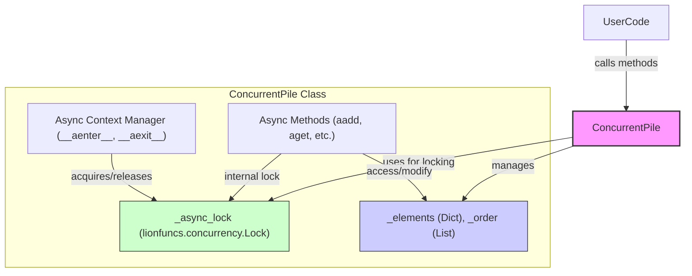
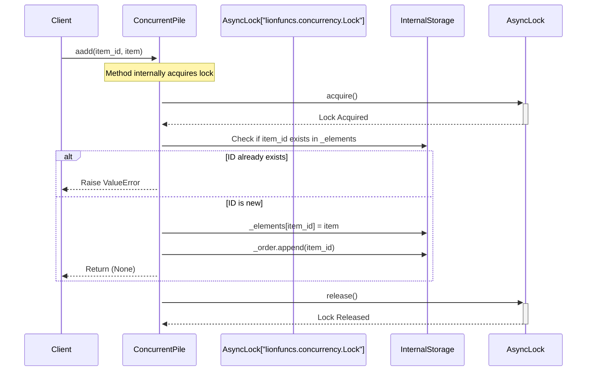
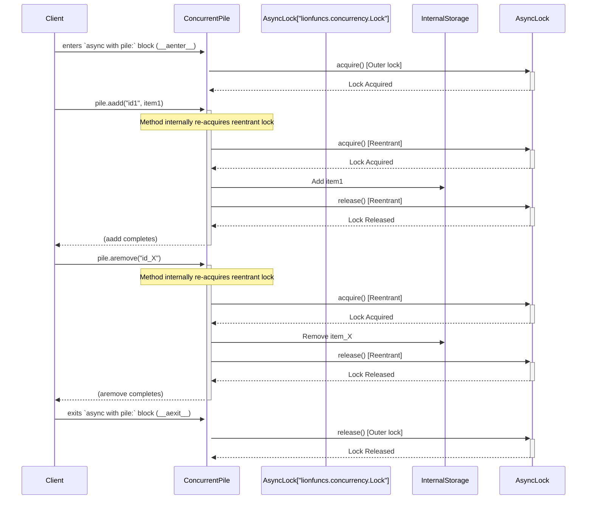

# Guidance

**Purpose**\
Lay out an **implementation-ready** blueprint for a component: data models,
APIs, flows, error handling, etc.

**When to Use**

- After Research is done, to guide the Implementer.
- Before Implementation Plan or simultaneously with it.

**Best Practices**

- Keep the design as **complete** as possible so coders can proceed with minimal
  guesswork.
- Emphasize any performance or security corners.
- Use diagrams (Mermaid) for clarity if applicable.

---

# Technical Design Specification: ConcurrentPile

## 1. Overview

### 1.1 Purpose

`ConcurrentPile` is designed to be an asynchronous, task-safe, ordered
collection class. It allows for concurrent addition, retrieval, and removal of
elements, identified by unique IDs, while maintaining insertion order. It
primarily targets asynchronous programming environments and aims to leverage
utilities from the `lionfuncs` library.

### 1.2 Scope

**Included:**

- Core async-safe collection operations (add, get, remove, pop, clear, iterate,
  length).
- Internal storage of elements mapped by ID and an ordered list of IDs.
- Leveraging [`lionfuncs.concurrency.Lock`](src/lionfuncs/concurrency.py:30) for
  task-safe operations.
- The class itself will be a Pydantic `BaseModel` for its own structure and
  validation.
- Implementation of the async context manager protocol (`__aenter__`,
  `__aexit__`) for managing compound atomic operations.
- Basic dictionary serialization helper methods using
  [`lionfuncs.utils.to_dict`](src/lionfuncs/utils.py:284).

**Not Included (for this version):**

- A synchronous API (focus is async-first).
- Advanced `Progression`-like ID-based ordering and slicing beyond standard list
  operations on IDs (as seen in the inspirational `Pile` class).
- A comprehensive `AdapterRegistry` for various file formats (JSON, CSV, Excel).
- Complex item-level type validation beyond what Pydantic offers for the
  elements themselves (if the generic type `E` is a Pydantic model).

### 1.3 Background

This design is inspired by the feature set of a more comprehensive `Pile` class
(user-provided example). The goal here is to create a somewhat simpler,
async-focused version that demonstrates and utilizes the concurrency and utility
functions available in the `lionfuncs` library. This component is intended as a
standalone design and not for direct integration into the `lionfuncs` core
library at this time. (Internal ref: User-provided `Pile.py` code snippet,
`lionfuncs` library).

### 1.4 Design Goals

- **Async-Safety:** All collection modification and access operations must be
  safe for concurrent execution in an asyncio environment. Individual methods
  are atomic.
- **Compound Atomicity:** Support for performing sequences of operations
  atomically via the async context manager protocol.
- **Simplicity:** Favor a clear and straightforward API and internal
  implementation.
- **Ordered:** Maintain the insertion order of elements.
- **Leverage `lionfuncs`:** Utilize relevant `lionfuncs` utilities for
  concurrency and data handling. (Internal ref:
  [`src/lionfuncs/concurrency.py`](src/lionfuncs/concurrency.py),
  [`src/lionfuncs/utils.py`](src/lionfuncs/utils.py))
- **Performance:** Ensure reasonable performance for typical concurrent use
  cases.

### 1.5 Key Constraints

- **Async-First:** The primary API will be asynchronous. Synchronous usage will
  require users to manage an event loop (e.g., via `asyncio.run()`).
- **Python Version:** Target Python 3.8+ (or as dictated by `lionfuncs`
  dependencies like `anyio`).
- **Dependencies:** Pydantic for the class structure, `lionfuncs` for specific
  utilities.

## 2. Architecture

### 2.1 Component Diagram



_Diagram illustrates `ConcurrentPile` encapsulating its internal state,
protected by an asynchronous lock from `lionfuncs`. Both individual methods and
the context manager interface utilize this lock._

### 2.2 Dependencies

- **Pydantic:** For `BaseModel` structure of `ConcurrentPile`.
- **`lionfuncs`:**
  - [`lionfuncs.concurrency.Lock`](src/lionfuncs/concurrency.py:30): For the
    asynchronous locking mechanism. (Internal ref: lionfuncs.concurrency.Lock)
  - [`lionfuncs.utils.to_dict`](src/lionfuncs/utils.py:284): For helper
    serialization methods. (Internal ref: lionfuncs.utils.to_dict)
  - (Optional) [`lionfuncs.utils.to_list`](src/lionfuncs/utils.py:130) for input
    normalization.
- **Standard Python `asyncio` library.**

### 2.3 Data Flow (Example: `aadd` operation & `async with` block)

**Single `aadd` call:**



**Compound operations with `async with`:**



## 3. Interface Definitions

### 3.1 Public Class Methods & Context Manager (Async API)

The `ConcurrentPile` class will provide the following primary asynchronous
methods. All methods that modify or access shared internal state will internally
acquire `_async_lock` ensuring atomicity for individual operations. The class
will also implement the asynchronous context manager protocol.

```python
import asyncio
from typing import TypeVar, Generic, Optional, Dict, List, AsyncIterator, Tuple, Iterable, Any
from pydantic import BaseModel, Field
from lionfuncs.concurrency import Lock as AsyncLionLock # Actual import path

E = TypeVar("E") # Element type

class ConcurrentPile(BaseModel, Generic[E]):
    _elements: Dict[str, E] = Field(default_factory=dict, exclude=True)
    _order: List[str] = Field(default_factory=list, exclude=True)
    _async_lock: AsyncLionLock = Field(default_factory=AsyncLionLock, exclude=True)

    class Config:
        arbitrary_types_allowed = True

    def __init__(self, elements: Optional[Iterable[Tuple[str, E]]] = None, **data: Any) -> None:
        """
        Initializes the ConcurrentPile.
        Args:
            elements: An optional iterable of (item_id, item) tuples to populate the pile.
            **data: Pydantic-related initialization data.
        """
        super().__init__(**data) # For Pydantic fields like _async_lock
        if elements:
            # Initial population is not made async for constructor simplicity.
            # Assumes constructor is called in a context where blocking briefly is acceptable,
            # or that `elements` is pre-validated and small.
            for item_id, item in elements:
                if item_id in self._elements: # Basic check, not under async lock here
                    raise ValueError(f"Duplicate ID '{item_id}' during initialization.")
                self._elements[item_id] = item
                self._order.append(item_id)

    async def __aenter__(self) -> 'ConcurrentPile[E]':
        """Enters the asynchronous context, acquiring the internal lock."""
        await self._async_lock.acquire()
        return self

    async def __aexit__(self, exc_type: Any, exc_val: Any, exc_tb: Any) -> None:
        """Exits the asynchronous context, releasing the internal lock."""
        self._async_lock.release()

    async def aadd(self, item_id: str, item: E) -> None:
        """
        Purpose: Asynchronously adds an item to the collection.
        Raises: ValueError if item_id already exists.
        """
        async with self._async_lock:
            if item_id in self._elements:
                raise ValueError(f"Item with ID '{item_id}' already exists.")
            self._elements[item_id] = item
            self._order.append(item_id)

    async def aget(self, item_id: str) -> Optional[E]:
        """
        Purpose: Asynchronously retrieves an item by its ID.
        Returns: The item if found, else None.
        """
        async with self._async_lock:
            return self._elements.get(item_id)

    async def aremove(self, item_id: str) -> Optional[E]:
        """
        Purpose: Asynchronously removes an item by its ID.
        Returns: The removed item if found, else None.
        """
        async with self._async_lock:
            if item_id in self._elements:
                item = self._elements.pop(item_id)
                self._order.remove(item_id)
                return item
            return None

    async def apop(self, index: int = -1) -> E:
        """
        Purpose: Asynchronously removes and returns an item at the given index (default last).
        Raises: IndexError if the pile is empty or the index is out of range.
        """
        async with self._async_lock:
            if not self._order:
                raise IndexError("Pop from an empty pile.")

            actual_index = index
            if index < 0:
                actual_index = len(self._order) + index

            if not (0 <= actual_index < len(self._order)):
                raise IndexError("Pop index out of range.")

            item_id_to_pop = self._order.pop(actual_index) # Use actual_index for pop
            return self._elements.pop(item_id_to_pop)

    async def aclear(self) -> None:
        """
        Purpose: Asynchronously removes all items from the collection.
        """
        async with self._async_lock:
            self._elements.clear()
            self._order.clear()

    async def alength(self) -> int:
        """
        Purpose: Asynchronously returns the number of items in the collection.
        """
        async with self._async_lock:
            return len(self._order)

    async def __aiter__(self) -> AsyncIterator[E]:
        """
        Purpose: Provides an asynchronous iterator over the items in order.
        Note: Creates a snapshot of the order under lock for safe iteration.
        """
        async with self._async_lock:
            # Snapshot the current order and relevant elements for safe iteration
            current_order_snapshot = list(self._order)
            # To ensure consistency, snapshot elements that are in the current_order_snapshot
            elements_snapshot = {id_: self._elements[id_] for id_ in current_order_snapshot if id_ in self._elements}

        for item_id in current_order_snapshot:
            if item_id in elements_snapshot: # Check if item still exists in snapshot
                 yield elements_snapshot[item_id]
            await asyncio.sleep(0) # Yield control to the event loop

    async def aitems(self) -> AsyncIterator[Tuple[str, E]]:
        """
        Purpose: Provides an asynchronous iterator over (ID, item) pairs in order.
        Note: Creates a snapshot for safe iteration.
        """
        async with self._async_lock:
            current_order_snapshot = list(self._order)
            elements_snapshot = {id_: self._elements[id_] for id_ in current_order_snapshot if id_ in self._elements}

        for item_id in current_order_snapshot:
            if item_id in elements_snapshot:
                yield (item_id, elements_snapshot[item_id])
            await asyncio.sleep(0)

    async def avalues(self) -> AsyncIterator[E]:
        """
        Purpose: Provides an asynchronous iterator over item values in order.
        Note: Creates a snapshot for safe iteration.
        """
        # This can be implemented by calling aitems and yielding only values
        async for _, value in self.aitems():
            yield value

    async def akeys(self) -> AsyncIterator[str]:
        """
        Purpose: Provides an asynchronous iterator over item IDs in order.
        Note: Creates a snapshot for safe iteration.
        """
        async with self._async_lock:
            current_order_snapshot = list(self._order)

        for item_id in current_order_snapshot:
            yield item_id
            await asyncio.sleep(0)
```

### 3.2 Internal Interfaces

- No significant private helper methods anticipated for the core logic beyond
  standard Pydantic behavior or simple internal checks.

## 4. Data Models

### 4.1 API Models

Not Applicable.

### 4.2 Domain Models

The primary domain model is `ConcurrentPile[E]` itself, as defined in section
3.1.

- `_elements: Dict[str, E]`: Stores the actual items, keyed by their unique
  string ID.
- `_order: List[str]`: Stores the unique string IDs in the order they were
  added.
- `_async_lock: lionfuncs.concurrency.Lock`: Ensures task-safe operations.
- The generic type `E` allows users to define the type of elements stored within
  the pile.

### 4.3 Database Schema

Not Applicable.

## 5. Behavior

### 5.1 Core Workflows

**Adding an item:**

1. Client calls `await pile.aadd(item_id, item)`.
2. `aadd` method acquires `_async_lock`.
3. Checks if `item_id` already exists in `_elements`.
   - If yes, raises `ValueError`.
   - If no, adds `item` to `_elements` and `item_id` to `_order`.
4. `_async_lock` is released.

**Iterating with `async for`:**

1. Client calls `async for item in pile: ...`.
2. `__aiter__` method is invoked.
3. `__aiter__` acquires `_async_lock`.
4. A snapshot of the current `_order` list and corresponding `_elements` is
   created.
5. `_async_lock` is released.
6. The iterator yields items from the snapshot one by one, with
   `await asyncio.sleep(0)` after each yield to allow other tasks to run.

**Compound operations with `async with pile:`:**

1. Client enters `async with pile:` block.
2. `pile.__aenter__` is called, acquiring `_async_lock`.
3. Client calls multiple `pile` methods (e.g., `await pile.aadd(...)`,
   `await pile.aremove(...)`).
   - Each of these methods internally attempts to acquire `_async_lock`. Since
     `lionfuncs.concurrency.Lock` (wrapping `anyio.Lock`) is reentrant, these
     acquisitions succeed.
4. Client exits `async with pile:` block.
5. `pile.__aexit__` is called, releasing `_async_lock` (the outermost hold).

### 5.2 Error Handling

- `ValueError`: Raised by `aadd` if an item ID already exists. Raised by
  `__init__` if duplicate IDs are provided during construction.
- `IndexError`: Raised by `apop` if the pile is empty or the index is out of
  range.
- Standard `asyncio` errors (e.g., `CancelledError`) will propagate if tasks are
  cancelled.
- Lock acquisition timeouts are not explicitly handled by
  `lionfuncs.concurrency.Lock` by default but could be a consideration if
  `anyio`'s underlying lock supports it and it's exposed. For now, assumes lock
  acquisition blocks indefinitely or until cancellation.

### 5.3 Security Considerations

- Not directly applicable for this data structure itself, beyond standard
  considerations for any Python object (e.g., if `E` contains sensitive data,
  the user of `ConcurrentPile` is responsible for its security).
- The component does not handle authentication, authorization, or network
  communication.

## 6. External Interactions

### 6.1 Dependencies on Other Services

Not Applicable.

### 6.2 External API Integrations

Not Applicable.

## 7. Performance Considerations

### 7.1 Expected Load

Designed for scenarios with moderate to high concurrency where multiple asyncio
tasks might interact with the same collection. Performance will depend on the
size of the collection, the frequency of operations, and the contention on the
lock.

### 7.2 Scalability Approach

- The primary bottleneck will be the single `_async_lock` serializing access to
  the shared state. For extremely high-throughput scenarios requiring
  modification, this could limit scalability.
- Read operations (like iteration over a snapshot) are designed to minimize lock
  holding time.
- The use of `dict` for `_elements` provides O(1) average time complexity for
  get/add/remove by ID (once the lock is acquired). List operations on `_order`
  (append, remove by value, pop by index) have their standard complexities.

### 7.3 Optimizations

- Iteration methods (`__aiter__`, `aitems`, `avalues`, `akeys`) create snapshots
  of the order and relevant elements under lock to allow the lock to be released
  quickly while iteration proceeds over the consistent snapshot. This improves
  concurrency by reducing the time the lock is held.
- Using `anyio.Lock` (via `lionfuncs.concurrency.Lock`) is generally efficient.

### 7.4 Caching Strategy

Not Applicable internally. Users might cache results from `aget` if appropriate
for their use case.

## 8. Observability

### 8.1 Logging

Minimal internal logging. Users can add logging around their calls to
`ConcurrentPile` methods. (Internal ref: Consider adding optional
`logging.Logger` instance if verbose internal operation logging is desired in
future).

### 8.2 Metrics

Not implemented in this version. Future enhancements could include counters for
operations, errors, lock contention time, etc.

### 8.3 Tracing

Not Applicable for this standalone class.

## 9. Testing Strategy

### 9.1 Unit Testing

- Test individual methods for correct behavior (add, get, remove, pop, clear,
  length).
- Test edge cases: empty pile, pile with one item, pile with many items.
- Test `__aiter__`, `aitems`, `avalues`, `akeys` for correct iteration and
  snapshot behavior.
- Test `__aenter__` and `__aexit__` for correct lock acquisition/release.
- Test concurrent access: multiple asyncio tasks attempting to add, remove, and
  read items simultaneously to ensure data integrity and absence of race
  conditions.
- Test error conditions (e.g., adding duplicate ID, popping from empty pile).

### 9.2 Integration Testing

Not applicable in the traditional sense for a standalone class, but testing its
use within a larger asyncio application that leverages it would be valuable.

### 9.3 Performance Testing

- Benchmark add, get, remove operations under varying levels of concurrency.
- Measure iteration speed over large collections.
- Assess lock contention impact.

## 10. Deployment and Configuration

### 10.1 Deployment Requirements

As a Python class, it's deployed as part of the application that uses it.
Requires Python 3.8+ (or as per `lionfuncs`) and dependencies (Pydantic,
`lionfuncs`).

### 10.2 Configuration Parameters

- The generic type `E` is configured at instantiation (e.g.,
  `ConcurrentPile[str]()`, `ConcurrentPile[MyDataObject]()`).
- Optional `elements` iterable in the constructor for initial population.

## 11. Open Questions

- Should there be a maximum size limit for the pile, and how should it be
  handled (e.g., raise error, block, drop oldest)? (Out of scope for v0.1.0, but
  see Appendix C for ideas using `lionfuncs.Event/Condition`)
- Is there a need for more sophisticated item-level type validation beyond
  relying on the generic type `E`? (Out of scope for v0.1.0)
- Are specific "bulk" operations (e.g., `aadd_many`, `aremove_many`) that
  operate under a single lock acquisition needed for performance in certain use
  cases? (Users can achieve this with `async with pile:`, but dedicated methods
  could be added. See Appendix C for `parallel_map` ideas).

## 12. Appendices

### Appendix A: Alternative Designs

- **External Lock Management:** Considered requiring users to manage the lock
  externally for all operations. Rejected in favor of internal locking for
  individual method safety and ease of use, while still providing the context
  manager for compound atomicity.
- **Synchronous API:** Considered providing a parallel synchronous API. Deferred
  in favor of an async-first design to simplify implementation and align with
  primary use cases. Synchronous users can use `asyncio.run()`.

### Appendix B: Research References

- Inspiration: User-provided `Pile.py` class example.
- [`lionfuncs` library documentation](src/lionfuncs) (specifically
  [`src/lionfuncs/concurrency.py`](src/lionfuncs/concurrency.py) and
  [`src/lionfuncs/utils.py`](src/lionfuncs/utils.py)).
- Python `asyncio` documentation on locks and context managers.
- `anyio` library documentation (as `lionfuncs.concurrency.Lock` is likely an
  `anyio` wrapper).
- Perplexity search `(pplx:978242b1-deb1-4abf-8bc3-ab26863cf3d3)` on single
  reentrant lock performance.

## Appendix C: Advanced Features & Deeper `lionfuncs` Integration

This appendix explores how additional primitives from the `lionfuncs` library
could be leveraged to enhance `ConcurrentPile` with more advanced features or
simplify the implementation of complex behaviors. While the v0.1.0 design
focuses on core concurrent collection capabilities using
`lionfuncs.concurrency.Lock`, the broader `lionfuncs` toolkit offers more.

### C.1 Processing Collection Contents Concurrently (`lionfuncs.async_utils`)

For scenarios where operations need to be performed on multiple (or all) items
within the `ConcurrentPile` concurrently:

- **`parallel_map(func, items, max_concurrency)`:**
  - **Potential Use Case:** Implement a method like
    `async def async_map_items(self, async_transform_func: Callable[[E], Any], max_concurrency: int = 10) -> List[Any]:`.
  - **Implementation Sketch:**
    ```python
    # Inside ConcurrentPile
    # from lionfuncs.async_utils import parallel_map # Actual import
    # async def async_map_items(self, async_transform_func, max_concurrency=10):
    #     items_snapshot = []
    #     async for item_value in self.avalues(): # uses snapshotting
    #         items_snapshot.append(item_value)
    #
    #     if not items_snapshot:
    #         return []
    #
    #     return await parallel_map(async_transform_func, items_snapshot, max_concurrency)
    ```
  - **Benefit:** `parallel_map` from
    [`src/lionfuncs/async_utils.py`](src/lionfuncs/async_utils.py:569) handles
    the complexities of task grouping, execution, and result aggregation, making
    the `ConcurrentPile` method much simpler to write.

- **`alcall(input_list, func, ...)` /
  `bcall(input_list, func, batch_size, ...)`:**
  - **Potential Use Case:** If `ConcurrentPile` items need to be processed by an
    external service (via an API call represented by `func`) with built-in
    retries, delays, batching, and error handling.
  - **Implementation Sketch:** A method like
    `async def async_process_with_retries(self, item_ids: List[str], processing_func: Callable, retry_params: dict = None, batch_size: Optional[int] = None)`
    could retrieve the specified items and then use `alcall` or `bcall` (from
    [`src/lionfuncs/async_utils.py`](src/lionfuncs/async_utils.py)) to manage
    their processing.
  - **Benefit:** These functions from
    [`src/lionfuncs/async_utils.py`](src/lionfuncs/async_utils.py) encapsulate
    sophisticated retry logic, concurrency management, and batching,
    significantly reducing the custom code needed within `ConcurrentPile` for
    such resilient operations.

### C.2 Controlling Method Execution Behavior (`lionfuncs.async_utils` decorators)

These decorators can be applied to specific `ConcurrentPile` methods:

- **`@throttle(period)`:**
  - **Potential Use Case:** If `ConcurrentPile` had a method that, for example,
    triggered a costly re-indexing or summary generation of its contents,
    `@throttle` (from
    [`src/lionfuncs/async_utils.py`](src/lionfuncs/async_utils.py:95)) could
    prevent it from being called too frequently.
  - **Benefit:** Simple, declarative rate limiting for specific operations.

- **`@max_concurrent(limit)`:**
  - **Potential Use Case:** While write operations are serialized by the main
    `_async_lock`, if there's a particularly resource-intensive read operation
    (e.g., one that deeply inspects or transforms items from a snapshot),
    `@max_concurrent` (from
    [`src/lionfuncs/async_utils.py`](src/lionfuncs/async_utils.py:122)) could
    limit how many such operations run in parallel, even if they don't block
    each other via the main lock.
  - **Benefit:** Fine-grained concurrency control for specific methods to
    prevent resource starvation.

### C.3 Advanced Synchronization & Flow Control (`lionfuncs.concurrency`)

- **`Semaphore(value)`:**
  - **Potential Use Case:** Limit the number of concurrent active iterators.
    While iterators operate on snapshots, creating many snapshots simultaneously
    for very large piles could have memory implications. A `Semaphore` (from
    [`src/lionfuncs/concurrency.py`](src/lionfuncs/concurrency.py:31)) could be
    acquired in `__aiter__` and released when the iterator is exhausted or
    closed.
  - **Benefit:** Control over concurrent resource usage related to specific pile
    operations (like iteration).

- **`Event()`:**
  - **Potential Use Case 1 (Max Size Limit):**
    - `ConcurrentPile` could have a `max_size` attribute and an internal
      `_space_available_event: lionfuncs.concurrency.Event`.
    - `aadd`: If `len(self._order) >= self.max_size`, it would
      `await self._space_available_event.wait()`, then clear the event.
    - `aremove`/`apop`: Would call `self._space_available_event.set()` if space
      becomes available.
  - **Potential Use Case 2 ("Wait for Item"):**
    - Implement
      `async def await_item_presence(self, item_id: str, timeout: Optional[float] = None) -> bool:`.
    - This method could use a dictionary of `lionfuncs.concurrency.Event`
      objects, one per awaited `item_id`. When `aadd` adds an item, it checks
      this dictionary and sets the corresponding event.
  - **Benefit:** `Event` (from
    [`src/lionfuncs/concurrency.py`](src/lionfuncs/concurrency.py:32)) provides
    a clean way to signal conditions and manage task waiting/resumption for
    features like bounded collections or item-presence notifications.

- **`Condition()`:**
  - **Potential Use Case:** Similar to `Event` for max size, but `Condition`
    (from [`src/lionfuncs/concurrency.py`](src/lionfuncs/concurrency.py:34)) is
    often preferred when the condition to wait for is more complex than a simple
    flag, or when multiple waiters need to be notified. It integrates directly
    with a lock (which could be `_async_lock`).
  - Example: Wait until `len(self._order) < self.max_size` or
    `len(self._order) == 0`.
    ```python
    # Inside ConcurrentPile, assuming self._condition uses self._async_lock
    # from lionfuncs.concurrency import Condition # Actual import
    # # In __init__ or as a Field:
    # # self._condition = Condition(self._async_lock._lock) # Assuming _async_lock is LionLock wrapping anyio.Lock
    #
    # async def aadd_with_max_size_condition(self, item_id, item):
    #     async with self._condition: # Acquires the associated lock
    #         while len(self._order) >= self.max_size: # self.max_size needs to be defined
    #             await self._condition.wait()
    #         # ... add item ...
    #         # self._condition.notify() # Notify one waiter if they wait for "not_empty"
    #
    # async def aremove_with_max_size_condition(self, item_id):
    #     async with self._condition:
    #         # ... remove item ...
    #         if len(self._order) < self.max_size: # self.max_size needs to be defined
    #             self._condition.notify_all() # Notify all waiters that space is available
    ```
  - **Benefit:** More expressive for complex state-based synchronization,
    tightly coupled with the collection's main lock.

### C.4 Utility Functions (`lionfuncs.utils`)

- **[`to_list()`](src/lionfuncs/utils.py:130):** As mentioned in the main TDS,
  useful for normalizing inputs to methods that might accept single items or
  iterables of items (e.g., a hypothetical `aadd_many`).
- **[`to_dict()`](src/lionfuncs/utils.py:284):** Used for basic serialization,
  as noted.
- **[`force_async()`](src/lionfuncs/utils.py:62) /
  [`is_coro_func()`](src/lionfuncs/utils.py:39):** If `ConcurrentPile` methods
  were to accept user-provided callback functions (e.g., for transforming items
  during an operation), these utilities would help in handling both sync and
  async callbacks gracefully.

By thoughtfully integrating these additional `lionfuncs` primitives,
`ConcurrentPile` could evolve into a very powerful and versatile component, with
much of the underlying concurrency and operational complexity handled robustly
by the `lionfuncs` library.
