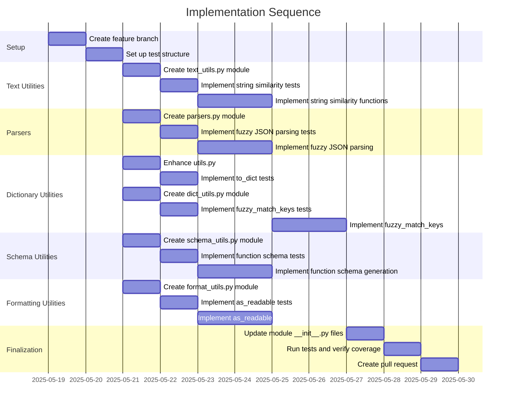

# Implementation Plan: Integration of .khive/dev/ Utilities into src/lionfuncs

## 1. Overview

### 1.1 Component Purpose

This implementation plan outlines the approach for integrating selected utility
functions from the `.khive/dev/` directory into the main `src/lionfuncs`
library. These utilities will enhance `lionfuncs` with well-tested,
general-purpose functions for string similarity, JSON parsing, dictionary
conversion, data formatting, dictionary key matching, and function schema
generation.

### 1.2 Design Reference

This implementation is based on the approved Technical Design Specification:

- [TDS-52.md](.khive/reports/tds/TDS-52.md) - "TDS for Integrating .khive/dev/
  Utilities into src/lionfuncs"

### 1.3 Implementation Approach

The implementation will follow Test-Driven Development (TDD) principles:

1. Create new module files in `src/lionfuncs` as specified in the TDS
2. For each utility function:
   - Write unit tests first
   - Implement the function to make tests pass
   - Refactor as needed while maintaining test coverage
3. Ensure all functions have proper type hints, docstrings, and error handling
4. Maintain backward compatibility with existing code
5. Aim for >90% test coverage for new code

## 2. Implementation Phases

### 2.1 Phase 1: Core Text and Parsing Utilities

**Key Deliverables:**

- New module `src/lionfuncs/text_utils.py` with string similarity functions
- New module `src/lionfuncs/parsers.py` with fuzzy JSON parsing

**Dependencies:**

- Standard library modules (`difflib`, `re`, `collections.Counter`, `json`)

**Estimated Complexity:** Medium

### 2.2 Phase 2: Dictionary and Schema Utilities

**Key Deliverables:**

- Enhanced `src/lionfuncs/utils.py` with `to_dict` function
- New module `src/lionfuncs/dict_utils.py` with key fuzzy matching
- New module `src/lionfuncs/schema_utils.py` with function schema generation

**Dependencies:**

- `text_utils.py` (for `dict_utils.py`)
- `pydantic` (for schema generation)
- `inspect` module (for function introspection)

**Estimated Complexity:** High

### 2.3 Phase 3: Formatting Utilities

**Key Deliverables:**

- New module `src/lionfuncs/format_utils.py` with human-readable data formatting

**Dependencies:**

- `utils.py` (for `to_dict` function)
- Optional dependency on `IPython` for notebook detection

**Estimated Complexity:** Medium

## 3. Test Strategy

### 3.1 Unit Tests

#### 3.1.1 Test Group: String Similarity Functions

| ID   | Description                                                       | Fixtures/Mocks | Assertions                                               |
| ---- | ----------------------------------------------------------------- | -------------- | -------------------------------------------------------- |
| UT-1 | Test string_similarity with various algorithms                    | None           | Similarity scores match expected values                  |
| UT-2 | Test string_similarity with edge cases (empty strings, identical) | None           | Correct handling of edge cases                           |
| UT-3 | Test private similarity functions (_levenshtein_distance, etc.)   | None           | Correct distance/similarity calculations                 |
| UT-4 | Test _cosine_similarity with word tokenization                    | None           | Vectorization and similarity calculation works correctly |

#### 3.1.2 Test Group: Fuzzy JSON Parsing

| ID   | Description                                               | Fixtures/Mocks | Assertions                                            |
| ---- | --------------------------------------------------------- | -------------- | ----------------------------------------------------- |
| UT-5 | Test fuzzy_parse_json with valid JSON                     | None           | Correctly parses valid JSON                           |
| UT-6 | Test fuzzy_parse_json with common JSON errors             | None           | Successfully fixes and parses JSON with common errors |
| UT-7 | Test fuzzy_parse_json with strict mode                    | None           | Raises appropriate exceptions in strict mode          |
| UT-8 | Test _fix_json_string with various JSON formatting issues | None           | Correctly fixes common JSON formatting issues         |

#### 3.1.3 Test Group: Dictionary Conversion

| ID    | Description                                               | Fixtures/Mocks   | Assertions                                         |
| ----- | --------------------------------------------------------- | ---------------- | -------------------------------------------------- |
| UT-9  | Test to_dict with Pydantic models                         | Mock models      | Correctly converts Pydantic models to dictionaries |
| UT-10 | Test to_dict with dataclasses                             | Mock dataclasses | Correctly converts dataclasses to dictionaries     |
| UT-11 | Test to_dict with nested structures                       | None             | Correctly handles nested structures                |
| UT-12 | Test to_dict with various options (fields, exclude, etc.) | Mock models      | Options correctly affect the output                |

#### 3.1.4 Test Group: Human-Readable Formatting

| ID    | Description                                              | Fixtures/Mocks | Assertions                                         |
| ----- | -------------------------------------------------------- | -------------- | -------------------------------------------------- |
| UT-13 | Test as_readable with different format_types             | None           | Correctly formats data in specified format         |
| UT-14 | Test as_readable with nested data                        | None           | Correctly formats nested data structures           |
| UT-15 | Test _format_dict_yaml_like with various data structures | None           | Correctly formats dictionaries in YAML-like format |
| UT-16 | Test _is_in_notebook detection                           | Mock IPython   | Correctly detects notebook environment             |

#### 3.1.5 Test Group: Dictionary Key Matching

| ID    | Description                                                 | Fixtures/Mocks | Assertions                                                |
| ----- | ----------------------------------------------------------- | -------------- | --------------------------------------------------------- |
| UT-17 | Test fuzzy_match_keys with exact matches                    | None           | Correctly identifies exact key matches                    |
| UT-18 | Test fuzzy_match_keys with fuzzy matches                    | None           | Correctly identifies fuzzy key matches based on threshold |
| UT-19 | Test fuzzy_match_keys with different similarity algorithms  | None           | Different algorithms produce expected results             |
| UT-20 | Test fuzzy_match_keys with various handle_unmatched options | None           | Correctly handles unmatched keys based on options         |

#### 3.1.6 Test Group: Function Schema Generation

| ID    | Description                                                 | Fixtures/Mocks | Assertions                                      |
| ----- | ----------------------------------------------------------- | -------------- | ----------------------------------------------- |
| UT-21 | Test function_to_openai_schema with simple functions        | None           | Correctly generates schema for simple functions |
| UT-22 | Test function_to_openai_schema with complex parameter types | None           | Correctly handles complex parameter types       |
| UT-23 | Test function_to_openai_schema with docstrings              | None           | Correctly extracts descriptions from docstrings |
| UT-24 | Test function_to_openai_schema with Pydantic models         | Mock models    | Correctly handles Pydantic models in type hints |

### 3.2 Integration Tests

#### 3.2.1 Test Group: Cross-Module Integration

| ID   | Description                                   | Setup                                           | Assertions                                        |
| ---- | --------------------------------------------- | ----------------------------------------------- | ------------------------------------------------- |
| IT-1 | Test fuzzy_match_keys using string_similarity | Initialize with different similarity algorithms | Correctly uses the specified similarity algorithm |
| IT-2 | Test as_readable using to_dict                | Create complex nested data structures           | Correctly converts and formats complex data       |

### 3.3 Mock and Stub Requirements

| Dependency         | Mock/Stub Type | Key Behaviors to Mock                         |
| ------------------ | -------------- | --------------------------------------------- |
| IPython            | Mock           | get_ipython() function and has_trait behavior |
| Pydantic BaseModel | Mock           | model_dump() method for to_dict testing       |

## 4. Implementation Tasks

### 4.1 Setup and Infrastructure

| ID  | Task                  | Description                                                 | Dependencies | Priority | Complexity |
| --- | --------------------- | ----------------------------------------------------------- | ------------ | -------- | ---------- |
| T-1 | Create feature branch | Create feature/13-integrate-dev-utils branch from design/52 | None         | High     | Low        |
| T-2 | Set up test structure | Create test files for each new module                       | None         | High     | Low        |

### 4.2 Text Utilities Implementation

| ID  | Task                                  | Description                                                | Dependencies | Priority | Complexity |
| --- | ------------------------------------- | ---------------------------------------------------------- | ------------ | -------- | ---------- |
| T-3 | Create text_utils.py module           | Create the new module file with proper imports and exports | None         | High     | Low        |
| T-4 | Implement string similarity tests     | Write tests for string similarity functions                | T-2          | High     | Medium     |
| T-5 | Implement string similarity functions | Implement the string similarity functions and helpers      | T-3, T-4     | High     | Medium     |

### 4.3 Parser Implementation

| ID  | Task                               | Description                                                | Dependencies | Priority | Complexity |
| --- | ---------------------------------- | ---------------------------------------------------------- | ------------ | -------- | ---------- |
| T-6 | Create parsers.py module           | Create the new module file with proper imports and exports | None         | High     | Low        |
| T-7 | Implement fuzzy JSON parsing tests | Write tests for fuzzy JSON parsing functions               | T-2          | High     | Medium     |
| T-8 | Implement fuzzy JSON parsing       | Implement the fuzzy_parse_json function and helpers        | T-6, T-7     | High     | Medium     |

### 4.4 Dictionary Utilities Implementation

| ID   | Task                             | Description                                                | Dependencies    | Priority | Complexity |
| ---- | -------------------------------- | ---------------------------------------------------------- | --------------- | -------- | ---------- |
| T-9  | Enhance utils.py                 | Add to_dict function to existing utils.py                  | None            | High     | Medium     |
| T-10 | Implement to_dict tests          | Write tests for to_dict function                           | T-2             | High     | Medium     |
| T-11 | Create dict_utils.py module      | Create the new module file with proper imports and exports | None            | High     | Low        |
| T-12 | Implement fuzzy_match_keys tests | Write tests for fuzzy_match_keys function                  | T-2             | High     | Medium     |
| T-13 | Implement fuzzy_match_keys       | Implement the fuzzy_match_keys function                    | T-5, T-11, T-12 | High     | Medium     |

### 4.5 Schema Utilities Implementation

| ID   | Task                                 | Description                                                | Dependencies | Priority | Complexity |
| ---- | ------------------------------------ | ---------------------------------------------------------- | ------------ | -------- | ---------- |
| T-14 | Create schema_utils.py module        | Create the new module file with proper imports and exports | None         | Medium   | Low        |
| T-15 | Implement function schema tests      | Write tests for function_to_openai_schema                  | T-2          | Medium   | Medium     |
| T-16 | Implement function schema generation | Implement the function_to_openai_schema function           | T-14, T-15   | Medium   | High       |

### 4.6 Formatting Utilities Implementation

| ID   | Task                          | Description                                                | Dependencies    | Priority | Complexity |
| ---- | ----------------------------- | ---------------------------------------------------------- | --------------- | -------- | ---------- |
| T-17 | Create format_utils.py module | Create the new module file with proper imports and exports | None            | Medium   | Low        |
| T-18 | Implement as_readable tests   | Write tests for as_readable function                       | T-2             | Medium   | Medium     |
| T-19 | Implement as_readable         | Implement the as_readable function and helpers             | T-9, T-17, T-18 | Medium   | Medium     |

### 4.7 Documentation and Finalization

| ID   | Task                            | Description                                      | Dependencies             | Priority | Complexity |
| ---- | ------------------------------- | ------------------------------------------------ | ------------------------ | -------- | ---------- |
| T-20 | Update module **init**.py files | Update **init**.py files to expose new functions | All implementation tasks | Medium   | Low        |
| T-21 | Run tests and verify coverage   | Run all tests and ensure coverage meets targets  | All implementation tasks | High     | Low        |
| T-22 | Create pull request             | Create PR from feature branch to main            | All tasks                | High     | Low        |

## 5. Implementation Sequence



## 6. Acceptance Criteria

### 6.1 Component Level

| ID   | Criterion                                                        | Validation Method           |
| ---- | ---------------------------------------------------------------- | --------------------------- |
| AC-1 | All utility functions are properly integrated into src/lionfuncs | All tests pass              |
| AC-2 | Code follows lionfuncs coding standards                          | Pre-commit hooks pass       |
| AC-3 | New code has >90% test coverage                                  | Coverage report             |
| AC-4 | All functions have proper type hints and docstrings              | Static type checking passes |

### 6.2 Function Level

| ID    | Criterion                                                             | Validation Method         |
| ----- | --------------------------------------------------------------------- | ------------------------- |
| AC-5  | string_similarity correctly calculates similarity with all algorithms | Unit tests UT-1 to UT-4   |
| AC-6  | fuzzy_parse_json correctly parses and fixes malformed JSON            | Unit tests UT-5 to UT-8   |
| AC-7  | to_dict correctly converts various object types to dictionaries       | Unit tests UT-9 to UT-12  |
| AC-8  | as_readable correctly formats data in human-readable formats          | Unit tests UT-13 to UT-16 |
| AC-9  | fuzzy_match_keys correctly matches dictionary keys using similarity   | Unit tests UT-17 to UT-20 |
| AC-10 | function_to_openai_schema correctly generates OpenAI function schemas | Unit tests UT-21 to UT-24 |

## 7. Test Implementation Plan

### 7.1 Test Implementation Sequence

1. Implement base test fixtures and helpers
2. Implement unit tests for string similarity functions
3. Implement unit tests for fuzzy JSON parsing
4. Implement unit tests for to_dict function
5. Implement unit tests for fuzzy_match_keys function
6. Implement unit tests for function_to_openai_schema function
7. Implement unit tests for as_readable function
8. Implement integration tests for cross-module functionality

### 7.2 Test Code Examples

#### Unit Test Example for string_similarity

```python
def test_string_similarity_levenshtein():
    # Arrange
    s1 = "kitten"
    s2 = "sitting"

    # Act
    similarity = string_similarity(s1, s2, method="levenshtein")

    # Assert
    assert 0.0 <= similarity <= 1.0
    assert similarity == 0.5714285714285714  # Expected value for these strings
```

#### Unit Test Example for fuzzy_parse_json

```python
def test_fuzzy_parse_json_fixes_common_errors():
    # Arrange
    malformed_json = "{'key': 'value', 'array': [1, 2, 3,]}"  # Single quotes and trailing comma

    # Act
    result = fuzzy_parse_json(malformed_json, attempt_fix=True)

    # Assert
    assert result == {"key": "value", "array": [1, 2, 3]}
```

## 8. Implementation Risks and Mitigations

| Risk                                      | Impact | Likelihood | Mitigation                                                                         |
| ----------------------------------------- | ------ | ---------- | ---------------------------------------------------------------------------------- |
| Incompatibility with existing code        | High   | Low        | Thorough testing, especially for to_dict which enhances an existing module         |
| Performance issues with string similarity | Medium | Medium     | Implement efficient algorithms, document performance characteristics               |
| Dependency management issues              | Medium | Low        | Minimize external dependencies, use standard library where possible                |
| Overly permissive fuzzy logic             | Medium | Medium     | Provide clear parameters to control "fuzziness", document behavior and limitations |

## 9. Dependencies and Environment

### 9.1 External Libraries

| Library  | Version  | Purpose                           |
| -------- | -------- | --------------------------------- |
| Pydantic | ^2.0.0   | Data validation and models        |
| IPython  | Optional | Notebook detection in as_readable |

### 9.2 Environment Setup

```bash
# Set up development environment
khive init

# Run tests
uv run pytest tests/unit/test_text_utils.py -v
```

## 10. Additional Resources

### 10.1 Reference Implementation

Original utility implementations in `.khive/dev/` directory.

### 10.2 Relevant Documentation

- [Pydantic v2 Documentation](https://docs.pydantic.dev/latest/)
- [Python Standard Library - difflib](https://docs.python.org/3/library/difflib.html)
- [Python Standard Library - inspect](https://docs.python.org/3/library/inspect.html)
- [Python Standard Library - json](https://docs.python.org/3/library/json.html)

### 10.3 Design Patterns

- Adapter Pattern: Used in to_dict to handle different object types
- Strategy Pattern: Used in string_similarity to select different algorithms
