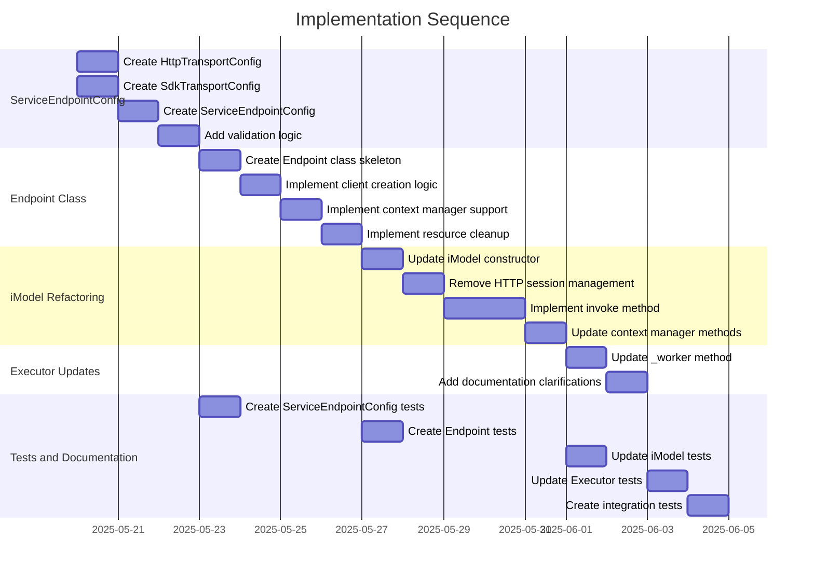

# Implementation Plan: Network Module Refactoring

## 1. Overview

### 1.1 Component Purpose

This implementation plan outlines the steps to refactor the network module by
introducing a new `Endpoint` class, refactoring the `iModel` class to use
`AsyncAPIClient` for direct HTTP calls and integrate with SDK adapters via the
new `Endpoint` class, and clarifying the optional nature of the API
token-specific rate limiter in the `Executor` class.

### 1.2 Design Reference

This implementation is based on the approved technical design document:

- [TDS-19.md](.khive/reports/tds/TDS-19.md): Technical Design Specification for
  iModel, Executor, and Endpoint Refinement

### 1.3 Implementation Approach

We will follow a Test-Driven Development (TDD) approach:

1. Write failing tests for each new component/feature
2. Implement the code to make the tests pass
3. Refactor as needed while maintaining passing tests

The implementation will be done in phases, starting with the new
`ServiceEndpointConfig` model, then the `Endpoint` class, followed by
refactoring the `iModel` class, and finally updating the `Executor` class.

## 2. Implementation Phases

### 2.1 Phase 1: ServiceEndpointConfig Model

Create the new `ServiceEndpointConfig` model to provide comprehensive
configuration for the `Endpoint` class.

**Key Deliverables:**

- New `ServiceEndpointConfig` Pydantic model in `primitives.py` or a new
  `config.py` file
- Supporting models: `HttpTransportConfig` and `SdkTransportConfig`
- Validation logic for configuration options

**Dependencies:**

- Existing `primitives.py` module
- Pydantic for model definition

**Estimated Complexity:** Medium

### 2.2 Phase 2: Endpoint Class

Implement the new `Endpoint` class to manage the creation, configuration, and
lifecycle of API clients.

**Key Deliverables:**

- New `endpoint.py` file with the `Endpoint` class
- Async context manager support
- Client creation and management logic
- Resource cleanup functionality

**Dependencies:**

- `ServiceEndpointConfig` model from Phase 1
- `AsyncAPIClient` and `AbstractSDKAdapter` classes

**Estimated Complexity:** Medium

### 2.3 Phase 3: iModel Refactoring

Refactor the `iModel` class to use the new `Endpoint` class for client/adapter
management and implement a generic `invoke` method.

**Key Deliverables:**

- Updated `iModel` class in `imodel.py`
- New `invoke` method for generic API calls
- Integration with `Endpoint` for client/adapter management
- Simplified API call coroutine submission to `Executor`

**Dependencies:**

- `Endpoint` class from Phase 2
- Existing `Executor` class
- `NetworkRequestEvent` class

**Estimated Complexity:** High

### 2.4 Phase 4: Executor Updates

Update the `Executor` class to handle the revised return signature from
`iModel`'s internal call coroutine.

**Key Deliverables:**

- Updated `_worker` method in `Executor` class
- Documentation clarifications for API token rate limiter

**Dependencies:**

- Refactored `iModel` class from Phase 3
- `NetworkRequestEvent` class

**Estimated Complexity:** Low

### 2.5 Phase 5: Tests and Documentation

Update existing tests and add new tests for the refactored components. Update
documentation.

**Key Deliverables:**

- Updated unit tests for all refactored components
- New unit tests for the `Endpoint` class
- Updated documentation

**Dependencies:**

- All implemented components from previous phases

**Estimated Complexity:** Medium

## 3. Test Strategy

### 3.1 Unit Tests

#### 3.1.1 Test Group: ServiceEndpointConfig

| ID   | Description                                                     | Fixtures/Mocks | Assertions                                             |
| ---- | --------------------------------------------------------------- | -------------- | ------------------------------------------------------ |
| UT-1 | Test that ServiceEndpointConfig validates HTTP transport config | None           | Validation passes for valid config, raises for invalid |
| UT-2 | Test that ServiceEndpointConfig validates SDK transport config  | None           | Validation passes for valid config, raises for invalid |
| UT-3 | Test that model_validator correctly enforces constraints        | None           | Validation raises for missing required fields          |

#### 3.1.2 Test Group: Endpoint

| ID   | Description                                                  | Fixtures/Mocks      | Assertions                                 |
| ---- | ------------------------------------------------------------ | ------------------- | ------------------------------------------ |
| UT-4 | Test that Endpoint creates AsyncAPIClient for HTTP transport | `mock_async_client` | Client is created with correct parameters  |
| UT-5 | Test that Endpoint creates SDKAdapter for SDK transport      | `mock_sdk_adapter`  | Adapter is created with correct parameters |
| UT-6 | Test that Endpoint properly manages client lifecycle         | `mock_client`       | Client is initialized and closed properly  |
| UT-7 | Test that Endpoint handles errors during client creation     | `mock_client_error` | Appropriate errors are raised              |

#### 3.1.3 Test Group: iModel

| ID    | Description                                            | Fixtures/Mocks                   | Assertions                                             |
| ----- | ------------------------------------------------------ | -------------------------------- | ------------------------------------------------------ |
| UT-8  | Test that iModel.invoke correctly calls AsyncAPIClient | `mock_endpoint`, `mock_executor` | Client request is called with correct parameters       |
| UT-9  | Test that iModel.invoke correctly calls SDKAdapter     | `mock_endpoint`, `mock_executor` | Adapter call is made with correct parameters           |
| UT-10 | Test that iModel.invoke correctly handles errors       | `mock_endpoint`, `mock_executor` | Errors are properly propagated                         |
| UT-11 | Test that iModel correctly submits tasks to Executor   | `mock_endpoint`, `mock_executor` | Executor.submit_task is called with correct parameters |

#### 3.1.4 Test Group: Executor

| ID    | Description                                             | Fixtures/Mocks        | Assertions                                    |
| ----- | ------------------------------------------------------- | --------------------- | --------------------------------------------- |
| UT-12 | Test that Executor._worker handles direct response body | `mock_api_coro`       | NetworkRequestEvent is updated correctly      |
| UT-13 | Test that Executor._worker handles exceptions           | `mock_api_coro_error` | NetworkRequestEvent error is set correctly    |
| UT-14 | Test that API token rate limiter is optional            | None                  | Executor works without API token rate limiter |

### 3.2 Integration Tests

#### 3.2.1 Test Group: End-to-End Flow

| ID   | Description                                               | Setup                                    | Assertions                                                       |
| ---- | --------------------------------------------------------- | ---------------------------------------- | ---------------------------------------------------------------- |
| IT-1 | Test that iModel with Endpoint and Executor work together | Initialize components with test config   | Request flows through all components and returns expected result |
| IT-2 | Test that error handling works across all components      | Initialize components, configure to fail | Error is properly propagated and captured in NetworkRequestEvent |

### 3.3 Mock and Stub Requirements

| Dependency        | Mock/Stub Type | Key Behaviors to Mock                   |
| ----------------- | -------------- | --------------------------------------- |
| AsyncAPIClient    | Mock           | request method, context manager methods |
| SDKAdapter        | Mock           | call method, context manager methods    |
| Executor          | Mock           | submit_task method                      |
| httpx.AsyncClient | Mock           | request method, context manager methods |

## 4. Implementation Tasks

### 4.1 ServiceEndpointConfig

| ID  | Task                         | Description                                              | Dependencies | Priority | Complexity |
| --- | ---------------------------- | -------------------------------------------------------- | ------------ | -------- | ---------- |
| T-1 | Create HttpTransportConfig   | Implement the HTTP transport configuration model         | None         | High     | Low        |
| T-2 | Create SdkTransportConfig    | Implement the SDK transport configuration model          | None         | High     | Low        |
| T-3 | Create ServiceEndpointConfig | Implement the main endpoint configuration model          | T-1, T-2     | High     | Medium     |
| T-4 | Add validation logic         | Implement model validators for configuration constraints | T-3          | High     | Medium     |

### 4.2 Endpoint Class

| ID  | Task                              | Description                                         | Dependencies | Priority | Complexity |
| --- | --------------------------------- | --------------------------------------------------- | ------------ | -------- | ---------- |
| T-5 | Create Endpoint class skeleton    | Implement the basic structure of the Endpoint class | T-3          | High     | Low        |
| T-6 | Implement client creation logic   | Add logic to create AsyncAPIClient or SDKAdapter    | T-5          | High     | Medium     |
| T-7 | Implement context manager support | Add async context manager methods                   | T-6          | High     | Low        |
| T-8 | Implement resource cleanup        | Add proper resource cleanup in close method         | T-7          | High     | Low        |

### 4.3 iModel Refactoring

| ID   | Task                           | Description                                                | Dependencies | Priority | Complexity |
| ---- | ------------------------------ | ---------------------------------------------------------- | ------------ | -------- | ---------- |
| T-9  | Update iModel constructor      | Modify to accept Endpoint instead of model_endpoint_config | T-8          | High     | Low        |
| T-10 | Remove HTTP session management | Remove _get_session and close_session methods              | T-9          | High     | Low        |
| T-11 | Implement invoke method        | Create generic invoke method for API calls                 | T-10         | High     | High       |
| T-12 | Update context manager methods | Modify to use Endpoint's context manager                   | T-11         | Medium   | Low        |

### 4.4 Executor Updates

| ID   | Task                             | Description                                                   | Dependencies | Priority | Complexity |
| ---- | -------------------------------- | ------------------------------------------------------------- | ------------ | -------- | ---------- |
| T-13 | Update _worker method            | Modify to handle direct response body from API call coroutine | T-12         | High     | Medium     |
| T-14 | Add documentation clarifications | Clarify optional nature of API token rate limiter             | T-13         | Medium   | Low        |

### 4.5 Tests and Documentation

| ID   | Task                               | Description                                                   | Dependencies | Priority | Complexity |
| ---- | ---------------------------------- | ------------------------------------------------------------- | ------------ | -------- | ---------- |
| T-15 | Create ServiceEndpointConfig tests | Write unit tests for the new configuration model              | T-4          | High     | Medium     |
| T-16 | Create Endpoint tests              | Write unit tests for the new Endpoint class                   | T-8          | High     | Medium     |
| T-17 | Update iModel tests                | Modify existing tests and add new tests for refactored iModel | T-12         | High     | Medium     |
| T-18 | Update Executor tests              | Modify existing tests for updated Executor                    | T-14         | High     | Medium     |
| T-19 | Create integration tests           | Write tests for end-to-end flow                               | T-18         | Medium   | Medium     |

## 5. Implementation Sequence



## 6. Acceptance Criteria

### 6.1 Component Level

| ID   | Criterion                                                               | Validation Method                   |
| ---- | ----------------------------------------------------------------------- | ----------------------------------- |
| AC-1 | ServiceEndpointConfig correctly validates configuration options         | Unit tests UT-1, UT-2, UT-3         |
| AC-2 | Endpoint correctly creates and manages clients/adapters                 | Unit tests UT-4, UT-5, UT-6, UT-7   |
| AC-3 | iModel correctly uses Endpoint for client/adapter management            | Unit tests UT-8, UT-9, UT-10, UT-11 |
| AC-4 | Executor correctly handles direct response body from API call coroutine | Unit tests UT-12, UT-13, UT-14      |
| AC-5 | All components work together in an end-to-end flow                      | Integration tests IT-1, IT-2        |

### 6.2 API Level

| ID   | Criterion                                                                   | Validation Method     |
| ---- | --------------------------------------------------------------------------- | --------------------- |
| AC-6 | iModel.invoke provides a consistent interface for different transport types | Unit tests UT-8, UT-9 |
| AC-7 | Endpoint provides a consistent interface for different client/adapter types | Unit tests UT-4, UT-5 |
| AC-8 | API token rate limiter in Executor is clearly optional                      | Unit test UT-14       |

## 7. Test Implementation Plan

### 7.1 Test Implementation Sequence

1. Implement base test fixtures and mocks for AsyncAPIClient, SDKAdapter, and
   Executor
2. Implement unit tests for ServiceEndpointConfig
3. Implement unit tests for Endpoint
4. Implement unit tests for refactored iModel
5. Implement unit tests for updated Executor
6. Implement integration tests for end-to-end flow

### 7.2 Test Code Examples

#### Unit Test Example for ServiceEndpointConfig

```python
def test_service_endpoint_config_http_validation():
    # Valid HTTP config
    config = ServiceEndpointConfig(
        name="test_http",
        transport_type="http",
        base_url="https://api.example.com",
        http_config=HttpTransportConfig()
    )
    assert config.name == "test_http"
    assert config.transport_type == "http"
    assert config.base_url == "https://api.example.com"

    # Invalid HTTP config (missing base_url)
    with pytest.raises(ValueError):
        ServiceEndpointConfig(
            name="test_http",
            transport_type="http",
            http_config=HttpTransportConfig()
        )
```

#### Unit Test Example for Endpoint

```python
async def test_endpoint_creates_async_api_client():
    # Arrange
    config = ServiceEndpointConfig(
        name="test_http",
        transport_type="http",
        base_url="https://api.example.com",
        http_config=HttpTransportConfig()
    )

    # Mock AsyncAPIClient
    with patch("lionfuncs.network.client.AsyncAPIClient") as mock_client_class:
        mock_client = mock_client_class.return_value
        mock_client.__aenter__.return_value = mock_client

        # Act
        endpoint = Endpoint(config)
        client = await endpoint.get_client()

        # Assert
        assert client == mock_client
        mock_client_class.assert_called_once_with(
            base_url="https://api.example.com",
            timeout=60.0,
            headers={},
        )
```

## 8. Implementation Risks and Mitigations

| Risk                                                    | Impact | Likelihood | Mitigation                                                                                           |
| ------------------------------------------------------- | ------ | ---------- | ---------------------------------------------------------------------------------------------------- |
| Breaking changes to existing code using iModel/Executor | High   | Medium     | Comprehensive test coverage, clear documentation of changes, consider backward compatibility options |
| Complex parameter merging logic in iModel.invoke        | Medium | Medium     | Thorough testing with different parameter combinations, clear documentation of parameter precedence  |
| Resource leaks if Endpoint is not properly closed       | Medium | Low        | Ensure proper context manager implementation, add warnings/logging for improper usage                |
| Inconsistent behavior between HTTP and SDK transport    | High   | Medium     | Standardize error handling and response formats, thorough testing of both transport types            |

## 9. Dependencies and Environment

### 9.1 External Libraries

| Library        | Version | Purpose                        |
| -------------- | ------- | ------------------------------ |
| httpx          | ^0.24.0 | HTTP client for AsyncAPIClient |
| pydantic       | ^2.0.0  | Data validation and models     |
| pytest         | ^7.0.0  | Testing framework              |
| pytest-asyncio | ^0.21.0 | Async testing support          |

### 9.2 Environment Setup

```bash
# Initialize development environment
khive init

# Run tests
uv run pytest tests/unit/network/
```

## 10. Additional Resources

### 10.1 Reference Implementation

- Existing `iModel` class in `src/lionfuncs/network/imodel.py`
- Existing `Executor` class in `src/lionfuncs/network/executor.py`
- Existing `AsyncAPIClient` class in `src/lionfuncs/network/client.py`
- Existing `AbstractSDKAdapter` protocol in `src/lionfuncs/network/adapters.py`

### 10.2 Relevant Documentation

- [TDS-19.md](.khive/reports/tds/TDS-19.md): Technical Design Specification
- [httpx Documentation](https://www.python-httpx.org/): For AsyncAPIClient
  implementation
- [Pydantic Documentation](https://docs.pydantic.dev/): For model validation

### 10.3 Design Patterns

- Factory Pattern: Used in `Endpoint` to create appropriate client/adapter
  instances
- Adapter Pattern: Used in `AbstractSDKAdapter` to provide a consistent
  interface for different SDKs
- Strategy Pattern: Used in `iModel.invoke` to handle different transport types
- Context Manager Pattern: Used in `Endpoint` and `iModel` for resource
  management
