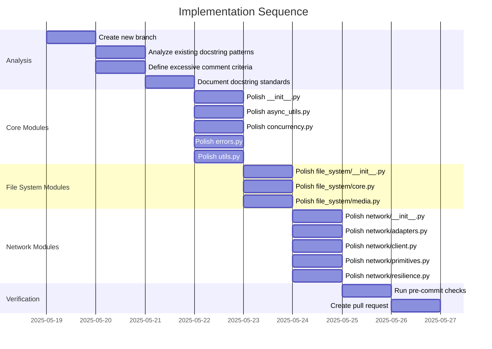

# Implementation Plan: lionfuncs Code Polishing

## 1. Overview

### 1.1 Component Purpose

This implementation plan outlines the approach for polishing the `lionfuncs`
package by removing excessive comments and ensuring docstring consistency across
all modules. The goal is to improve code readability and maintainability without
changing functionality.

### 1.2 Design Reference

This implementation is based on the task requirements to:

1. Remove excessive comments that are redundant, state the obvious, or contain
   commented-out code
2. Ensure docstring consistency across all modules, classes, functions, and
   methods
3. Maintain Google-style docstrings unless another style is already established

### 1.3 Implementation Approach

The implementation will follow a systematic approach:

1. Analyze the current state of comments and docstrings in each module
2. Define clear criteria for identifying excessive comments
3. Establish docstring standards based on existing patterns
4. Apply changes methodically, one file at a time
5. Run pre-commit checks to ensure code quality is maintained
6. Create a pull request with the changes

## 2. Implementation Phases

### 2.1 Phase 1: Analysis and Standards Definition

**Key Deliverables:**

- Assessment of current comment and docstring patterns
- Defined criteria for excessive comments
- Established docstring standards

**Dependencies:**

- None

**Estimated Complexity:** Low

### 2.2 Phase 2: Core Module Polishing

**Key Deliverables:**

- Polished core modules (`__init__.py`, `async_utils.py`, `concurrency.py`,
  `errors.py`, `utils.py`)

**Dependencies:**

- Phase 1 completion

**Estimated Complexity:** Medium

### 2.3 Phase 3: File System Module Polishing

**Key Deliverables:**

- Polished file system modules (`file_system/__init__.py`,
  `file_system/core.py`, `file_system/media.py`)

**Dependencies:**

- Phase 2 completion

**Estimated Complexity:** Medium

### 2.4 Phase 4: Network Module Polishing

**Key Deliverables:**

- Polished network modules (`network/__init__.py`, `network/adapters.py`,
  `network/client.py`, `network/primitives.py`, `network/resilience.py`)

**Dependencies:**

- Phase 3 completion

**Estimated Complexity:** Medium

### 2.5 Phase 5: Verification and PR Creation

**Key Deliverables:**

- Pre-commit checks passed
- Pull request created

**Dependencies:**

- Phase 4 completion

**Estimated Complexity:** Low

## 3. Test Strategy

Since this task involves code polishing without functional changes, we will rely
on existing tests to verify that functionality remains intact.

### 3.1 Verification Tests

| ID   | Description                                   | Validation Method                             |
| ---- | --------------------------------------------- | --------------------------------------------- |
| VT-1 | Ensure all existing tests pass after changes  | Run `uv run pytest tests`                     |
| VT-2 | Verify code formatting and linting standards  | Run `uv run pre-commit run --all-files`       |
| VT-3 | Confirm no functional changes were introduced | Compare test results before and after changes |

## 4. Implementation Tasks

### 4.1 Analysis and Standards Definition

| ID  | Task                                | Description                                                    | Dependencies | Priority | Complexity |
| --- | ----------------------------------- | -------------------------------------------------------------- | ------------ | -------- | ---------- |
| T-1 | Create new branch                   | Create `refactor/lionfuncs-polishing` branch                   | None         | High     | Low        |
| T-2 | Analyze existing docstring patterns | Review all modules to identify the predominant docstring style | T-1          | High     | Low        |
| T-3 | Define excessive comment criteria   | Establish clear guidelines for identifying comments to remove  | T-1          | High     | Low        |
| T-4 | Document docstring standards        | Create a reference for consistent docstring formatting         | T-2          | High     | Low        |

### 4.2 Core Module Polishing

| ID  | Task                    | Description                                                | Dependencies | Priority | Complexity |
| --- | ----------------------- | ---------------------------------------------------------- | ------------ | -------- | ---------- |
| T-5 | Polish `__init__.py`    | Remove excessive comments and ensure docstring consistency | T-4          | Medium   | Low        |
| T-6 | Polish `async_utils.py` | Remove excessive comments and ensure docstring consistency | T-4          | High     | Medium     |
| T-7 | Polish `concurrency.py` | Remove excessive comments and ensure docstring consistency | T-4          | High     | Medium     |
| T-8 | Polish `errors.py`      | Remove excessive comments and ensure docstring consistency | T-4          | Medium   | Low        |
| T-9 | Polish `utils.py`       | Remove excessive comments and ensure docstring consistency | T-4          | High     | Medium     |

### 4.3 File System Module Polishing

| ID   | Task                             | Description                                                | Dependencies | Priority | Complexity |
| ---- | -------------------------------- | ---------------------------------------------------------- | ------------ | -------- | ---------- |
| T-10 | Polish `file_system/__init__.py` | Remove excessive comments and ensure docstring consistency | T-9          | Medium   | Low        |
| T-11 | Polish `file_system/core.py`     | Remove excessive comments and ensure docstring consistency | T-9          | High     | Medium     |
| T-12 | Polish `file_system/media.py`    | Remove excessive comments and ensure docstring consistency | T-9          | High     | Medium     |

### 4.4 Network Module Polishing

| ID   | Task                           | Description                                                | Dependencies | Priority | Complexity |
| ---- | ------------------------------ | ---------------------------------------------------------- | ------------ | -------- | ---------- |
| T-13 | Polish `network/__init__.py`   | Remove excessive comments and ensure docstring consistency | T-12         | Medium   | Low        |
| T-14 | Polish `network/adapters.py`   | Remove excessive comments and ensure docstring consistency | T-12         | High     | Medium     |
| T-15 | Polish `network/client.py`     | Remove excessive comments and ensure docstring consistency | T-12         | High     | Medium     |
| T-16 | Polish `network/primitives.py` | Remove excessive comments and ensure docstring consistency | T-12         | High     | Medium     |
| T-17 | Polish `network/resilience.py` | Remove excessive comments and ensure docstring consistency | T-12         | High     | Medium     |

### 4.5 Verification and PR Creation

| ID   | Task                  | Description                                                | Dependencies | Priority | Complexity |
| ---- | --------------------- | ---------------------------------------------------------- | ------------ | -------- | ---------- |
| T-18 | Run pre-commit checks | Ensure all formatting and linting checks pass              | T-17         | High     | Low        |
| T-19 | Create pull request   | Create PR targeting the main branch with clear description | T-18         | High     | Low        |

## 5. Implementation Sequence



## 6. Acceptance Criteria

### 6.1 Code Quality

| ID   | Criterion                                                                 | Validation Method                   |
| ---- | ------------------------------------------------------------------------- | ----------------------------------- |
| AC-1 | All excessive comments are removed                                        | Code review                         |
| AC-2 | All docstrings follow a consistent style                                  | Code review                         |
| AC-3 | All public modules, classes, functions, and methods have clear docstrings | Code review                         |
| AC-4 | No functional changes are introduced                                      | All tests pass                      |
| AC-5 | Code passes all pre-commit checks                                         | `uv run pre-commit run --all-files` |

### 6.2 PR Quality

| ID   | Criterion                                                | Validation Method   |
| ---- | -------------------------------------------------------- | ------------------- |
| AC-6 | PR targets the main branch                               | GitHub PR interface |
| AC-7 | PR description clearly states the purpose of the changes | GitHub PR interface |

## 7. Implementation Guidelines

### 7.1 Excessive Comment Criteria

Comments will be considered excessive and candidates for removal if they:

1. Restate what the code obviously does (e.g., `# Increment counter` for
   `counter += 1`)
2. Are commented-out code that is no longer needed
3. Are redundant with docstrings
4. Contain outdated information
5. Are placeholder comments with no actual content

Comments will be retained if they:

1. Explain complex logic or algorithms
2. Provide context that isn't obvious from the code
3. Explain why something is done a certain way
4. Document workarounds or edge cases
5. Contain important warnings or notes for future developers

### 7.2 Docstring Standards

Based on initial analysis, the Google docstring style appears to be the
predominant pattern in the codebase. We will standardize on this format:

```python
def function_name(param1, param2):
    """Short description of function.

    Longer description if needed.

    Args:
        param1: Description of param1.
        param2: Description of param2.

    Returns:
        Description of return value.

    Raises:
        ExceptionType: Description of when this exception is raised.
    """
    # Function implementation
```

For classes:

```python
class ClassName:
    """Short description of class.

    Longer description if needed.

    Attributes:
        attr1: Description of attr1.
        attr2: Description of attr2.
    """

    def __init__(self, param1, param2):
        """Initialize the class.

        Args:
            param1: Description of param1.
            param2: Description of param2.
        """
        # Implementation
```

## 8. Implementation Risks and Mitigations

| Risk                                             | Impact | Likelihood | Mitigation                                                                      |
| ------------------------------------------------ | ------ | ---------- | ------------------------------------------------------------------------------- |
| Removing comments that contain important context | High   | Medium     | Carefully review each comment before removal, when in doubt, retain the comment |
| Introducing functional changes while editing     | High   | Low        | Focus only on comments and docstrings, run tests after each file change         |
| Inconsistent docstring formatting                | Medium | Medium     | Create clear docstring standards and review each file against these standards   |
| Pre-commit checks failing after changes          | Medium | Medium     | Run pre-commit checks after each file change to catch issues early              |

## 9. Dependencies and Environment

### 9.1 Required Tools

| Tool       | Version | Purpose                   |
| ---------- | ------- | ------------------------- |
| Git        | Any     | Version control           |
| uv         | Any     | Python package management |
| pre-commit | Any     | Code quality checks       |
| pytest     | Any     | Running tests             |

### 9.2 Environment Setup

```bash
# Clone repository and create branch
git checkout -b refactor/lionfuncs-polishing

# Install dependencies
khive init

# Run tests to establish baseline
uv run pytest tests
```

## 10. Additional Notes

This implementation plan focuses on code polishing without changing
functionality. The goal is to improve code readability and maintainability by
removing unnecessary comments and ensuring consistent documentation.

The changes will be made incrementally, one file at a time, with regular testing
to ensure no functional changes are introduced. The final result will be a
cleaner, more maintainable codebase with consistent documentation.
