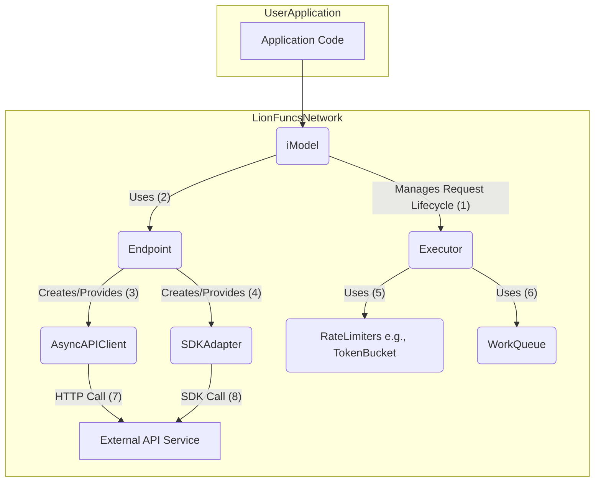
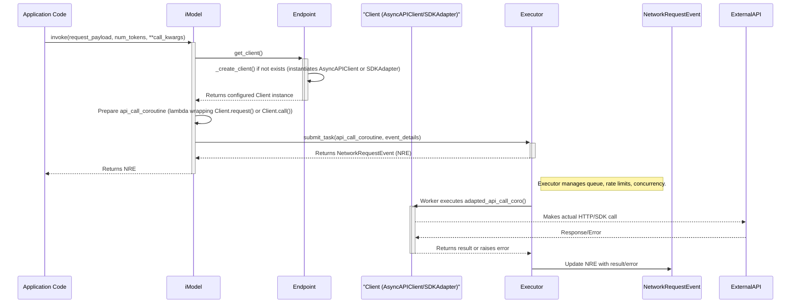

# Guidance

**Purpose** Lay out an **implementation-ready** blueprint for refining library
components: data models, class structures, APIs, flows, error handling, etc.

**When to Use**

- After Research is done, to guide the Implementer.
- Before Implementation Plan or simultaneously with it.

**Best Practices**

- Keep the design as **complete** as possible so coders can proceed with minimal
  guesswork.
- Emphasize any performance or concurrency considerations.
- Use diagrams (Mermaid) for clarity.

---

# Technical Design Specification: iModel, Executor, and Endpoint Refinement

## 1. Overview

### 1.1 Purpose

This document outlines the technical design for:

1. Refactoring the `iModel` class to use `lionfuncs.AsyncAPIClient` for direct
   HTTP calls and integrate with SDK adapters via a new `Endpoint` class.
2. Introducing a new `Endpoint` class responsible for client/adapter creation
   and configuration.
3. Clarifying the optional nature of the API token-specific rate limiter in the
   `Executor` class. This revision addresses feedback from GitHub Issue #19 and
   incorporates insights from user-provided examples.

### 1.2 Scope

**In Scope:**

- Design of a new `lionfuncs.network.Endpoint` class.
- Modifications to `lionfuncs.network.imodel.iModel`:
  - Use `AsyncAPIClient` for HTTP calls.
  - Integrate with SDK adapters from `lionfuncs.network.adapters` via the new
    `Endpoint` class.
  - Implement a generic invocation method (e.g., `invoke`).
- Modifications to `lionfuncs.network.executor.Executor`:
  - Ensure the API token-specific rate limiter is clearly optional in its
    configuration and usage.
- Definition of a new `ServiceEndpointConfig` model for configuring the
  `Endpoint` class.
- Updated class structures, interaction diagrams, and configuration details.
- Clear separation of concerns: `Endpoint` for connection/client management,
  `Executor` for rate-limiting/concurrency, `iModel` for request preparation and
  orchestration.

**Out of Scope:**

- Implementation of new, specific SDK adapters beyond what's needed to
  illustrate the pattern (OpenAI, Anthropic adapters in
  `lionfuncs.network.adapters` serve as examples).
- Major changes to the `Executor`'s core rate-limiting or `WorkQueue` logic
  beyond the optional token limiter.
- Detailed implementation of resilience patterns (retry, circuit breaker) within
  the `Endpoint` class if not directly passed to `AsyncAPIClient` or handled by
  SDKs themselves. Focus is on `AsyncAPIClient`'s existing capabilities.

### 1.3 Background

This design revises the networking components based on feedback from Issue #19,
aiming for a more flexible, robust, and maintainable system for API
interactions. It builds upon the foundations laid in
[`TDS-17.md`](.khive/reports/tds/TDS-17.md) and existing `lionfuncs` network
primitives. A key introduction is the `Endpoint` class, inspired by user
feedback, to centralize client and adapter management.

### 1.4 Design Goals

- **Flexibility:** `iModel` should easily support various communication methods
  (direct HTTP, SDKs) via the `Endpoint` class.
- **Clarity:** Clearly define responsibilities for `iModel`, `Endpoint`, and
  `Executor`.
- **Robustness:** Leverage `AsyncAPIClient` and SDK adapters for reliable
  communication.
- **Configurability:** Ensure `Executor`'s rate limiters (especially the API
  token one) are easily and clearly configurable. `ServiceEndpointConfig` should
  be comprehensive.
- **Maintainability:** Improve code organization and reduce direct dependencies
  within `iModel`.
- **User-centricity:** Incorporate the user's `Endpoint` concept for improved
  usability in client/adapter management.

### 1.5 Key Constraints

- Must utilize existing `lionfuncs` primitives where appropriate (e.g.,
  `AsyncAPIClient`, `AbstractSDKAdapter`, `TokenBucketRateLimiter`).
- The solution must be asynchronous (`asyncio`).
- Adherence to feedback points in Issue #19.

## 2. Architecture

### 2.1 Component Interaction Diagram



**Responsibilities:**

- **`iModel`**:
  - Is configured with an `Endpoint` instance and an `Executor` instance.
  - Prepares request parameters based on input and `Endpoint` configuration.
  - Uses the `Endpoint` to get a client/adapter instance (`AsyncAPIClient` or
    `SDKAdapter`).
  - Constructs the actual API call coroutine (a lambda or partial function)
    using the client/adapter.
  - Submits the call coroutine to the `Executor` via `executor.submit_task()`.
  - Returns the `NetworkRequestEvent` from the `Executor`, allowing the caller
    to track the request.
- **`Endpoint`**:
  - Initialized with a `ServiceEndpointConfig`.
  - Acts as a factory to create and configure instances of `AsyncAPIClient` (for
    `transport_type="http"`) or specific SDK Adapters (for
    `transport_type="sdk"`) using
    `lionfuncs.network.adapters.create_sdk_adapter`.
  - Manages the lifecycle of the created client/adapter through the async
    context manager protocol (`__aenter__`, `__aexit__`). It ensures that the
    underlying client (e.g., `httpx.AsyncClient` within `AsyncAPIClient`, or the
    SDK's own client) is properly initialized and closed.
- **`Executor`**:
  - Manages a `WorkQueue` of tasks (API call coroutines).
  - Enforces concurrency limits using `CapacityLimiter`.
  - Enforces request rate limits using a `TokenBucketRateLimiter`.
  - Enforces API token consumption rate limits using an optional
    `TokenBucketRateLimiter` (disabled if `api_tokens_rate` is not configured).
  - Executes the API call coroutines dequeued from `WorkQueue`.
  - Creates and updates `NetworkRequestEvent` for each task, tracking its
    lifecycle and outcome.
- **`AsyncAPIClient`**:
  - Handles direct HTTP/S communication using `httpx.AsyncClient`.
  - Manages its own `httpx.AsyncClient` instance.
  - Implements resilience patterns like retries and circuit breaking,
    configurable via its constructor.
  - Maps HTTP errors to `lionfuncs.errors` exceptions.
- **`SDKAdapter` (`AbstractSDKAdapter` implementations e.g. `OpenAIAdapter`):**
  - Wraps a specific vendor SDK (e.g., `openai`, `anthropic`).
  - Provides a consistent `call(method_name, **kwargs)` interface.
  - Manages the lifecycle of the underlying SDK client.
  - Maps SDK-specific errors to `LionSDKError`.

### 2.2 Data Flow / Interaction Diagram (`iModel.invoke()`)



## 3. Class Structures & Internal Interfaces

### 3.1 `lionfuncs.network.primitives.ServiceEndpointConfig` (New Model)

**File:** To be added, e.g., in
[`src/lionfuncs/network/config.py`](src/lionfuncs/network/config.py) or enhance
`primitives.py`. This new Pydantic model will provide comprehensive
configuration for the `Endpoint` class.

```python
# Proposed structure for ServiceEndpointConfig
# Location: e.g., src/lionfuncs/network/config.py

from typing import Literal, Optional, Dict, Any, Union
from pydantic import BaseModel, Field, model_validator

# Assuming RetryConfig and CircuitBreakerConfig are defined in lionfuncs.network.resilience
# from lionfuncs.network.resilience import RetryConfig, CircuitBreakerConfig # Placeholder

class HttpTransportConfig(BaseModel):
    # method: str = "POST" # Default HTTP method if not overridden at call time
    # Other AsyncAPIClient specific configs can go here if not covered by client_constructor_kwargs
    pass

class SdkTransportConfig(BaseModel):
    sdk_provider_name: str # e.g., "openai", "anthropic" (maps to adapter factory)
    # Default SDK method to call if not specified in iModel.invoke()
    # default_sdk_method_name: Optional[str] = None
    pass

class ServiceEndpointConfig(BaseModel):
    name: str = Field(description="User-defined name for this endpoint configuration, e.g., 'openai_chat_completions_gpt4'")
    transport_type: Literal["http", "sdk"] = Field(description="Specifies if direct HTTP or an SDK adapter is used.")

    # Common fields for both transport types
    api_key: Optional[str] = Field(None, description="API key. Can be set via env var or direct value.")
    base_url: Optional[str] = Field(None, description="Base URL for HTTP calls or if required by an SDK.")
    timeout: float = Field(60.0, description="Default request timeout in seconds.")

    # Headers for HTTP transport, can also be used by some SDKs if they accept custom headers.
    default_headers: Dict[str, str] = Field(default_factory=dict, description="Default headers for HTTP requests.")

    # Keyword arguments passed directly to the constructor of AsyncAPIClient or the specific SDK client.
    # For AsyncAPIClient, this can include 'auth', 'event_hooks', etc.
    # For SDKs, this includes any specific init params for that SDK (e.g., 'organization' for OpenAI).
    client_constructor_kwargs: Dict[str, Any] = Field(default_factory=dict)

    # Specific configuration block for HTTP transport
    http_config: Optional[HttpTransportConfig] = Field(None, description="Configuration specific to HTTP transport.")

    # Specific configuration block for SDK transport
    sdk_config: Optional[SdkTransportConfig] = Field(None, description="Configuration specific to SDK transport.")

    # Default keyword arguments to be included in every request made through this endpoint.
    # These can be overridden by call-specific arguments in iModel.invoke().
    # For HTTP, these might be default query params or JSON body elements.
    # For SDK, these are default parameters for the SDK method call.
    default_request_kwargs: Dict[str, Any] = Field(default_factory=dict)

    # Optional resilience configurations to be passed to AsyncAPIClient constructor
    # or potentially used by Endpoint to wrap SDK calls if SDKs don't have native support.
    # retry_config: Optional[RetryConfig] = None
    # circuit_breaker_config: Optional[CircuitBreakerConfig] = None # Define CircuitBreakerConfig if needed

    @model_validator(mode='after')
    def check_transport_specific_config(cls, values):
        transport_type = values.get('transport_type')
        if transport_type == 'http' and values.get('http_config') is None:
            # Default HttpTransportConfig if not provided
            values['http_config'] = HttpTransportConfig()
        if transport_type == 'sdk' and values.get('sdk_config') is None:
            raise ValueError("sdk_config must be provided for SDK transport type.")
        if transport_type == 'http' and not values.get('base_url'):
            raise ValueError("base_url must be provided for HTTP transport type.")
        return values

    class Config:
        extra = 'forbid' # Disallow extra fields not defined in the model
```

### 3.2 `lionfuncs.network.Endpoint` (New Class)

**File:**
[`src/lionfuncs/network/endpoint.py`](src/lionfuncs/network/endpoint.py) (New
file)

```python
# In src/lionfuncs/network/endpoint.py
import asyncio
from typing import Optional, Union, Any

from lionfuncs.network.client import AsyncAPIClient
from lionfuncs.network.adapters import AbstractSDKAdapter, create_sdk_adapter
# from lionfuncs.network.config import ServiceEndpointConfig # Assuming new config model
# from lionfuncs.network.resilience import RetryConfig, CircuitBreaker # If Endpoint manages resilience

class Endpoint:
    """
    Manages the creation, configuration, and lifecycle of API clients
    (AsyncAPIClient or SDK Adapters) based on a ServiceEndpointConfig.
    It acts as a factory and context manager for these clients.
    """
    def __init__(self, config: ServiceEndpointConfig):
        """
        Initializes the Endpoint.

        Args:
            config: The configuration defining how to connect to the service.
        """
        self.config: ServiceEndpointConfig = config
        self._client_instance: Optional[Union[AsyncAPIClient, AbstractSDKAdapter]] = None
        self._lock = asyncio.Lock() # Protects _client_instance creation
        self._closed = False

    async def _create_client(self) -> Union[AsyncAPIClient, AbstractSDKAdapter]:
        """Instantiates the appropriate client based on configuration."""
        if self.config.transport_type == "http":
            return AsyncAPIClient(
                base_url=self.config.base_url, # Must be present due to validator
                timeout=self.config.timeout,
                headers=self.config.default_headers,
                # Pass resilience configs if they are part of ServiceEndpointConfig and AsyncAPIClient accepts them
                # retry_config=self.config.retry_config,
                # circuit_breaker=self.config.circuit_breaker_config.build() if self.config.circuit_breaker_config else None,
                **self.config.client_constructor_kwargs
            )
        elif self.config.transport_type == "sdk":
            # sdk_config is guaranteed by validator
            sdk_conf = self.config.sdk_config
            return create_sdk_adapter(
                provider=sdk_conf.sdk_provider_name,
                api_key=self.config.api_key, # api_key is passed to adapter factory
                **self.config.client_constructor_kwargs
            )
        else:
            # This case should ideally be caught by Pydantic validation of transport_type
            raise ValueError(f"Unsupported transport_type: {self.config.transport_type}")

    async def get_client(self) -> Union[AsyncAPIClient, AbstractSDKAdapter]:
        """
        Provides a configured and ready-to-use client instance.
        Manages singleton creation and enters client's async context if applicable.
        """
        if self._closed:
            raise RuntimeError(f"Endpoint '{self.config.name}' is closed.")

        if self._client_instance is None:
            async with self._lock:
                if self._client_instance is None: # Double-check after acquiring lock
                    self._client_instance = await self._create_client()
                    # If the created client is an async context manager, enter its context.
                    if hasattr(self._client_instance, '__aenter__'):
                         await self._client_instance.__aenter__()
        return self._client_instance

    async def close(self) -> None:
        """Closes the underlying client and marks the Endpoint as closed."""
        if self._closed:
            return
        async with self._lock:
            if self._client_instance:
                client_to_close = self._client_instance
                self._client_instance = None # Clear instance before potentially slow close
                if hasattr(client_to_close, '__aexit__'):
                    await client_to_close.__aexit__(None, None, None)
                elif hasattr(client_to_close, 'close'): # For adapters/clients not full context managers
                    # Check if close is a coroutine
                    close_method = getattr(client_to_close, 'close')
                    if asyncio.iscoroutinefunction(close_method):
                        await close_method()
                    else:
                        close_method() # Assuming synchronous close if not a coroutine
            self._closed = True

    async def __aenter__(self) -> "Endpoint":
        """Enters the async context, ensuring the client is initialized."""
        await self.get_client()
        return self

    async def __aexit__(self, exc_type, exc_val, exc_tb) -> None:
        """Exits the async context, ensuring the client is closed."""
        await self.close()
```

### 3.3 `lionfuncs.network.imodel.iModel` (Refactoring)

**File:** [`src/lionfuncs/network/imodel.py`](src/lionfuncs/network/imodel.py)

**Key Changes:**

1. **Constructor:**
   - `__init__(self, endpoint: Endpoint, executor: Executor)`
2. **Client Handling:**
   - Uses `await self.endpoint.get_client()` to obtain `AsyncAPIClient` or
     `SDKAdapter`.
3. **Generic Invocation Method `invoke`:**
   - `async def invoke(self, request_payload: Any, num_api_tokens_needed: int = 0, **call_specific_kwargs) -> NetworkRequestEvent:`
   - `call_specific_kwargs` can include:
     - `http_path: str` (for HTTP, path relative to `Endpoint`'s `base_url`)
     - `http_method: str` (e.g., "GET", "PUT", overrides `Endpoint`'s default if
       any)
     - `sdk_method_name: str` (for SDK, e.g., "chat.completions.create")
     - `request_params: Dict[str, Any]` (for GET request query params or to
       merge into SDK/POST payload)
     - `metadata: Dict[str, Any]` (for `NetworkRequestEvent`)
4. **Call Logic in `invoke`:**
   - Dynamically constructs the call based on the type of client from
     `Endpoint`.
   - Merges `Endpoint.config.default_request_kwargs`, `request_payload`, and
     `call_specific_kwargs` appropriately.
5. **Executor Submission:**
   - The `api_call_coroutine` submitted to `executor.submit_task` will be
     simplified. It should just make the call and return the direct result
     (e.g., parsed JSON for HTTP, SDK's response object) or raise an exception.
     `Executor`'s `_worker` will handle wrapping this into the
     `(status, headers, body)` tuple for `NetworkRequestEvent` or setting the
     error.

```python
# In src/lionfuncs/network/imodel.py
import logging
from typing import Any, Optional, Union

from pydantic import BaseModel # For type hinting request_payload

# from lionfuncs.network.config import ServiceEndpointConfig # If used directly by iModel for type hints
from lionfuncs.network.endpoint import Endpoint
from lionfuncs.network.executor import Executor
from lionfuncs.network.events import NetworkRequestEvent, RequestStatus
from lionfuncs.network.client import AsyncAPIClient
from lionfuncs.network.adapters import AbstractSDKAdapter
from lionfuncs.errors import APIClientError, LionSDKError # For specific error handling if needed

logger = logging.getLogger(__name__)

class iModel:
    """
    Orchestrates API interactions for a specific model or service endpoint.
    It uses an Endpoint to get a configured client/adapter and an Executor
    to manage the execution of API calls.
    """

    def __init__(self, endpoint: Endpoint, executor: Executor):
        """
        Initialize the iModel.

        Args:
            endpoint: A configured Endpoint instance providing access to the API client/adapter.
            executor: An Executor instance for managing API call execution.
        """
        self.endpoint = endpoint
        self.executor = executor
        logger.debug(f"Initialized iModel with Endpoint: {self.endpoint.config.name}")

    async def invoke(
        self,
        request_payload: Any,  # Can be a dict or Pydantic model
        num_api_tokens_needed: int = 0,
        http_path: Optional[str] = None, # e.g., "v1/chat/completions"
        http_method: Optional[str] = None, # Overrides ServiceEndpointConfig.http_config.method
        sdk_method_name: Optional[str] = None, # e.g., "chat.completions.create"
        # Additional kwargs to pass to AsyncAPIClient.request or SDKAdapter.call
        # These are merged with Endpoint's default_request_kwargs and the payload
        **additional_request_params: Any
    ) -> NetworkRequestEvent:
        """
        Makes a generic call to the configured API endpoint.

        Args:
            request_payload: The primary payload for the request (dict or Pydantic model).
            num_api_tokens_needed: Estimated API tokens this call will consume.
            http_path: Specific path for HTTP requests (appended to Endpoint's base_url).
            http_method: HTTP method (e.g., "GET", "POST"). Overrides Endpoint default.
            sdk_method_name: Specific SDK method to call (e.g., "chat.completions.create").
            **additional_request_params: Further keyword arguments for the API call,
                                         merged with/overriding Endpoint's defaults and payload.
                                         Can include 'metadata' for NetworkRequestEvent.

        Returns:
            A NetworkRequestEvent tracking the request.
        """
        client = await self.endpoint.get_client()

        # Prepare the final set of arguments for the API call
        # Start with endpoint defaults, then merge payload, then call-specific overrides
        merged_call_args = self.endpoint.config.default_request_kwargs.copy()
        if isinstance(request_payload, BaseModel):
            payload_dict = request_payload.model_dump(exclude_none=True)
        elif isinstance(request_payload, dict):
            payload_dict = request_payload.copy()
        else: # Assume it's a primitive or directly usable by SDK
            payload_dict = request_payload

        # How payload_dict is merged depends on whether it's the body or part of kwargs
        # For SDKs, often all parts become kwargs. For HTTP POST, payload_dict is json body.

        # For SDKs, merge payload_dict and additional_request_params into merged_call_args
        # For HTTP, payload_dict might be 'json' body, additional_request_params could be 'params' for GET

        # --- Determine call type and prepare ---
        actual_api_call_coroutine = None
        event_endpoint_url_str: str = ""
        event_method_str: str = ""
        event_payload_to_log: Any = payload_dict

        if isinstance(client, AsyncAPIClient):
            if not self.endpoint.config.base_url: # Should be caught by ServiceEndpointConfig validation
                raise ValueError("base_url is required for HTTP transport in Endpoint config.")

            _http_method = (http_method or
                           (self.endpoint.config.http_config.method if self.endpoint.config.http_config else "POST")).upper()

            _path = (http_path or "").lstrip('/')
            event_endpoint_url_str = f"{self.endpoint.config.base_url.rstrip('/')}/{_path}"
            event_method_str = _http_method

            # Prepare kwargs for AsyncAPIClient.request
            client_request_kwargs = merged_call_args.copy()
            client_request_kwargs.update(additional_request_params) # call_specific_kwargs override endpoint defaults

            if _http_method in ["POST", "PUT", "PATCH", "DELETE_WITH_BODY"]: # Assuming a convention for DELETE with body
                client_request_kwargs["json"] = payload_dict
            else: # GET, standard DELETE
                client_request_kwargs["params"] = payload_dict # payload becomes query params

            actual_api_call_coroutine = lambda: client.request(
                method=_http_method, url=event_endpoint_url_str, **client_request_kwargs
            )
            event_payload_to_log = client_request_kwargs.get("json") or client_request_kwargs.get("params")


        elif isinstance(client, AbstractSDKAdapter):
            if not self.endpoint.config.sdk_config: # Should be caught by ServiceEndpointConfig validation
                raise ValueError("sdk_config is required for SDK transport in Endpoint config.")

            _sdk_method_name = (sdk_method_name or
                                self.endpoint.config.sdk_config.default_sdk_method_name if hasattr(self.endpoint.config.sdk_config, 'default_sdk_method_name') else "call")

            event_endpoint_url_str = f"sdk://{self.endpoint.config.sdk_config.sdk_provider_name}/{_sdk_method_name}"
            event_method_str = "SDK_CALL"

            # For SDKs, typically all data is passed as keyword arguments
            sdk_call_final_args = merged_call_args.copy()
            if isinstance(payload_dict, dict): # If payload is a dict, merge it
                 sdk_call_final_args.update(payload_dict)
            else: # If payload is not a dict (e.g. a string for a simple SDK call), pass it as a primary arg if SDK expects one
                  # This part is tricky and SDK-dependent. Assume for now payload_dict is always dict-like or SDK handles it.
                  # A common pattern is for payload_dict to be the main set of named args.
                  if isinstance(payload_dict, dict):
                      sdk_call_final_args.update(payload_dict)
                  else: # if not a dict, it might be a positional argument or not used if all in additional_request_params
                      # This needs a convention or more specific config in SdkTransportConfig
                      # For now, assume if payload_dict is not a dict, it's ignored if additional_request_params exist,
                      # otherwise it might be the sole argument if the SDK method expects one.
                      # Safest: expect payload_dict to be a dict for SDK calls for named arguments.
                      if not isinstance(payload_dict, dict) and payload_dict is not None:
                          logger.warning("Non-dict request_payload for SDK call might not be correctly passed unless SDK method expects a single positional arg.")
                          # sdk_call_final_args['default_payload_arg'] = payload_dict # Example if SDK takes a default arg

            sdk_call_final_args.update(additional_request_params)
            event_payload_to_log = sdk_call_final_args.copy()

            actual_api_call_coroutine = lambda: client.call(
                method_name=_sdk_method_name, **sdk_call_final_args
            )
        else:
            raise TypeError(f"Unsupported client type from Endpoint: {type(client)}")

        # Wrapper for Executor: expects (status, headers, body) or exception
        async def adapted_executor_coroutine():
            try:
                response_body = await actual_api_call_coroutine()
                # Assuming success, provide a generic success status.
                # Headers might not be applicable/available for all SDK calls.
                return 200, {}, response_body
            except APIClientError as e: # From AsyncAPIClient
                # Re-raise to be caught by Executor's worker, which will populate event
                # Or, extract details here if needed for a more specific (status, headers, body_error) tuple
                logger.debug(f"iModel: APIClientError caught: {e.status_code} {e.message}")
                raise
            except LionSDKError as e: # From SDKAdapter
                logger.debug(f"iModel: LionSDKError caught: {e}")
                raise
            except Exception as e: # Catchall for other unexpected errors
                logger.error(f"iModel: Unexpected error during API call: {e}", exc_info=True)
                raise

        event_metadata = additional_request_params.get("metadata", {})
        event_metadata.update({"endpoint_name": self.endpoint.config.name})

        request_event = await self.executor.submit_task(
            api_call_coroutine=adapted_executor_coroutine,
            endpoint_url=event_endpoint_url_str,
            method=event_method_str,
            payload=event_payload_to_log, # Log the prepared payload
            num_api_tokens_needed=num_api_tokens_needed,
            metadata=event_metadata,
        )
        return request_event

    async def __aenter__(self) -> "iModel":
        """Enters the async context, ensuring its Endpoint's client is initialized."""
        await self.endpoint.__aenter__()
        return self

    async def __aexit__(self, exc_type, exc_val, exc_tb) -> None:
        """Exits the async context, ensuring its Endpoint's client is closed."""
        await self.endpoint.__aexit__(exc_type, exc_val, exc_tb)
```

### 3.4 `lionfuncs.network.executor.Executor` (Clarifications)

**File:**
[`src/lionfuncs/network/executor.py`](src/lionfuncs/network/executor.py)

**Clarifications for TDS-19 (Primarily Documentation/Usage):**

1. **Optional `api_tokens_rate_limiter`:**
   - The `__init__` method (lines 72-78 in current implementation) correctly
     makes `api_tokens_rate_limiter` optional. It is only instantiated if
     `api_tokens_rate` (a float) is provided. If `api_tokens_rate` is `None`,
     the limiter is not created.
   - The `_worker` method (line 113 in current implementation) correctly checks
     `if self.api_tokens_rate_limiter and num_api_tokens_needed > 0` before
     attempting to acquire tokens.
   - **TDS Documentation Emphasis:**
     - The configuration section for `Executor` must clearly state: "To disable
       API token-specific rate limiting, set `api_tokens_rate` to `None` (or
       omit it if `None` is the default for an optional float). In this case,
       the `num_api_tokens_needed` argument to `submit_task` will be ignored by
       the API token limiter part of the worker."
     - Provide examples in the TDS showing `Executor` instantiation both with
       and without API token limiting enabled.
2. **`api_call_coroutine` Expectation:**
   - The `api_call_coroutine` submitted to `Executor.submit_task` is now
     expected to:
     - Return the processed response body directly on success.
     - Raise an exception on failure (e.g., `APIClientError`, `LionSDKError`, or
       other `Exception` subtypes).
   - The `Executor._worker` (lines 127-135 in current implementation) will:
     - On success from `api_call_coroutine`: Call
       `event.set_result(response_status_code=200, response_headers={}, response_body=result_from_coro)`.
       A generic 200 status is used as the detailed status is part of the
       `response_body` or handled by the client's error mapping. Headers are set
       to empty as they might not be uniformly available or relevant from all
       call types (especially SDKs).
     - On exception from `api_call_coroutine`: Call `event.set_error(e)`.

**Updated `Executor._worker` (Conceptual for TDS - actual change might be
minimal):** The current `Executor._worker` already expects `api_coro` to return
`(status_code, headers, body)`. This needs to be reconciled with the simplified
return from `iModel`'s `adapted_executor_coroutine`.

**Revised `Executor._worker` logic (for TDS):**

```python
# Conceptual change in Executor._worker for TDS-19
# ... (inside _worker try block, after acquiring limits) ...
                event.update_status(RequestStatus.CALLING)

                # New expectation: api_coro() returns the body on success, or raises an exception.
                # The (status_code, headers, body) tuple is no longer returned by api_coro.
                response_body = await api_coro() # This is the change

                # If successful, set a generic success status. Detailed status is in response_body or error.
                event.set_result(
                    status_code=200, # Generic success
                    headers={}, # Headers might not be uniformly available; can be added to metadata if needed
                    body=response_body
                )
            except Exception as e:
                event.set_error(e) # This already correctly captures the exception
                logger.exception(f"Executor: Error processing API call for event {event.request_id}: {e}")
            finally:
                # ... existing finally block ...
```

This change simplifies what `iModel` needs to construct for
`api_call_coroutine`.

## 4. Behavior

### 4.1 Initialization Flow

1. Application instantiates an `Executor` (potentially shared).
2. Application defines one or more `ServiceEndpointConfig` objects.
3. Application creates `Endpoint` instances, each with a
   `ServiceEndpointConfig`.
4. Application creates `iModel` instances, injecting an `Endpoint` and the
   `Executor`.

### 4.2 `iModel.invoke()` Call Flow

1. Caller invokes `iModel.invoke(payload, **kwargs)`.
2. `iModel` requests a client from its `Endpoint` via
   `await self.endpoint.get_client()`.
   - `Endpoint` lazily creates and configures (`AsyncAPIClient` or `SDKAdapter`)
     if not already done.
   - `Endpoint` enters the client's async context if applicable.
3. `iModel` prepares `additional_request_params` by merging `Endpoint` defaults,
   `payload`, and `invoke` kwargs.
4. `iModel` creates an `adapted_executor_coroutine` (lambda):
   - This lambda, when called, will use the obtained client to make the actual
     API call (e.g., `client.request()` or `client.call()`).
   - It's designed to return the direct response body on success or raise an
     appropriate exception (`APIClientError`, `LionSDKError`).
5. `iModel` calls
   `await self.executor.submit_task(api_call_coroutine=adapted_executor_coroutine, ...)`
6. `Executor` enqueues the task. Its worker eventually picks it up:
   - Acquires concurrency slot and rate limit tokens (request and, if enabled,
     API tokens).
   - Calls the `adapted_executor_coroutine`.
   - If the coroutine returns successfully (with the response body): `Executor`
     calls `event.set_result(status_code=200, headers={}, body=response_body)`.
   - If the coroutine raises an exception: `Executor` calls
     `event.set_error(exception_instance)`.
7. `iModel.invoke()` returns the `NetworkRequestEvent` to the caller.

### 4.3 Resource Management

- `Endpoint` instances, when used as async context managers (e.g.,
  `async with Endpoint(...) as ep:` or via `iModel`'s context management), will
  ensure their underlying `AsyncAPIClient` or `SDKAdapter` is properly closed
  via their `__aexit__` or `close()` methods.
- `AsyncAPIClient` manages its internal `httpx.AsyncClient` lifecycle.
- `SDKAdapter` implementations are responsible for managing the lifecycle of the
  specific SDK clients they wrap.
- `Executor`, when stopped (especially via `async with Executor():`), ensures
  its `WorkQueue` and workers are shut down.

## 5. Risks and Mitigations

- **Risk:** Increased complexity in `ServiceEndpointConfig` to cater to diverse
  client/SDK options.
  - **Mitigation:** Strive for a balance. Use `client_constructor_kwargs` and
    `default_request_kwargs` for flexibility. Provide clear documentation and
    examples for common providers. Pydantic validation will help catch
    misconfigurations.
- **Risk:** `iModel.invoke` logic for parameter merging and determining how to
  call the client/adapter could be complex.
  - **Mitigation:** Standardize parameter passing conventions.
    `ServiceEndpointConfig` should guide how `default_request_kwargs`,
    `request_payload`, and `additional_request_params` are merged for HTTP vs.
    SDK calls. Clear conditional logic in `invoke` based on client type.
- **Risk:** Ensuring consistent error types are raised from `AsyncAPIClient` and
  `SDKAdapter` implementations for uniform handling by `Executor` and
  potentially by the end-user.
  - **Mitigation:** `AsyncAPIClient` raises `APIClientError` subtypes.
    `AbstractSDKAdapter`'s `call` method is typed to raise `LionSDKError`.
    Implementations should adhere to this. `Executor`'s `_worker` catches
    `Exception`, so it will get these.
- **Risk:** Lifecycle management of clients created by `Endpoint`. If `Endpoint`
  is not used as a context manager or `close()` isn't called, resources might
  leak.
  - **Mitigation:** Strongly recommend using `Endpoint` (and `iModel` which uses
    it) as an async context manager. Document the importance of calling
    `close()` if not using context management. `AsyncAPIClient` and
    `BaseSDKAdapter` already implement proper closing.
- **Risk:** Configuration of resilience (retry, circuit breaker). If configured
  in multiple places (e.g., `AsyncAPIClient` constructor via `Endpoint`, and
  potentially if `Executor` were to add its own layer), it could lead to
  unexpected behavior.
  - **Mitigation:** Clearly document where resilience should be configured.
    **Decision for this TDS:** Resilience is primarily configured at the client
    level. `ServiceEndpointConfig` will have optional fields for `RetryConfig`
    and `CircuitBreakerConfig` (or parameters to construct them). `Endpoint`
    will pass these to `AsyncAPIClient`'s constructor. For SDKs, if the SDK
    supports similar configuration, `client_constructor_kwargs` can be used. If
    an SDK lacks resilience, `Endpoint` _could_ be enhanced to wrap
    `SDKAdapter.call` with `lionfuncs.network.resilience` utilities, but this is
    a V2 consideration to keep V1 simpler. `Executor` will _not_ implement its
    own retry/circuit breaker layer on top of the submitted tasks.

## 6. Open Questions

- **Granularity of `ServiceEndpointConfig`:** Is one `ServiceEndpointConfig` per
  provider (e.g., "OpenAI") sufficient, with `iModel.invoke` specifying the
  actual operation (e.g., "chat.completions.create" via `sdk_method_name`)? Or
  should `ServiceEndpointConfig` be more granular, e.g., one for "OpenAI Chat",
  one for "OpenAI Embeddings"?
  - **Recommendation:** Allow `ServiceEndpointConfig` to be defined at a service
    level (e.g., "OpenAI API"). `iModel.invoke` then specifies the particular
    action (e.g., `sdk_method_name` or `http_path`). This provides flexibility.
    The `name` field in `ServiceEndpointConfig` can be used by users to create
    more specific named configurations if they wish (e.g.,
    `ServiceEndpointConfig(name="openai_gpt4_chat", ...)`).
- **Error details in `NetworkRequestEvent`:** When `Executor._worker` calls
  `event.set_result(200, {}, body)`, it loses specific HTTP status codes if the
  call was HTTP.
  - **Consideration:** `AsyncAPIClient.request` already maps HTTP errors to
    exceptions. If it's a non-error HTTP status (e.g., 201, 202, 204), the
    current `AsyncAPIClient` returns `response.json()`. If the actual status
    code is important even for success, `AsyncAPIClient.request` would need to
    change its return signature, or `iModel`'s `adapted_executor_coroutine`
    would need to extract it before returning just the body.
  - **Decision for V1:** Keep it simple. Successful calls result in the body
    being passed to `event.set_result`. Detailed HTTP status for non-200 success
    can be part of the `response_body` if the API includes it, or considered a
    V2 enhancement if critical. The primary focus is distinguishing clear
    success (body returned) from failure (exception raised).

## 7. Appendices

## _(As needed)_
