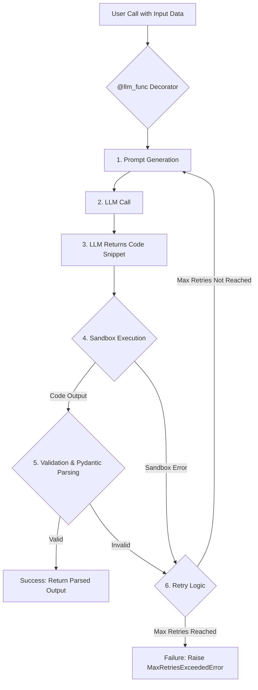

# LLM Functional Agents

A lightweight Python library for creating reliable, contract-driven LLM functions.

## Table of Contents

- [Overview](#overview)
- [Core Idea](#core-idea)
- [Quick Teaser](#quick-teaser)
- [Getting Started](#getting-started)
  - [Installation](#installation)
  - [Quick Start Guide](#quick-start-guide)
- [More Examples](#more-examples)
- [Security Considerations](#security-considerations)
- [Testing](#testing)
- [API Documentation](#api-documentation)
- [Contributing](#contributing)
- [Support and Community](#support-and-community)
- [License](#license)

## Overview

LLM Functional Agents offers a Pythonic way to seamlessly integrate Large Language Models (LLMs) for specific, "fuzzy" tasks within your existing codebase. Think of it as using LLMs as **universal function approximators for atomic operations** like text classification, summarization, or data extraction, without the overhead of complex agentic frameworks. The goal is to make LLM integration feel more like normal Python development and less like pure prompt engineering.

This library allows developers to define standard Python functions where an LLM performs the core intelligent logic. The LLM then uses a minimal Python code snippet to deliver its structured result, which must adhere to a clear, Python-defined contract. It emphasizes:

-   **Python-Centric Development:** Define and call LLM-powered capabilities just like regular Python functions.
-   **Clear Contracts:** Input/output schemas (e.g., via Pydantic) and type hints define the expected structure for the LLM's response, ensuring predictability.
-   **Code-Grounded Validation:** The primary grounding for the LLM's output comes from Python-defined assertions and post-condition hooks, ensuring the results are not just syntactically correct but also semantically valid for your use case. This shifts focus from elaborate prompt engineering to robust, code-based validation.
-   **Automated Feedback Loop:** Mechanisms for retrying LLM calls with contextual feedback on assertion failures or if the output doesn't meet the contract, enhancing reliability.
-   **Safe Execution:** The LLM's Python-formatted response (the minimal code snippet) is executed in a sandbox to securely integrate its answer into the Python environment.
-   **Pluggable LLM Backends:** Support for different LLM providers.

The term "Functional Agent" here refers to an LLM acting as the specialized, intelligent core of a Python function, dedicated to that function's specific task.

## Core Idea

The `@llm_func` decorator is the cornerstone of this library. It transforms a standard Python function stub (consisting of its signature, type hints, and docstring) into a robust, LLM-powered operation. Instead of you writing the function body, the LLM does.

Here's the typical workflow:
1. You define a Python function, specifying its inputs and outputs (ideally with Pydantic models).
2. In the docstring, you describe the task for the LLM. This docstring serves as the primary natural language instruction.
3. The LLM generates a minimal Python code snippet (usually just assigning the result to a predefined variable like `llm_output`) to fulfill the task.
4. This snippet is executed in a restricted sandbox environment.
5. The result is then rigorously validated against your defined output contract (e.g., Pydantic model) and any custom Python assertion functions (post-hooks) you provide. These assertions are key to "grounding" the LLM's output in your specific requirements.

This approach allows you to offload intelligent but "fuzzy" sub-tasks to an LLM, while keeping the overall control flow and validation within your familiar Python environment.



## Quick Teaser

The core of the library is the `@llm_func` decorator. You define a Python function, describe the task for an LLM in its docstring, and the LLM generates the code to perform that task, returning structured output.

```python
from llm_functional_agents import llm_func
# from pydantic import BaseModel # For structured input/output

# Example Pydantic models (optional but recommended)
# class InputModel(BaseModel):
#     text_to_process: str

# class OutputModel(BaseModel):
#     processed_text: str
#     some_value: int

@llm_func # Use @llm_func(output_model=OutputModel) for Pydantic validation
def my_llm_powered_function(data: dict) -> dict: # Or: (data: InputModel) -> OutputModel
    """
    The LLM reads this docstring to understand its task.
    It receives 'data' (e.g., {"text_to_process": "some input"}).
    It should then generate Python code that produces a dictionary assigned to 'llm_output'.
    Example of LLM-generated code:
    llm_output = {"processed_text": "result from LLM", "some_value": 123}
    """
    # This body is primarily for type hints and is not executed by the LLM.
    raise NotImplementedError("LLM provides the implementation based on the docstring.")

# Conceptual call:
# result = my_llm_powered_function({"text_to_process": "Test input"})
# print(result) # -> {"processed_text": "result from LLM", "some_value": 123}
```

See the [Quick Start Guide](#quick-start-guide) below for a runnable example.

## Getting Started

### Installation

**For Users:**

Install `llm-functional-agents` from PyPI, preferably within a Python virtual environment:

```bash
pip install llm-functional-agents
```

**For Developers (Contributing or Running Examples Directly from Source):**

1.  **Clone the repository:**
    ```bash
    git clone https://github.com/jtewen/llm-functional-agents.git
    cd llm-functional-agents
    ```
2.  **Set up a virtual environment (recommended) and install dependencies using Poetry:**
    If you don't have Poetry, install it first ([Poetry installation guide](https://python-poetry.org/docs/#installation)).
    ```bash
    # Activate your preferred virtual environment
    poetry install
    ```

**Supported Python Versions:** `>=3.9` to `<3.13`.

### Quick Start Example: Text Categorization

This example demonstrates an LLM function that categorizes input text.

1.  **Set up your API Key:**
    Create a `.env` file in your project root with your LLM provider API key. For OpenRouter:
    ```env
    # .env
    OPENROUTER_API_KEY="your_openrouter_api_key_here"
    ```
    > [!IMPORTANT]
    > Ensure `.env` is in your `.gitignore`.

2.  **Create and run `my_categorizer.py`:**

    ```python
    from typing import Optional
    from pydantic import BaseModel, Field
    from llm_functional_agents import llm_func, LLMCallContext # LLMCallContext for advanced error inspection
    from llm_functional_agents.config import configure
    from llm_functional_agents.exceptions import ValidationFailedError, MaxRetriesExceededError

    # Configure to use OpenRouter (uses OPENROUTER_API_KEY from .env by default if set)
    # configure(default_llm_backend_id="default_openrouter") # Explicitly, or rely on default

    class TextInput(BaseModel):
        text: str = Field(..., description="The text to categorize.")

    class CategoryOutput(BaseModel):
        category: str = Field(..., description="The determined category for the text.")
        confidence: Optional[float] = Field(None, ge=0.0, le=1.0, description="Confidence score (0.0 to 1.0)")

    ALLOWED_CATEGORIES = ["general_inquiry", "technical_support", "billing_question", "positive_feedback"]

    def check_category_is_allowed(output: CategoryOutput, *, data: TextInput): # Assertion hook
        assert output.category in ALLOWED_CATEGORIES, \\
            f"Category '{output.category}' is not valid. Allowed: {ALLOWED_CATEGORIES}"

    @llm_func(output_model=CategoryOutput, post_hooks=[check_category_is_allowed])
    def categorize_text(data: TextInput) -> CategoryOutput:
        """
        Analyze the input 'data.text' and determine its category.
        The category MUST be one of: {ALLOWED_CATEGORIES}.
        Optionally, provide a 'confidence' score (float between 0.0 and 1.0).
        Example for llm_output: {{ "category": "technical_support", "confidence": 0.85 }}
        """
        raise NotImplementedError("LLM provides the implementation based on the docstring.")

    def run_example():
        sample_text = "I'm having trouble logging into my account on your website."
        print(f"Input text: \\"{sample_text}\\"")
        
        input_data = TextInput(text=sample_text)
        
        try:
            print("\\nCalling categorize_text functional agent...")
            result: CategoryOutput = categorize_text(data=input_data)
            
            print("\\nSuccessfully categorized text:")
            print(result.model_dump_json(indent=2))

        except ValidationFailedError as ve:
            print(f"\\nVALIDATION FAILED for '{sample_text}':")
            print(f"  Error: {ve}")
            if ve.last_error_context:
                print(f"  Function: {ve.last_error_context.func_name}")
                print(f"  Attempts: {ve.last_error_context.current_attempt_number}/{ve.last_error_context.max_retries + 1}")
                # For full details: ve.last_error_context.get_attempts_history()
        except MaxRetriesExceededError as mre:
            print(f"\\nMAX RETRIES EXCEEDED for '{sample_text}':")
            print(f"  Error: {mre}")
            if mre.final_llm_call_context:
                 print(f"  Function: {mre.final_llm_call_context.func_name}")
                 # For full details: mre.final_llm_call_context.get_attempts_history()
        except Exception as e:
            print(f"\\nUNEXPECTED ERROR for '{sample_text}': {type(e).__name__} - {e}")

    if __name__ == "__main__":
        run_example()
    ```

3.  **Run from your project root:**
    ```bash
    python my_categorizer.py
    ```

4.  **Example Output:**

    *   **On Success:**
        ```
        Input text: "I'm having trouble logging into my account on your website."

        Calling categorize_text functional agent...

        Successfully categorized text:
        {
          "category": "technical_support",
          "confidence": 0.92
        }
        ```
        *(Actual confidence score may vary)*

    *   **On Validation Failure (if LLM returns an invalid category):**
        ```
        Input text: "I love this new feature, it works great!" 
        # (Assuming LLM hypothetically returns 'awesome_feedback' which is not in ALLOWED_CATEGORIES)

        Calling categorize_text functional agent...

        VALIDATION FAILED for 'I love this new feature, it works great!':
          Error: Category 'awesome_feedback' is not valid. Allowed: ['general_inquiry', 'technical_support', 'billing_question', 'positive_feedback']
          Function: categorize_text
          Attempts: 1/4 
        ```

This guide shows how to define an LLM function with input/output contracts (Pydantic models) and a post-execution validation hook (`check_category_is_allowed`). If the LLM's response (parsed into `CategoryOutput`) violates the assertion in the hook, a `ValidationFailedError` is raised, triggering a retry (up to a configured maximum).

## More Examples

For a more comprehensive set of examples showcasing various features of the library, including advanced error handling and different use cases, please see the `examples/run_demo.py` script.

## Security Considerations

Executing LLM-generated code, even in a sandbox, carries inherent risks. While this library implements sandboxing using Python's `multiprocessing` and resource limits (CPU time, memory, wall-clock time) to mitigate common risks, it's crucial to understand its limitations:

*   **Resource Limits:** These are OS-dependent (primarily effective on Unix-like systems) and might not prevent all denial-of-service vectors.
*   **Code Analysis:** The sandbox does not perform deep static analysis of the code to detect all forms of malicious intent before execution. It relies on restricting the execution environment.
*   **Sophisticated Attacks:** Determined attackers might find ways to bypass the current sandboxing mechanisms, especially if the underlying system running the sandbox is not further hardened.

**Recommendations for Production Use:**

1.  **Stronger Sandboxing:** For production systems handling untrusted code from LLMs, evaluate and integrate more robust sandboxing solutions. Options include:
    *   **`RestrictedPython`:** This library can compile Python code with restricted access to builtins and modules, offering finer-grained control over what the LLM-generated code can do. Integrating it would involve pre-compiling the LLM code snippet and executing the compiled bytecode in a carefully configured environment. The `llm_functional_agents.core.sandbox_executor` module contains comments indicating conceptual integration points for `RestrictedPython`.
    *   **Containerization (Docker):** Run the LLM agent or the sandbox worker in isolated Docker containers with strict resource limits and minimal privileges.
    *   **MicroVMs (Firecracker, gVisor):** For even stronger isolation, consider technologies like Firecracker or gVisor.
    *   **WASM (Pyodide):** If applicable, executing Python in a WebAssembly environment can provide good isolation.
2.  **Input/Output Sanitization:** Always sanitize inputs to the LLM and validate outputs rigorously, even if they appear to conform to the Pydantic schema. The Pydantic models and assertion hooks are key to this.
3.  **Principle of Least Privilege:** Ensure the process running the LLM functional agents has only the minimum necessary permissions.
4.  **Monitoring and Logging:** Implement comprehensive logging and monitoring to detect and respond to suspicious activity.
5.  **Model Choice:** Be mindful of the LLM you are using. Some models might be more prone to generating exploitable or malicious code snippets than others. Prioritize models from trusted sources with good safety records.
6.  **Regular Updates:** Keep the library, Python, and all dependencies updated to patch known vulnerabilities.

By default, the library prioritizes ease of use and rapid development. For production deployment, carefully review and enhance these security measures according to your specific risk profile and application requirements.

## Testing

This project uses `pytest` for running unit and integration tests. To run tests:

```bash
poetry run pytest
```

To run tests with coverage:

```bash
poetry run pytest --cov=llm_functional_agents --cov-report=html
```

## API Documentation

Currently, detailed API documentation is best found by exploring the source code, particularly the docstrings for core modules like `llm_functional_agents.core.llm_function`, `llm_functional_agents.core.agent_executor`, and the Pydantic models in the `examples` and `llm_functional_agents` directories.

Future versions may include Sphinx or MkDocs generated documentation.

## Contributing

We welcome contributions to LLM Functional Agents! Here's how you can help:

**Reporting Bugs or Requesting Features:**

*   Please open an issue on the [GitHub Issues page](https://github.com/jtewen/llm-functional-agents/issues).
*   For bugs, include steps to reproduce, expected behavior, and actual behavior.
*   For feature requests, describe the feature and its potential benefits.

**Setting Up Your Development Environment:**

1.  Follow the steps in the "Getting Started > Installation" section.
2.  This project uses Poetry for dependency management and various linters/formatters (Black, Flake8, isort, MyPy) configured in `pyproject.toml`.

**Making Changes:**

1.  **Fork** the repository on GitHub.
2.  Create a new **branch** for your feature or bug fix (e.g., `feature/my-new-feature` or `fix/issue-123`).
3.  Make your changes. Ensure you add or update tests as appropriate.
4.  **Format and Lint:** Before committing, please run the formatters and linters:
    ```bash
    poetry run black .
    poetry run isort .
    poetry run flake8
    poetry run mypy .
    ```
5.  **Run Tests:** Ensure all tests pass:
    ```bash
    poetry run pytest
    ```
6.  **Commit** your changes with a clear and descriptive commit message.
7.  **Push** your branch to your fork.
8.  Open a **Pull Request (PR)** to the `main` branch of the original repository.
    *   Clearly describe the changes in your PR.
    *   Link to any relevant issues.

We appreciate your contributions to making this library better!

## Support and Community

For questions, support, or to report issues, please use the following:
*   **GitHub Issues:** [https://github.com/jtewen/llm-functional-agents/issues](https://github.com/jtewen/llm-functional-agents/issues) (for bug reports and feature requests)

As the project grows, additional community channels may be established.

## License

This project is licensed under the MIT License. See the [LICENSE](LICENSE) file for details.