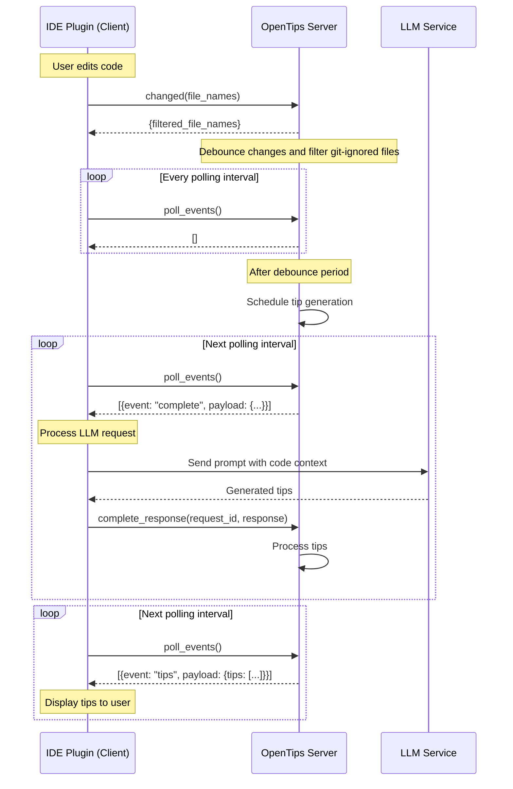

# OpenTips

OpenTips provides realtime code review from within your code editor. It's like having a helpful colleague who points out potential improvements and best practices as you write code.

Suggestions are based primarily on the current Git diff of the project, and focus primarily on potential bugs, security flaws, and performance problems.

## Usage in an IDE Plugin Environment

OpenTips is designed to be an IDE plugin, such as a Visual Studio Code extension. The server is run automatically as a separate process, and the extension is a client that communicates with the server.

In this type of environment, the IDE plugin runs the server with `-p 0`, which allows the OS to assign an available port. This approach is beneficial as it avoids potential port conflicts that might occur if a fixed port number was used. The chosen port is written to the standard output, and the plugin reads this port number.

## See Also

- [OpenTips VSCode Extension](https://github.com/kgilpin/opentips-vscode): A Visual Studio Code extension that integrates OpenTips into the IDE.

## Running the Server and Client Manually

For development purposes, you can run the OpenTips server and client manually without an IDE plugin. This approach is useful for testing and debugging the server and client independently. To run the server, use the following commands:

```bash
ANTHROPIC_API_KEY=your_api_key python -m opentips.cli.main -p 5000 -d ../myproject
```

This command starts the OpenTips server on port 5000, serving suggestions for the project located in the `../myproject` directory. You can then connect to the server using the OpenTips client program:

```bash
python -m opentips.cli.client -p 5000 suggest
```

# Examples

## Tracking code changes and computing tip suggestions



1. **Change Detection**:

   - The user modifies code in the IDE
   - The IDE plugin detects these changes and calls the `changed` method with the list of modified files
   - The server filters out git-ignored files and returns the filtered list

2. **Event Polling**:

   - The IDE plugin continuously polls for events using `poll_events()`
   - Initially, no events are returned while the server debounces changes

3. **LLM Request Generation**:

   - After the debounce period, the server schedules tip generation
   - When ready, the server emits a `complete` event
   - During the next polling interval, the IDE plugin receives this event

4. **LLM Processing**:

   - The IDE plugin processes the LLM request:
     - Extracts the prompt and context from the event payload
     - Sends this to an LLM service
     - Returns the generated tips using `complete_response()`
   - The server processes these tips

5. **Tip Delivery**:
   - In the next polling cycle, the server emits a tips event
   - The IDE plugin receives this event and displays the tips to the user

# RPC Reference

- [Methods](#methods)
  - [`changed`](#changed-method)
  - [`poll_events`](#poll_events-method)
  - [`complete_response`](#complete_response-method)
  - [`suggest`](#suggest-method)
  - [`suggest_file_range`](#suggest_file_range-method)
  - [`list_tips`](#list_tips-method)
  - [`fetch_tip`](#fetch_tip-method)
  - [`explain_tip`](#explain_tip-method)
  - [`apply_tip`](#apply_tip-method)
  - [`delete_tip`](#delete_tip-method)
- [Events](#events)
  - [`tips`](#tips-event)
  - [`tip_deleted`](#tip_deleted-event)
- [RPC Types](#rpc-types)
  - [`Tip`](#tip-type)
- [Tip Alignment and Validation](#tip-alignment-and-validation)

<a id="changed-method"><h2><code>changed</code></h2></a>

The `changed` method notifies OpenTips that files have been modified, triggering analysis and tip generation for those changes.
This method is designed to be called by the IDE plugin as file changes are detected. Changes are de-bounced in the server, so
multiple calls to `changed` within a short period are combined into a single analysis.

### Request

- `file_names` (required): List of file paths that have changed
- `immediate` (optional): Boolean flag to process tips immediately (default: `false`)

### Response

- `file_names`: List of files that will be analyzed (filtered to exclude git-ignored files)

### Events

- `changed`: Emitted with payload `{"file_names": [filtered_file_list]}` when file changes are detected
- `tips`: Emitted when tip generation is completed (via the `TipsJob`)

### Behavior

This RPC method receives a list of changed files, filters out any git-ignored files, and schedules analysis of the remaining files. The analysis can occur immediately or after a configurable delay (to allow for batching of changes).

The method first logs the changed files, then filters them using git-ignore rules. If no files remain after filtering, it returns an empty response. Otherwise, it schedules tip generation and returns the list of files that will be analyzed.

### Example Usage

```json
// Request
{
  "method": "changed",
  "params": {
    "file_names": ["src/main.py", "src/utils.py"],
    "immediate": false
  }
}

// Response
{
  "file_names": ["src/main.py", "src/utils.py"]
}
```

<a id="poll_events-method"><h2><code>poll_events</code></h2></a>

The `poll_events` method retrieves all pending events from the event system for client consumption.

## Request Parameters

- None

## Response

Returns an array of event objects, where each event has the following structure:

- `event`: String identifying the event type
- `payload`: Object containing event-specific data

## Description

This RPC method is the core of OpenTips' event system. Since JSON-RPC doesn't support true event broadcasting, OpenTips uses a polling mechanism where clients periodically call this method to retrieve any pending events.

When called, the method returns all events that have been enqueued since the last time the method was called, then clears the queue. If no events are available, it returns an empty array.

The client should call this method regularly to stay updated with server-side changes, including new tips, tip deletions, and other state changes.

## Event Types

See the [Events](#events) section for a list of possible event types.

## Example Usage

```json
// Request
{
  "method": "poll_events",
  "params": {}
}

// Response
[
  {
    "event": "tips",
    "payload": {
      "tips": [/* array of tip objects */]
    }
  },
  {
    "event": "tip_deleted",
    "payload": {
      "tip_id": "MS4wCi91c2Vycy9wcm9qZWN0cwp0aXBfYTFiMmMzZDQ",
      "reason": "applied"
    }
  }
]
```

<a id="complete_response-method"><h2><code>complete_response</code></h2></a>

The `complete_response` method allows clients to provide the results of an LLM completion request back to the server.

## Request Parameters

- `request_id` (required): String containing the unique identifier of the completion request
- `response` (required): String or structured object containing the LLM's response

## Response

A detailed response is not required; typically just `null` or `true` to indicate the response was received.

## Description

This RPC method is the counterpart to the `complete` event. When a client receives a `complete` event, it should process the LLM request and then call this method to provide the result back to the server.

The `response` parameter can be either a string (for unstructured text responses) or a structured object that conforms to the JSON schema provided in the original `complete` event's `response_format` field.

After calling this method, the server will continue processing the operation that required the LLM completion.

## Example Usage

```json
// Request
{
  "method": "complete_response",
  "params": {
    "request_id": "550e8400-e29b-41d4-a716-446655440000",
    "response": "The factorial of a number can be calculated recursively by multiplying the number by the factorial of (number - 1). The base case is that factorial(0) = 1."
  }
}

// Response
true
```

Or with a structured response:

```json
// Request
{
  "method": "complete_response",
  "params": {
    "request_id": "550e8400-e29b-41d4-a716-446655440000",
    "response": {
      "tips": [
        {
          "type": "performance",
          "label": "Use memoization",
          "description": "Cache results of expensive function calls"
        }
      ]
    }
  }
}
```

<a id="suggest-method"><h2><code>suggest</code></h2></a>

The `suggest` method retrieves programming tips for code changes in the code diff. This command can be used to
fetch an initial set of tips when the plugin is first loaded, or to refresh tips after a file has been modified.

For example, the `suggest` method can be rendered as a refresh icon (:arrows_counterclockwise:) in the IDE plugin.

### Request Parameters

- `new_only` (optional): Boolean flag to focus only on newly observed changes in the diff (default: `true`)

### Response

Returns a `TipList` object containing:

- tips: Array of `Tip` objects with suggestions for the analyzed code
- `error` (optional): Error message if something went wrong

### Events

- `"suggest"`: Emitted with empty payload `{}` when suggestion request begins
- `"tips"`: Emitted with a list of [`Tip`](#tip-type) objects when suggestions are generated

### Description

This RPC method analyzes the current git diff of the project to provide contextual programming tips. It first checks for code differences using the git diff functionality. If no differences are found, it returns an empty tip list.

When differences are found, it passes them to the LLM analysis service which generates helpful tips and suggestions based on the code changes. These tips are then returned to the client and also emitted as an event.

The `new_only` parameter allows filtering the diff to focus only on newly added code rather than both added and removed code.

### Example Usage

```json
// Request
{
  "method": "suggest",
  "params": {
    "new_only": true
  }
}

// Response
{
  "tips": [
   {
      // Tip1
   },
   {
      // Tip2
   }
  ]
}
```

<a id="suggest_file_range-method"><h2><code>suggest_file_range</code></h2></a>

The `suggest_file_range` method analyzes a specific section of a file to generate programming tips and suggestions for that code range.

## Request Parameters

- `file_name` (required): Path to the file to analyze
- `start_line` (required): Starting line number (1-based)
- `end_line` (required): Ending line number (1-based, inclusive)

## Response

- tips: Array of [`Tip`](#tip-type) objects with suggestions for the analyzed code range
- `error` (optional): Error message if something went wrong (e.g., file not found)

## Events Broadcasted

- `suggest_file_range`: Emitted when the request begins with payload `{"file": file_name, "start": start_line, "end": end_line}`
- `tips`: Emitted with the full list of tips

## Description

This RPC method allows clients to request programming tips for a specific range of lines within a file, rather than analyzing the entire git diff. This is particularly useful for IDE integrations where users want suggestions for just the code they're currently working on or have selected.

The method first reads the specified file range, then passes the content to the LLM to generate tips. If the file doesn't exist or can't be read, an error message is included in the response.

Unlike the `suggest` method which works with git diffs, this method works directly with file content, making it suitable for analyzing code that hasn't been committed yet or for focusing on specific sections of interest.

## Example Usage

```json
// Request
{
  "method": "suggest_file_range",
  "params": {
    "file_name": "src/utils.py",
    "start_line": 45,
    "end_line": 60
  }
}

// Response
{
  "tips": [
    {
      // Tip 1
    }
  ]
}
```

<a id="list_tips-method"><h2><code>list_tips</code></h2></a>

## Overview

The `list_tips` method retrieves all the stored tips for the current working directory, filtered to include only valid tips.
Unlike the `suggest` method, `list_tips` does not analyze the current code diff but instead returns all pre-existing tips
that are known for the server working directory.

## Request Parameters

- `limit` (optional): Maximum number of tips to return (defaults to the configured `tips_limit` if not provided)

## Response

Returns an array of [`Tip`](#tip-type) objects, each representing a programming tip or suggestion.

## Events Broadcasted

- None

## Description

This RPC method retrieves all tips stored for the current working directory. It performs several important operations on the list of tips:

1. Retrieves all tips from storage
2. Validates each tip against the current state of the files.
3. Prunes the list to retain only the most relevant tips.
4. Limits the number of tips returned based on the `limit` parameter

The method ensures that tips are still applicable to the current code by checking that the files still exist and the referenced code hasn't significantly changed. Tips that are no longer valid are filtered out.

## Example Usage

```json
// Request
{
  "method": "list_tips",
  "params": {
    "limit": 10
  }
}

// Response
[
  {
   // Tip 1
  },
  {
   // Tip 2
  }
]
```

<a id="fetch_tip-method"><h2><code>fetch_tip</code></h2></a>

# RPC Method: `fetch_tip`

The `fetch_tip` method retrieves a specific tip by its unique identifier.

## Request Parameters

- `tip_id` (required): String containing the unique identifier of the tip to fetch

## Response

Returns a [`Tip`](#tip-type) object representing the requested tip.

## Errors

- Throws an error if the `tip_id` is invalid or doesn't match the current working directory
- Returns a 404-type error if the tip isn't found

## Description

This method allows clients to fetch complete information about a specific tip. The tip ID must be a valid external ID (a base64-encoded string containing version, directory, and tip ID).

Before retrieving the tip, the method validates that the tip ID is correctly formatted and belongs to the current working directory. This validation helps prevent cross-directory tip access for security.

The method is commonly used to get full tip details when a user selects a tip from a list, wants to see more information, or before applying a tip.

## Example Usage

```json
// Request
{
  "method": "fetch_tip",
  "params": {
    "tip_id": "MS4wCi91c2Vycy9wcm9qZWN0cwp0aXBfYTFiMmMzZDQ"
  }
}

// Response
{
   // Tip
}
```

<a id="explain_tip-method"><h2><code>explain_tip</code></h2></a>

The `explain_tip` method provides a detailed explanation of a programming tip, offering additional context and information beyond the tip's basic description.

## Request Parameters

- `tip_id` (required): String containing the unique identifier of the tip to explain

## Response

Returns an `ExplanationResponse` object containing:

- `explanation`: String with a detailed explanation of the tip, including its rationale, benefits, and implementation details

## Errors

- Throws an error if the `tip_id` is invalid or doesn't match the current working directory
- Returns a 404-type error if the tip isn't found

## Description

This method retrieves a specific tip and generates an in-depth explanation using the LLM. The explanation typically includes:

- Why the tip is beneficial
- How implementing it improves code quality, performance, or maintainability
- Background information on the programming concept or pattern
- Examples of before and after code
- Alternative approaches that could be considered
- Potential trade-offs or considerations

The explanation is generated on-demand using an LLM, which analyzes the tip and its context to provide personalized insights.

## Example Usage

````json
// Request
{
  "method": "explain_tip",
  "params": {
    "tip_id": "MS4wCi91c2Vycy9wcm9qZWN0cwp0aXBfYTFiMmMzZDQ"
  }
}

// Response
{
  "explanation": "This tip suggests using a list comprehension instead of a for-loop with append operations. List comprehensions are a more Pythonic way to create lists from existing iterables.\n\nBenefits:\n1. More concise and readable code\n2. Often faster execution as it's optimized by the Python interpreter\n3. Reduces the chance of errors from modifying variables in the loop\n\nFor example, instead of:\n```python\nresult = []\nfor item in items:\n    result.append(item * 2)\n```\n\nYou can write:\n```python\nresult = [item * 2 for item in items]\n```\n\nThis makes your intention clearer and eliminates the need for creating an empty list and appending to it."
}
````

<a id="apply_tip-method"><h2><code>apply_tip</code></h2></a>

## Overview

The `apply_tip` method applies a tip's suggested code changes to the actual file, optionally deleting the tip after successful application.

## Request Parameters

- `tip_id` (required): String containing the unique identifier of the tip to apply
- `delete_after_apply` (optional): Boolean flag to delete the tip after successful application (default: `false`)

## Response

- `success`: Boolean indicating whether the tip was successfully applied
- `patches`: Array of `Patch` objects representing the changes made to the files

## Events Broadcasted

- `patches`: Emitted with payload containing tip ID and patches applied
- `tip_deleted`: Emitted if the tip was deleted after application with `"reason": "applied"`

## Dependencies

This method requires additional dependencies:

- `aider-chat` must be installed in the Python virtualenv
- The process must have an LLM API key (e.g., `ANTHROPIC_API_KEY`) in the environment
- An LLM model name should be configured in the environment

## Description

This method applies the code changes suggested by a tip to the actual file. It first validates and loads the tip, then uses
a background job to perform the actual application. The job generates patches that represent the changes made to the files.

If the `delete_after_apply` parameter is `true`, the tip will be deleted from storage after successful application, and a `tip_deleted` event will be broadcast.

If the application is successful, a response with `success: true` and the list of patches is returned. If no patches were generated, a response with `success: false` is returned.

## Example Usage

```json
// Request
{
  "method": "apply_tip",
  "params": {
    "tip_id": "MS4wCi91c2Vycy9wcm9qZWN0cwp0aXBfYTFiMmMzZDQ",
    "delete_after_apply": true
  }
}

// Response
{
  "success": true,
  "patches": [
    {
      "file_name": "src/utils.py",
      "hunks": [
        {
          "old_start": 45,
          "old_count": 2,
          "new_start": 45,
          "new_count": 1,
          "content": "@@ -45,2 +45,1 @@\n-for i in range(len(items)):\n-    result.append(items[i] * 2)\n+result = [item * 2 for item in items]\n\n"
        }
      ]
    }
  ]
}
```

<a id="delete_tip-method"><h2><code>delete_tip</code></h2></a>

The `delete_tip` method removes a specific tip from storage permanently.

## Request Parameters

- `tip_id` (required): String containing the unique identifier of the tip to delete

## Response

Returns a boolean value:

- `true`: If the tip was successfully deleted
- `false`: If the tip couldn't be found or deleted

## Events Broadcasted

- `"tip_deleted"`: Emitted with payload `{"tip_id": "<tip_id>", "reason": "deleted"}` when a tip is successfully deleted

## Description

This RPC method allows clients to manually delete a specific tip from storage. It first validates that the tip ID is correctly formatted and belongs to the current working directory. This validation helps prevent unauthorized tip deletion across different projects.

After validating the tip ID, the method attempts to delete the tip from storage. If successful, it broadcasts a `tip_deleted` event with the tip ID and the reason "deleted" to notify all clients that the tip is no longer available.

This method is typically used when a user explicitly decides to dismiss or ignore a tip, indicating they don't want to see it anymore.

## Example Usage

```json
// Request
{
  "method": "delete_tip",
  "params": {
    "tip_id": "MS4wCi91c2Vycy9wcm9qZWN0cwp0aXBfYTFiMmMzZDQ"
  }
}

// Response
true
```

## Client Implementation Notes

Clients should implement a polling intervalto regularly check for new events. The polling interval should balance responsiveness against unnecessary server load. Note that checking for events is fast, so a short polling interval is acceptable.

# Events

JSON-RPC does not support true event sending. Instead, the client is required to poll for events.

<a id="tips-event"><h2><code>tips</code></h2></a>

The tips event is broadcast when new programming tips have been generated by the system, providing clients with suggestions for improving code.

## Event Structure

```json
{
  "event": "tips",
  "payload": {
    "tips": [
      {
        // Tip 1
      }
      // Additional tips...
    ],
    "error": null
  }
}
```

## Payload Properties

- tips: Array of [`Tip`](#tip-type) objects containing programming suggestions
- `error` (optional): Error message if tip generation was only partially successful

## When It's Emitted

This event is emitted in several scenarios:

1. After the `suggest` method analyzes git diff content
2. After the `suggest_file_range` method analyzes a specific section of code
3. After the `changed` method triggers tip generation
4. When tips are refreshed or updated through other mechanisms

<a id="tip_deleted-event"><h2><code>tip_deleted</code></h2></a>

The `tip_deleted` event is broadcast when a tip is removed from the system, providing information about which tip was deleted and why.

## Event Structure

```json
{
  "event": "tip_deleted",
  "payload": {
    "tip_id": "<tip-id>",
    "reason": "[reason]"
  }
}
```

## Payload Properties

- `tip_id`: The unique identifier of the deleted [`Tip`](#tip-type)
- `reason`: The reason why the tip was deleted, which can be one of:
  - `deleted`: Manual deletion through the `delete_tip` RPC method
  - `applied`: Deleted after successful application of the tip
  - `invalidated`: Deleted because it no longer applies to the current code
  - `pruned`: Deleted as part of tip prioritization to maintain the tips limit

## Description

This event is emitted in several scenarios:

1. When a tip is manually deleted via the `delete_tip` RPC method
2. When a tip is automatically deleted after being applied (if `delete_after_apply` is true)
3. When a tip is invalidated because its associated code has changed
4. When a tip is pruned to maintain the configured maximum number of tips

Client applications should listen for this event to remove tips from the UI that are no longer valid.

<a id="complete-event"><h2><code>complete</code></h2></a>

The `complete` event is broadcast when the server needs to obtain a completion from an LLM. The client handles this event to generate content using an LLM service of its choosing, responding with `complete_response`.

## Event Structure

```json
{
  "event": "complete",
  "payload": {
    "request_id": "unique-uuid-string",
    "directory": "/path/to/working/directory",
    "prompt": "System prompt for the LLM",
    "user_message": "User message to send to the LLM",
    "temperature": 0.7,
    "response_format": {
      // Optional JSON schema describing the expected response format
    }
  }
}
```

## Payload Properties

- `request_id`: A unique identifier for this completion request
- `directory`: The current working directory
- `prompt`: The system prompt for the LLM
- `user_message`: The user message to send to the LLM
- `temperature`: The temperature setting for LLM generation
- `response_format` (optional): JSON schema describing the expected response format

## Response Mechanism

Unlike other events, the `complete` event expects a response from the client. The client should:

1. Detect the `complete` event via polling
2. Extract the completion request parameters
3. Send the request to an LLM service
4. Return the response using the `complete_response` RPC method

## When It's Emitted

This event is emitted whenever the server needs to generate content using an LLM, such as:

1. When generating tips for code changes
2. When explaining existing tips

# Tip Alignment and Validation

As the files in the code base change, the tips stored in the database may become outdated or invalid.

The `file`, `line`, and `context` associated with the Tip are used to validate the tip against the current state of the codebase. In tip validation, the current contents of the file are searched for the tip context. If the tip context is
still found in the file, the Tip line is updated accordingly. If the tip context is not found, the Tip is considered invalid and is removed from the list of tips.

When a Tip is invalidated, the `tip_deleted` event is emitted with the Tip ID as the payload.

# RPC Types

<a id="tip-type"><h2><code>Tip</code></h2></a>

A `Tip` object represents a programming tip or suggestion that can be applied to code. It includes details such as the tip's identifier, label, description, context, file name, line numbers, and suggested code changes.

### Fields

- `id`: Unique identifier for the tip
- `directory`: Working directory where the tip was generated
- `file`: File name where the tip applies
- `line`: Line number where the tip applies
- `context`: Code snippet where the tip applies
- `type`: Type of tip (e.g., "refactor", "performance", "style")
- `label`: Short description of the tip
- `description`: Detailed explanation of the tip

**Note**:: The tip `id` is a URL-safe Base64 encoded string of the following fields, joined by a newline:

```
1.0
<directory>
<unique_id>
```

The Tip id can therefore be unpacked to obtain the directory from which the tip was generated. This directory information can
_then_ be used to determine which RPC process to invoke for further information about the tip (e.g., `explain_tip`).

### Example

```json
{
  "id": "MS4wCi91c2Vycy9wcm9qZWN0cwp0aXBfYTFiMmMzZDQ",
  "directory": "/path/to/users/project",
  "file": "src/utils.py",
  "line": 45,
  "context": "for i in range(len(items)):\n    result.append(items[i] * 2)",
  "type": "style",
  "priority": "medium",
  "complexity": "low",
  "label": "Use list comprehension",
  "description": "Replace the for-loop with a more concise list comprehension"
}
```

## Local Development

### Setup

1. Create a virtual environment:

   ```bash
   python -m venv venv
   source venv/bin/activate  # or `venv\Scripts\activate` on Windows
   ```

````

2. Install development dependencies:

   ```bash
   pip install -r requirements-dev.txt
   ```

## Optional Dependencies

- To apply tips outside of the IDE environment: `aider-chat`
```

## Customizing Tips with REVIEW.md

OpenTips supports customizing the tip generation process by creating a `REVIEW.md` file in the root of your project. This file contains instructions that are incorporated into the prompt used by the LLM when generating tips.

### Benefits of Using REVIEW.md

- Customize the types of tips that are suggested
- Focus tip generation on specific aspects of code quality
- Add project-specific best practices
- Include team coding standards
- Guide the LLM to emphasize or de-emphasize certain types of suggestions

### Example REVIEW.md

```markdown
# Code Review Guidelines

When reviewing code in this project, please prioritize the following:

1. Error handling - Ensure all functions handle errors appropriately
2. Input validation - Check that user inputs are properly validated
3. Memory management - Look for potential memory leaks
4. Security best practices - Identify any security vulnerabilities
5. Performance considerations - Suggest optimizations for CPU-intensive code

Do not suggest:
- Style changes that don't conform to our ESLint configuration
- Refactorings that don't improve performance or readability
- Changes to our test framework approach
```

The contents of REVIEW.md are added to the LLM prompt when generating tips, influencing the suggestions to align with your project's specific needs.
