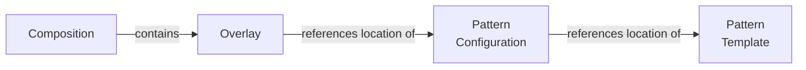

# Migrations

- The anchor for changes is:

    - The location of the
    - the hashed value of the composition and its overlays
        - This detects changes to overridden values and changes to pattern configuration locations (like a more up-to-date git reference)

- What to store

    - Store the composition location
    - Store the composition contents hash to detect if its overrides have changed
        - This catches when the pattern configuration location changes (like a more up-to-date git reference)
    - For each pattern
        - Store the requested location from the overlay
        - This will provide information if a specific version of the pattern was requested
            - The location may be very generic (like a GitHub repo), or very specific (commit 123456 of the repo)
        - Store the location used:
            - For git URLs, this would be a URL to a specific reference
            - Will need to be able to resolve the specificity of Git references
                - branches -> current commit
                - tags -> commit
