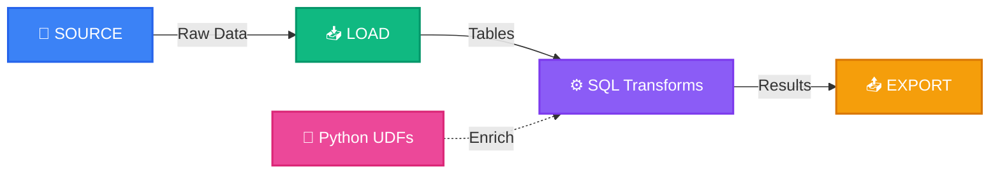

# SQLFlow: The Complete SQL Data Pipeline Platform

<div align="center">

**Define, orchestrate, and manage your entire data workflow in pure SQL**

[](https://opensource.org/licenses/Apache-2.0)
[](https://www.python.org/downloads/)
[](https://duckdb.org/)

</div>



## Why We Built SQLFlow

Data teams today face a fragmented landscape: separate tools for data ingestion, transformation, and export, each with their own syntax, configurations, and learning curves. This fragmentation creates unnecessary complexity, especially for SQL-fluent teams who just want to get things done.

**SQLFlow unifies your entire data workflow in a single, SQL-centric platform.**

Stop stitching together complex tools. Write SQL you already know, add a few intuitive directives like `SOURCE`, `LOAD`, and `EXPORT`, and you've defined your complete data pipeline.

## What Makes SQLFlow Different

| Traditional Approach | SQLFlow Approach |
|---|---|
| Multiple tools with different languages | One tool with SQL you already know |
| Complex orchestration setup | Automatic dependency management |
| Environment configuration sprawl | Simple profile-based settings |
| Context switching between tools | End-to-end pipeline in one file |
| Separate ingestion and transformation | Unified flow from source to destination |

## Quick Example

```sql
-- Define your data source
SOURCE orders TYPE CSV PARAMS {
  "path": "data/orders.csv",
  "has_header": true
};

-- Load it into your workspace
LOAD orders_data FROM orders;

-- Transform with familiar SQL
CREATE TABLE daily_sales AS
SELECT
  order_date,
  COUNT(*) AS order_count,
  SUM(amount) AS total_sales
FROM orders_data
GROUP BY order_date;

-- Apply Python transformations when needed
CREATE TABLE enriched_sales AS
SELECT
  *,
  PYTHON_FUNC("python_udfs.calculate_trend", daily_sales) AS trend_indicator
FROM daily_sales;

-- Export to your destination
EXPORT
  SELECT * FROM enriched_sales
TO "s3://analytics/${date}/sales_report.parquet"
TYPE S3
OPTIONS { "compression": "snappy" };
```

## Key Features

### 🔄 Complete Data Workflow

* **Source Connectors:** Ingest from CSV, PostgreSQL, and more
* **SQL Transformations:** Standard SQL with automatic dependency tracking
* **Python Integration:** Extend with Python UDFs when SQL isn't enough
* **Export Destinations:** Output to files, S3, and other targets

### 💪 Powerful Yet Simple

* **SQL-First:** Leverage the language data teams already know
* **Intuitive DSL:** Extended SQL with clear, purpose-built directives
* **Automatic DAG:** Dependencies automatically tracked and visualized
* **Clean Syntax:** No complex configuration or boilerplate

### 🛠️ Developer Experience

* **Easy Environment Switching:** Dev to production in seconds with profiles
* **Fast Iteration:** Lightning-quick in-memory mode for development
* **Robust Production:** Persistent storage mode for deployment
* **Built-in Visualization:** Auto-generated pipeline diagrams

### 🧩 Extensibility

* **Python UDFs:** Both scalar and table functions
* **Type Safety:** Enforced typing for reliable pipelines
* **Pluggable Architecture:** Add custom connectors and extensions
* **Open Design:** Clear interfaces for extension

## ⚡ Getting Started in 2 Minutes

```bash
# Install SQLFlow
pip install sqlflow-core

# Initialize a new project
sqlflow init my_project
cd my_project

# Create a simple pipeline
cat > pipelines/first_pipeline.sf << EOF
SOURCE users TYPE CSV PARAMS {
  "path": "data/users.csv",
  "has_header": true
};

LOAD users_data FROM users;

CREATE TABLE user_stats AS
SELECT
  country,
  COUNT(*) AS user_count,
  AVG(age) AS avg_age
FROM users_data
GROUP BY country;

EXPORT
  SELECT * FROM user_stats
TO "output/user_stats.csv"
TYPE LOCAL_FILE
OPTIONS { "header": true };
EOF

# Create sample data
mkdir -p data
echo "id,name,country,age\n1,Alice,US,28\n2,Bob,UK,34\n3,Charlie,US,22" > data/users.csv

# Run your pipeline
sqlflow pipeline run first_pipeline

# View your results
cat output/user_stats.csv
```

For a comprehensive step-by-step guide, check out our [Getting Started Guide](docs/getting_started.md).

## 🔍 Why Teams Choose SQLFlow

### For Data Analysts

* Use SQL you already know for your entire workflow
* No need to learn multiple tools or complex orchestration
* Focus on data insights instead of pipeline plumbing

### For Data Engineers

* Simplify your data stack and reduce maintenance
* Standardize on SQL across your organization
* Extend with Python when needed without leaving your workflow

### For Startups & SMEs

* Get enterprise-grade data capabilities without enterprise complexity
* Move faster with a unified, lightweight solution
* Reduce training costs by leveraging existing SQL skills

## 🧰 Core Concepts

### 1. Profiles for Environment Management

Switch between development and production with a single flag:

```bash
# Development (in-memory, fast)
sqlflow pipeline run my_pipeline

# Production (persistent storage)
sqlflow pipeline run my_pipeline --profile production
```

Each profile can define its own variables, engine settings, and connector configurations.

### 2. DuckDB-Powered Execution

SQLFlow uses DuckDB as its core engine, offering:

* In-memory mode for lightning-fast development
* Persistent mode for production reliability
* High performance SQL execution
* Pandas-like speed with SQL simplicity

### 3. Python UDFs Integration

Extend your SQL pipelines with Python when needed:

```python
# python_udfs/metrics.py
from sqlflow.udfs.decorators import python_scalar_udf, python_table_udf
import pandas as pd

@python_scalar_udf
def calculate_score(value: float, weight: float = 1.0) -> float:
    """Calculate weighted score."""
    return value * weight

@python_table_udf
def add_metrics(df: pd.DataFrame) -> pd.DataFrame:
    """Add calculated metrics to the dataframe."""
    result = df.copy()
    result["total"] = result["quantity"] * result["price"]
    result["discount"] = result["total"] * 0.1
    return result
```

Use in your SQL:

```sql
-- Scalar UDF
SELECT
  product_id,
  price,
  PYTHON_FUNC("python_udfs.metrics.calculate_score", price, 1.5) AS weighted_price
FROM products;

-- Table UDF
CREATE TABLE enriched_orders AS
SELECT * FROM PYTHON_FUNC("python_udfs.metrics.add_metrics", orders);
```

## 📊 Comparison with Other Tools

| Feature | SQLFlow | Transformation Tools | Ingestion/Export Tools | Orchestrators |
|---------|---------|----------------------|------------------------|---------------|
| **SQL-based pipelines** | ✅ Complete | ✅ Transforms only | ❌ Limited | ❌ No |
| **Source connectors** | ✅ Built-in | ❌ No | ✅ Yes | ❌ No |
| **Export destinations** | ✅ Built-in | ❌ No | ✅ Yes | ❌ No |
| **Python integration** | ✅ UDFs | ✅ Limited | ❌ No | ✅ Python-first |
| **Environment mgmt** | ✅ Profiles | ✅ Limited | ✅ Limited | ✅ Complex |
| **DAG visualization** | ✅ Automatic | ✅ Manual | ❌ No | ✅ Complex |
| **Learning curve** | ⭐ Low (SQL+) | ⭐⭐ Medium | ⭐⭐ Medium | ⭐⭐⭐ High |
| **Setup complexity** | ⭐ Low | ⭐⭐ Medium | ⭐⭐ Medium | ⭐⭐⭐ High |

## 📦 Installation

```bash
pip install sqlflow-core
```

For development installations:

```bash
git clone https://github.com/sqlflow/sqlflow.git
cd sqlflow
pip install -e .
```

## 📖 Documentation

* [SQLFlow Syntax Reference](docs/syntax.md)
* [Getting Started Guide](docs/getting_started.md)
* [Architecture & Concepts](docs/architecture.md)
* [CLI Reference Guide](docs/cli_guide.md)
* [Examples](examples/)
* [Contributing Guide](CONTRIBUTING.md)
* [Logging Configuration Guide](docs/logging.md)

## 🤝 Join the Community

SQLFlow is an open-source project built for data practitioners by data practitioners.

* ⭐ **Star us on GitHub!** Show your support
* 🐞 [Report issues](https://github.com/sqlflow/sqlflow/issues) or suggest features

## 📜 License

SQLFlow is released under the [Apache License 2.0](LICENSE), allowing for broad use and contribution while providing a framework for governance and future development.

## ❓ FAQ

**Q: How is SQLFlow different from transformation-only tools?**  
A: SQLFlow goes beyond transformation to include data ingestion and export in a single workflow. While transformation tools excel at in-warehouse modeling, SQLFlow offers an end-to-end pipeline solution with a similar SQL-first approach.

**Q: Do I need a data warehouse to use SQLFlow?**  
A: No! SQLFlow uses DuckDB as its engine, allowing you to build complete pipelines without any external warehouse. It works entirely local-first but can connect to warehouses when needed.

**Q: How do I switch between development and production environments?**  
A: Simply use the `--profile` flag: `sqlflow pipeline run my_pipeline --profile production`. Each profile can define different settings, connectors, and variables.

**Q: Are intermediate tables saved when using persistent mode?**  
A: Yes. All tables created during pipeline execution are persisted to disk when using the persistent mode, making debugging and data examination easier.

---

## Contributing and Development

### Installation for Development

```bash
git clone https://github.com/YOUR_ORG/sqlflow.git
cd sqlflow
pip install -e ".[dev]"
```

### Release Process

SQLFlow follows a two-stage release process:

1. **TestPyPI**: New versions are first published to TestPyPI for verification
2. **PyPI**: After testing, releases are promoted to PyPI for public use

For maintainers, we provide simple scripts to manage releases:

```bash
# Create a new release to TestPyPI
./tag_release.sh patch  # or minor, major

# After testing, promote to PyPI
./release_to_pypi.sh v0.x.y  # using the tag name
```

For detailed instructions, see our [Release Process Documentation](docs/RELEASE_PROCESS.md).

---

<div align="center">
  <strong>
    Built with ❤️ for data teams who love SQL
  </strong>
</div>
